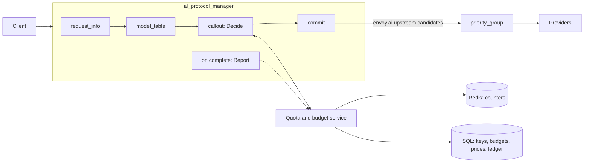
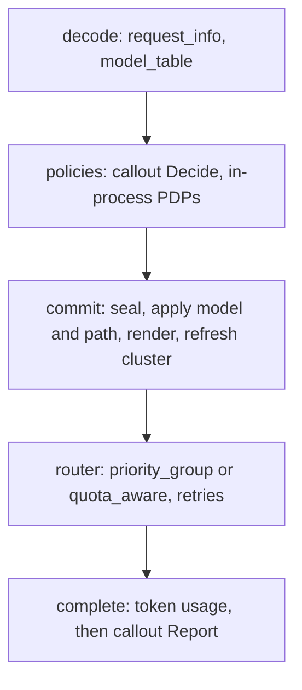

# Budget- and quota-based routing for AI traffic

Status: proposal, no code. Written against upstream/main `9c3d9aff1a`. Extension, field and filter
state names are proposals; everything not marked as new exists today.

Revision 6 (2026-10-07):

- **One protocol.** The limit check is an AI-native callout made by the AI Protocol Manager (APM):
  `Decide` before routing and `Report` after the response. A quota and budget service is its first
  user.
- **Policy leaves Envoy config.** Keys, budgets, limits, windows and prices live in the service.
  Envoy config only says which targets can serve a model, and where the service is.
- **One data model.** In-process and remote policies read and change the same records: the request,
  the caller, the candidates, the usage. The callout messages are those records.

Kept from revision 5: the `model_table` filter seeds `envoy.ai.upstream.candidates`, and APM commits
the list at the end of the AI filter chain into `priority_group` (envoyproxy/envoy#46640, merged) or
`quota_aware` (envoyproxy/envoy#47805, open).

## Summary



| | Envoy | Quota and budget service |
|---|---|---|
| Owns | parsing, the model table, candidates, routing, token usage, rejections in the client's API | keys, budgets, limits, windows, prices, reservations, the spend ledger |
| Per request | one `Decide` before routing, one `Report` after the response | answers `Decide`, records `Report` |
| Config | where the service is, and the model table | everything about policy |

## 1. Critical user journeys

| CUJ | Who | Does | Sees | LiteLLM | agentgateway |
|---|---|---|---|---|---|
| 1. Connect providers and price models | admin | lists models and the providers that serve them; sets prices in the service | requests reach providers; each has a cost | `model_list`, price map | `llm.models`, model catalog |
| 2. Give a team a monthly budget | budget owner | sets $500/month for team `search` in the service | team spend stops at $500 | team `max_budget` | not supported |
| 3. Issue a key with its own budget and models | budget owner | creates a key with $20/month and two allowed models | that key stops at $20; other models are refused | `/key/generate`, key `models` | per-key `budgets`, `allowedModels` |
| 4. Hit a limit | developer | keeps calling | a 429 their SDK understands, with when it resets; the remaining budget on responses | 400/401/429, varies | 429, `Retry-After` |
| 5. Cap tokens per minute | admin | sets 100k tokens/min per key | bursts are throttled | `tpm_limit` | rate limit `type: tokens` |
| 6. Spread a model over providers with their own budgets | admin | gives OpenAI $100/day and Azure $50/day for `gpt-4o` | a spent provider is skipped; a failing one is retried on the next | `provider_budget_config`, fallbacks | failover on health only |
| 7. Downgrade near the limit | budget owner | asks for `gpt-4o-mini` once the team passes 80% | cheaper responses, no errors, until 100% | not found | not found |
| 8. See spend | budget owner | asks for spend by team and model | a ledger and a dashboard | `/spend/logs`, UI | cost metric, UI |
| 9. Try a limit first | admin | adds an org-wide cap in dry-run | what would have been blocked | none | `Audit` |
| 10. Keep a tenant in its region | admin | allows EU teams only EU deployments | EU traffic stays in the EU | `allowed_model_region` | conditional routing |

Every journey is a service-side policy over the same four things: who calls, what it asks for, where
it could go, and what it used. Envoy's config does not change from one journey to the next.

## 2. Envoy design

### 2.1 One lifecycle, four records

APM already drives a request through decode, routing and completion. The design adds a commit
between decode and routing, and a completion hook. Every policy, local or remote, works on four
records:

| Record | Holds | Produced by | Status |
|---|---|---|---|
| `envoy.ai.request_info` (typed metadata) | API, model, stream, `max_output_tokens`, `estimated_input_tokens`, counts | `request_info` AI filter | exists |
| `envoy.ai.caller` (filter state) | key, user, team, org, end user, attributes | an identity filter, or the service's `Decide` answer | new |
| `envoy.ai.upstream.candidates` (filter state) | where the request may go, and who excluded what | `model_table`, then policies; sealed by the commit | new |
| `envoy.ai.token_usage` (typed metadata) | input, output, cached and reasoning tokens, as the provider reported them | APM, at a clean end of stream | exists |



### 2.2 Candidates: `envoy.ai.upstream.candidates`

An ordered list, seeded by `model_table` and changed by policies until the commit seals it:

| Field | Example | Meaning |
|---|---|---|
| `name` | `azure` | unique in the list; defaults to `id` |
| `id` | `azure_openai` | what routing matches: a cluster name, or a host's `envoy.lb.id` |
| `weight` | `1` | share within a group |
| `model`, `path` | `gpt-4o-mini`, `/openai/v1/chat/completions` | sent instead of the client's when this candidate is first |
| `llm_protocol` | `ANTHROPIC_MESSAGES` | the upstream API, for the transcoder's dynamic target work |
| `attributes` | `region: eu`, `tier: premium` | free-form, for policies |
| `excluded` | `{by: callout, reason: "provider budget spent"}` | empty while eligible |

A policy can **exclude** a candidate with a reason, **reorder** eligible candidates, or **annotate**
one. Entries are never deleted, so `%FILTER_STATE(envoy.ai.upstream.candidates:PLAIN)%` in an access
log says why a request went where it did.

### 2.3 The commit

After the last AI filter, if a list exists, APM:

1. seals it;
2. replies 503 in the client's dialect if nothing is eligible and no policy has replied;
3. applies the first eligible candidate's `model` to the body and `path` to `:path`;
4. keeps the eligible candidates with the same `model`, `path` and `llm_protocol`, since the request
   is written once;
5. renders them into dynamic metadata `envoy.ai.upstream.candidates`: `priority_groups` for the
   `priority_group` override, `candidates` for `quota_aware`;
6. sets `envoy.ai.backend.upstream` to the first id, for the `matcher` cluster specifier;
7. asks for a route cluster refresh.

### 2.4 The callout filter

`envoy.http.ai_filters.callout` is an AI filter. It does three things:

- **`Decide`, during decode.** It sends `request_info`, the caller, the eligible candidates and
  selected request headers. Then it applies the answer: exclusions and order go to the candidates,
  the resolved caller to `envoy.ai.caller`, headers to the response. A deny becomes a local reply in
  the client's API.
- **`Report`, at completion.** It sends the token usage, the served candidate, the status and
  whether the stream completed. The call is fire-and-forget.
- **Failure.** A failed `Decide` fails closed by default (503), like `ext_authz`, because the
  service may also authenticate keys. `failure_mode_allow` lets traffic through with an unchanged
  list.

It runs on APM's coroutines and needs nothing outside the AI filter chain: no `ext_authz`, no
`set_filter_state`, no rate limit filter.

## 3. The service interface

### 3.1 Options

| Interface | Fits | Gaps for budgets and quotas |
|---|---|---|
| Rate limit service (RLS), `envoyproxy/ratelimit` | counters with a peek and a post-response charge; refunds | 32-bit limits; limits in static config; no reservations, ledger, identity or candidates; descriptor plumbing in Envoy config |
| Rate limit quota service (RLQS) | server-assigned quotas, local enforcement, asynchronous reports | counts requests, not tokens or money; no per-request decision; complex bucket matchers |
| `ext_authz` | per-request decision, identity, deny body | sees headers, not the parsed AI request; nothing after the response; no candidates |
| `ext_proc` | full request and response access | streams HTTP bodies; no AI types; heavy for a yes/no plus a usage report |
| **AI callout, `Decide` + `Report` (recommended)** | the parsed request, caller and candidates in; allow, exclude or deny out; usage after | a new, small API |

### 3.2 API

Two unary RPCs, over gRPC or over HTTP with the proto3 JSON mapping. The messages reuse APM's
records, so there is nothing to translate.

```proto
package envoy.service.ai.callout.v3;

// A policy decision point for AI requests.
service AiCallout {
  // Called once the request is parsed, before it is routed.
  rpc Decide(DecideRequest) returns (DecideResponse);

  // Called once the response is complete. The service applies a request_id once.
  rpc Report(ReportRequest) returns (ReportResponse);
}

message Caller {
  string key = 1;
  string user = 2;
  string team = 3;
  string org = 4;
  string end_user = 5;
  map<string, string> attributes = 6;
}

message Candidate {
  string name = 1;
  string id = 2;
  string model = 3;
  map<string, string> attributes = 4;
}

message DecideRequest {
  // Generated by Envoy; Report carries the same id.
  string request_id = 1;
  envoy.data.ai.v3.RequestInfo request = 2;
  // What earlier filters established about the caller; may be empty.
  Caller caller = 3;
  // The eligible candidates, in order.
  repeated Candidate candidates = 4;
  // The request headers the filter is configured to forward, such as authorization.
  map<string, string> headers = 5;
}

message DecideResponse {
  message Allow {
    message Exclusion {
      string name = 1;
      string reason = 2;
    }

    repeated Exclusion exclude = 1;
    // A new order for the eligible candidates, by name. Empty keeps the order.
    repeated string order = 2;
  }

  message Deny {
    type.v3.HttpStatus status = 1;
    // Shown to the client, inside its API's error shape.
    string message = 2;
    // The error type in the client's API, e.g. insufficient_quota.
    string error_type = 3;
    google.protobuf.Duration retry_after = 4;
  }

  oneof decision {
    Allow allow = 1;
    Deny deny = 2;
  }

  // The caller the service resolved, e.g. from an API key. Published as envoy.ai.caller.
  Caller caller = 3;

  // Returned unchanged in Report, e.g. to tie a reservation to the request.
  bytes context = 4;

  repeated config.core.v3.HeaderValueOption response_headers_to_add = 5;
}

message ReportRequest {
  string request_id = 1;
  bytes context = 2;
  Caller caller = 3;
  // The candidate that served the final attempt; empty if no upstream answered.
  string served = 4;
  // The usage the provider reported; unset when none was published.
  envoy.data.ai.v3.TokenUsage usage = 5;
  // The status sent to the client, and whether the response finished cleanly.
  uint32 status = 6;
  bool complete = 7;
}

message ReportResponse {
}
```

### 3.3 What a quota and budget service does with it

**`Decide`**

1. Authenticate the forwarded key; resolve key, user and team. Return the caller.
2. Refuse models the key may not use: deny, 403.
3. For each budget of the caller (key, user, team, org, global), check
   `spent + reserved + estimate <= limit`. On failure, deny 429, with `error_type`
   `insufficient_quota` and `retry_after` set to the window's reset.
4. For each candidate, check its own budgets and quotas: a provider's daily budget, a deployment's
   tokens per minute. Exclude the ones that are out, with a reason.
5. Apply soft policies as exclusions: premium candidates when the team is past 80% (CUJ 7), non-EU
   candidates for EU teams (CUJ 10).
6. If no candidate is left, deny 429. Otherwise reserve the estimate under the request id, and
   return the reservation in `context` and the remaining budget as a response header.

**`Report`**

1. Price `usage` for the served candidate's model with the service's price table.
2. Charge the caller's budgets and the served candidate's.
3. Release the reservation and write the ledger row.
4. Treat a request id seen before as done.

What is charged is the service's rule. A reasonable one: charge only completed or cut-off 2xx
responses, and charge the reservation's input estimate when usage is missing.

**State**

| State | Store |
|---|---|
| keys, teams, budgets, limits, prices | SQL |
| counters and reservations | Redis, with TTLs equal to the windows |
| ledger | SQL |

`envoyproxy/ratelimit` can serve as the counter store behind the service. Reservations whose
`Report` is lost expire with their TTL.

LiteLLM's proxy does the same work in-process: its auth check reads keys and budgets, and its
success callback writes spend. Here that brain is a service, and Envoy is the data plane.

### 3.4 Cost and scale

- **Latency.** `Decide` is one round trip on the request path, about the cost of `ext_authz`.
  `Report` is off the path.
- **Caching.** A service that does not reserve can mark a decision cacheable for a caller and
  model. A later `valid_for` field would let Envoy reuse it.
- **Scale.** Batched `Report`s, and later a streaming variant in which the service pushes
  allowances and Envoy decides locally, as RLQS does.

## 4. Filter state and metadata contract

| Key | Kind | Written by | Read by |
|---|---|---|---|
| `envoy.ai.request_info` (exists) | typed metadata | `request_info` | callout `Decide`, logs |
| `envoy.ai.model.request` (exists) | filter state, string | `request_info` | `model_table` |
| `envoy.ai.caller` (new) | filter state, object; JSON factory for `set_filter_state` | an identity filter, or the callout from `Decide` | callout, logs, stats tags |
| `envoy.ai.upstream.candidates` (new) | filter state, object | `model_table`, then policies; sealed by the commit | policies, logs |
| `envoy.ai.upstream.candidates` (new) | dynamic metadata | the commit | `priority_group`, `quota_aware` |
| `envoy.ai.backend.upstream` (new, shared) | filter state, string | the commit | `matcher` cluster specifier, logs |
| `envoy.ai.callout` (new) | filter state, object | callout | logs: `outcome` (`ALLOWED`, `DENIED`, `FAILED_OPEN`, `FAILED_CLOSED`), `reason`, latency |
| `envoy.ai.token_usage` (exists) | typed metadata | APM, at a clean end of stream | callout `Report` |

All have life span `FilterChain`. Only the candidates change after they are first written, and only
until the commit.

## 5. End-to-end configuration

Design A: a cluster per provider. `gpt-4o` is served by OpenAI, then Azure OpenAI, with
`gpt-4o-mini` as the cheaper tier. All policy is in the service.

```yaml
node: {id: llm-gateway, cluster: llm-gateway}          # needed for the SDS-delivered provider keys
static_resources:
  listeners:
  - name: llm_gateway
    address:
      socket_address: {address: 0.0.0.0, port_value: 10000}
    filter_chains:
    - filters:
      - name: envoy.filters.network.http_connection_manager
        typed_config:
          "@type": type.googleapis.com/envoy.extensions.filters.network.http_connection_manager.v3.HttpConnectionManager
          stat_prefix: llm_gateway
          http_filters:
          - name: envoy.filters.http.ai_protocol_manager
            typed_config:
              "@type": type.googleapis.com/envoy.extensions.filters.http.ai_protocol_manager.v3.AiProtocolManager
              request_handling: {}
              response_handling:
                token_usage: {}
              filters:
              - name: envoy.http.ai_filters.request_info
                typed_config:
                  "@type": type.googleapis.com/envoy.extensions.http.ai_filters.request_info.v3.RequestInfo
                  token_estimation: {tokens_per_byte: 0.3}
              - name: envoy.http.ai_filters.model_table            # new
                typed_config:
                  "@type": type.googleapis.com/envoy.extensions.http.ai_filters.model_table.v3.ModelTable
                  models:
                    gpt-4o:
                      candidates:
                      - {id: openai}
                      - {id: azure_openai, path: /openai/v1/chat/completions}
                      - {name: mini, id: openai, model: gpt-4o-mini}
              - name: envoy.http.ai_filters.callout                # new
                typed_config:
                  "@type": type.googleapis.com/envoy.extensions.http.ai_filters.callout.v3.Callout
                  grpc_service:
                    envoy_grpc: {cluster_name: quota_service}
                    timeout: 0.1s
                  forward_headers: [authorization]
          - name: envoy.filters.http.router
            typed_config:
              "@type": type.googleapis.com/envoy.extensions.filters.http.router.v3.Router
          route_config:
            virtual_hosts:
            - name: llm
              domains: ["*"]
              routes:
              - match: {prefix: /v1/chat/completions}
                request_headers_to_remove: [accept-encoding]     # usage is read from plain bodies
                route:
                  timeout: 300s
                  auto_host_rewrite: true
                  inline_cluster_specifier_plugin:
                    extension:
                      name: envoy.router.cluster_specifier_plugin.priority_group
                      typed_config:
                        "@type": type.googleapis.com/envoy.extensions.router.cluster_specifiers.priority_group.v3.PriorityGroupClusterSpecifier
                        priority_groups:
                        - {name: default, clusters: [{cluster_name: openai, weight: 1}]}
                        override_metadata_namespace: envoy.ai.upstream.candidates
                  retry_policy:
                    retry_on: "5xx,reset,connect-failure,retriable-status-codes"
                    retriable_status_codes: [429]
                    num_retries: 2
                    refresh_cluster_on_retry: true
                typed_per_filter_config:
                  envoy.filters.http.ai_protocol_manager:
                    "@type": type.googleapis.com/envoy.extensions.filters.http.ai_protocol_manager.v3.AiProtocolManagerPerRoute
                    request: {llm_protocol: OPENAI_CHAT_COMPLETIONS}
  clusters:
  - name: openai
    type: LOGICAL_DNS
    load_assignment:
      cluster_name: openai
      endpoints:
      - lb_endpoints:
        - endpoint:
            address: {socket_address: {address: api.openai.com, port_value: 443}}
            hostname: api.openai.com
    transport_socket:
      name: envoy.transport_sockets.tls
      typed_config:
        "@type": type.googleapis.com/envoy.extensions.transport_sockets.tls.v3.UpstreamTlsContext
        sni: api.openai.com
    typed_extension_protocol_options:
      envoy.extensions.upstreams.http.v3.HttpProtocolOptions:
        "@type": type.googleapis.com/envoy.extensions.upstreams.http.v3.HttpProtocolOptions
        explicit_http_config: {http_protocol_options: {}}
        http_filters:
        - name: envoy.filters.http.credential_injector
          typed_config:
            "@type": type.googleapis.com/envoy.extensions.filters.http.credential_injector.v3.CredentialInjector
            overwrite: true
            credential:
              name: envoy.http.injected_credentials.generic
              typed_config:
                "@type": type.googleapis.com/envoy.extensions.http.injected_credentials.generic.v3.Generic
                credential:
                  name: openai_key
                  sds_config: {path_config_source: {path: /etc/envoy/secrets/openai.yaml}}
                header_value_prefix: "Bearer "
        - name: envoy.filters.http.upstream_codec
          typed_config:
            "@type": type.googleapis.com/envoy.extensions.filters.http.upstream_codec.v3.UpstreamCodec
  # azure_openai: the same, with myres.openai.azure.com, its own secret, and header: api-key.
  - name: quota_service
    type: STRICT_DNS
    load_assignment:
      cluster_name: quota_service
      endpoints:
      - lb_endpoints:
        - endpoint:
            address: {socket_address: {address: quota-service, port_value: 9000}}
    typed_extension_protocol_options:
      envoy.extensions.upstreams.http.v3.HttpProtocolOptions:
        "@type": type.googleapis.com/envoy.extensions.upstreams.http.v3.HttpProtocolOptions
        explicit_http_config: {http2_protocol_options: {}}
```

The AI part is about twenty lines, and stays the same as journeys are added: CUJs 2-10 are rows in
the service, not Envoy config.

An optional access log for operators, built from the records:

```yaml
access_log:
- name: envoy.access_loggers.file
  typed_config:
    "@type": type.googleapis.com/envoy.extensions.access_loggers.file.v3.FileAccessLog
    path: /var/log/envoy/llm.jsonl
    log_format:
      json_format:
        team: "%FILTER_STATE(envoy.ai.caller:FIELD:team)%"
        requested_model: "%FILTER_STATE(envoy.ai.model.request:PLAIN)%"
        cluster: "%UPSTREAM_CLUSTER%"
        candidates: "%FILTER_STATE(envoy.ai.upstream.candidates:PLAIN)%"
        callout: "%FILTER_STATE(envoy.ai.callout:PLAIN)%"
        status: "%RESPONSE_CODE%"
```

### 5.1 Walk-through

Team `search` has spent $300 of $500 (60%); OpenAI has used its whole daily budget.

| # | Component | Does | Candidates |
|---|---|---|---|
| 1 | HCM | matches the route; `priority_group` picks `default` (`openai`), provisionally | — |
| 2 | `request_info` | publishes `gpt-4o`, `max_output_tokens`, the input estimate | — |
| 3 | `model_table` | seeds `gpt-4o` | openai, azure_openai, mini |
| 4 | callout `Decide` | sends the request, the three candidates and `authorization` | — |
| 5 | quota service | resolves key `k1` → team `search`; team at 60% passes; OpenAI's daily budget is spent; `mini` is not needed while a premium candidate is eligible; reserves the estimate | — |
| 6 | callout | applies `exclude: [openai: provider budget spent, mini: premium available]`; publishes `envoy.ai.caller`; keeps the reservation context | azure_openai |
| 7 | commit | applies Azure's path; renders `priority_groups`; refreshes the cluster | sealed |
| 8 | router | attempt 1 → `azure_openai`; the cluster injects `api-key` | — |
| 9 | APM | at a clean end of stream, publishes `envoy.ai.token_usage` | — |
| 10 | callout `Report` | sends the usage, `served: azure_openai`, status 200, the context | — |
| 11 | quota service | prices the usage, charges team, key and Azure's budget, releases the reservation, writes the ledger row | — |

At 84%, the service excludes both premium candidates, and the commit sends `gpt-4o-mini` to OpenAI. At
100%, `Decide` denies with 429; APM replies in OpenAI's error shape with `retry-after` and
`x-should-retry: false`.

## 6. Design B: one cluster of deployments

For many deployments of one API that share a path and a credential, each with its own quota: Azure
OpenAI regions behind one Entra ID token, Bedrock regions, vLLM replicas. Only the model table, the
route and the cluster change. The service, the callout and the protocol stay the same.

```yaml
# model_table: candidates are hosts, named by their envoy.lb.id.
models:
  gpt-4o:
    candidates:
    - {id: azure-eastus}
    - {id: azure-westus}
    - {id: azure-sweden}
```

```yaml
# route: a plain cluster; retries go to another eligible host, then the next priority.
route:
  cluster: gpt4o_pool
  auto_host_rewrite: true
  retry_policy:
    retry_on: "5xx,reset,connect-failure,retriable-status-codes"
    retriable_status_codes: [429]
    num_retries: 2
    retry_host_predicate:
    - name: envoy.retry_host_predicates.previous_hosts
      typed_config:
        "@type": type.googleapis.com/envoy.extensions.retry.host.previous_hosts.v3.PreviousHostsPredicate
    retry_priority:
      name: envoy.retry_priorities.previous_priorities
      typed_config:
        "@type": type.googleapis.com/envoy.extensions.retry.priority.previous_priorities.v3.PreviousPrioritiesConfig
        update_frequency: 1
```

```yaml
# cluster: quota_aware skips hosts that are not candidates; each host gets its own SNI.
- name: gpt4o_pool
  type: STRICT_DNS
  load_balancing_policy:
    policies:
    - typed_extension_config:
        name: envoy.load_balancing_policies.quota_aware       # envoyproxy/envoy#47805
        typed_config:
          "@type": type.googleapis.com/envoy.extensions.load_balancing_policies.quota_aware.v3.QuotaAware
          metadata_namespace: envoy.ai.upstream.candidates
          candidates_key: candidates
          fallback_policy:
            policies:
            - typed_extension_config:
                name: envoy.load_balancing_policies.round_robin
                typed_config:
                  "@type": type.googleapis.com/envoy.extensions.load_balancing_policies.round_robin.v3.RoundRobin
  load_assignment:
    cluster_name: gpt4o_pool
    endpoints:
    - priority: 0
      lb_endpoints:
      - endpoint:
          address: {socket_address: {address: eastus.example.openai.azure.com, port_value: 443}}
          hostname: eastus.example.openai.azure.com
        metadata:
          filter_metadata:
            envoy.lb: {id: azure-eastus}
            envoy.transport_socket_match: {deployment: azure-eastus}
      # azure-westus: the same at priority 0; azure-sweden at priority 1
  transport_socket_matches:
  - name: azure-eastus
    match: {deployment: azure-eastus}
    transport_socket:
      name: envoy.transport_sockets.tls
      typed_config:
        "@type": type.googleapis.com/envoy.extensions.transport_sockets.tls.v3.UpstreamTlsContext
        sni: eastus.example.openai.azure.com
```

When East US's tokens for the minute are used, the service excludes it, the commit renders
`candidates = [azure-westus, azure-sweden]`, and `quota_aware` applies that at every host selection,
so no cluster refresh is needed. `Report` names the served host's `envoy.lb.id`. Different providers
in one cluster need per-attempt upstream rewriting of credential and path, which is the model
fallback track's work.

| | A: a cluster per provider | B: one cluster of deployments |
|---|---|---|
| Consumer | `priority_group` (#46640, merged, unchanged) | `quota_aware` (#47805, open) |
| Candidate ids | cluster names | host `envoy.lb.id` |
| List applied | at the cluster refresh after the commit, then every retry | at every host selection |
| Downgrade | yes | only within the cluster |

## 7. Details

- **Rejections.** A `Deny` becomes a local reply with the given status, `retry-after`,
  `x-should-retry: false` and the client API's error shape: OpenAI `{"error": {...}}`, Anthropic
  `{"type": "error", ...}`, Gemini `{"error": {"status": ...}}`. Response code details are
  `ai_callout_denied`.
- **Headers.** `response_headers_to_add` from an `Allow` are added to the upstream response, e.g.
  `x-ai-budget-remaining`.
- **Retries.** A retry refreshes the cluster again, and `priority_group` takes the next group.
  Cross-cluster retries are off with per-try-timeout hedging, and the first cluster's circuit
  breakers still apply.
- **Usage.** `Report` carries what APM extracted. That needs an uncompressed body, hence the
  `accept-encoding` removal; for OpenAI streams, `stream_options.include_usage` set by the client or
  the transcoder. With no usage, the service charges its reservation estimate.
- **Trust.** Forwarded headers can carry API keys, so the service must be trusted and reached over
  mTLS. Token counts are provider-reported.
- **Without a service.** Token-per-minute caps still work with the stock rate limit filter and
  `hits_addend` over the usage, as Envoy AI Gateway does.

## 8. API sketches

```proto
package envoy.extensions.http.ai_filters.callout.v3;

// [#extension: envoy.http.ai_filters.callout]
message Callout {
  oneof service {
    option (validate.required) = true;
    config.core.v3.GrpcService grpc_service = 1;
    // POSTs the proto3 JSON mapping of DecideRequest and ReportRequest.
    config.core.v3.HttpService http_service = 2;
  }

  // Request headers sent in Decide, e.g. authorization.
  repeated string forward_headers = 3;

  // Admit with the candidates unchanged when Decide fails. Defaults to false: 503.
  bool failure_mode_allow = 4;

  // Skip Report, for a policy that needs no usage.
  bool disable_report = 5;
}
```

```proto
package envoy.extensions.http.ai_filters.model_table.v3;

// [#extension: envoy.http.ai_filters.model_table]
message ModelTable {
  message Candidate {
    // Defaults to id; unique within a model.
    string name = 1;
    // A cluster name for priority_group, or a host's envoy.lb.id for quota_aware.
    string id = 2 [(validate.rules).string = {min_len: 1}];
    google.protobuf.UInt32Value weight = 3;
    string model = 4;
    string path = 5;
    type.ai.v3.LLMProtocol llm_protocol = 6;
    map<string, string> attributes = 7;
  }

  message Candidates {
    repeated Candidate candidates = 1 [(validate.rules).repeated = {min_items: 1}];
  }

  // Keyed by the requested model; "*" matches any model not listed.
  map<string, Candidates> models = 1;
}
```

APM core gains four general capabilities. Any AI filter can use them, not only the callout:

| Capability | Interface | Used by |
|---|---|---|
| Completion hook | `AiFilter::onStreamComplete(const AiStreamCompletion&)` with the final `TokenUsage` | callout `Report`, cost |
| Candidates and commit | `envoy.ai.upstream.candidates`, sealed and rendered at the end of the chain | model_table, callout, any PDP |
| Awaitable callouts | a coroutine-friendly gRPC and HTTP client on `AiFilterContext`, with timeout and cancellation | callout, future AI-native callouts |
| Replies and headers | `LocalReplier` with status, error type, `retry-after` and headers in the client's API; response headers from AI filters | callout `Deny` and `Allow` |

## 9. MVP breakdown

| # | PR | Scope |
|---|---|---|
| 1 | `ai_protocol_manager: add an AI filter stream-complete hook` | hook with the final usage |
| 2 | `ai_protocol_manager: add upstream candidates and commit them` | `envoy.ai.upstream.candidates`, seal, model and path, rendering, cluster refresh |
| 3 | `ai_filters: add a model table filter` | seeding from `models` |
| 4 | `ai_protocol_manager: let AI filters reply in the client's API and add response headers` | `LocalReplier`, response headers |
| 5 | `ai_protocol_manager: add awaitable callouts for AI filters` | gRPC and HTTP clients on the context |
| 6 | `api: add the AI callout service` and `ai_filters: add a callout filter` | `Decide` and `Report`, `envoy.ai.caller`, `envoy.ai.callout` |
| 7 | examples: a quota and budget service | Redis and SQL, keys, budgets, prices, ledger, admin API; an e2e sandbox |

Design A needs nothing else: #46640 is merged and used unchanged. Design B also needs #47805.

## 10. Alternatives

- **Budgets as rate limit descriptors in Envoy config** (revisions 2-5): a `budget` AI filter that
  peeks and charges `envoyproxy/ratelimit`, with limits in the RLS config and a `cost` filter for
  prices. It needs no new API, but policy lives in Envoy config, the 32-bit limits cap money at about
  $4,295 per window, and there are no reservations, ledger, identity or per-key models.
- **`ext_authz` before routing plus access logs after.** Works today, but the decision cannot see
  the parsed request or change candidates, and usage reaches the service only through a log
  pipeline.
- **A local-only policy in Envoy**: in-process counters, no service. It is fast, but limits are per
  instance and nothing is shared.

## 11. Decisions and open questions

Decided:

- The key is `envoy.ai.upstream.candidates`.
- APM commits it at the end of the AI filter chain.
- A `model_table` filter seeds it.
- (Revision 6) The limit check is an APM callout with `Decide` and `Report`. Policy lives in the
  service.

Open:

1. API package: `envoy.service.ai.callout.v3`, as proposed, or a name tied to quotas?
2. Should `Decide` also be able to add candidates (e.g. a per-tenant deployment), not only exclude
   and reorder?
3. Should HTTP/JSON be in the first PR, or follow gRPC?
4. Should the callout forward the request body for content-based policies later, as `ext_authz`'s
   `with_request_body` does?
