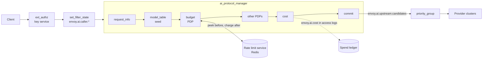

# Budget- and quota-based routing for AI traffic

Status: proposal, no code. Written against upstream/main `9c3d9aff1a`. Extension, field and filter
state names are proposals; everything not marked as new exists today.

Revision 5 (2026-10-06) records three decisions and adds the end-to-end configuration:

- The shared target list is the filter state object `envoy.ai.upstream.candidates`.
- APM commits it automatically at the end of the AI filter chain.
- A small `model_table` AI filter seeds it; policy decision points (PDPs) such as `budget` only
  exclude, reorder or annotate.

Budgets and quotas remain cost-weighted rate limits on the rate limit service (RLS). Routing uses
`priority_group` (envoyproxy/envoy#46640, merged) unchanged, or `quota_aware`
(envoyproxy/envoy#47805, open) for one cluster of deployments.

## Summary

| Step | Question | Built on | New |
|---|---|---|---|
| Seed | Which targets could serve this model? | — | `model_table` AI filter |
| Decide | Which of them may serve it now? | RLS descriptors: peek before, charge after | `budget` and other PDPs change `envoy.ai.upstream.candidates` |
| Route | Where does each attempt go? | `priority_group` (#46640), `quota_aware` (#47805) | APM's commit hands them the list |
| Meter | What did it cost? | token usage from APM | `cost` AI filter, `envoy.ai.cost` |

A budget is money over a long window; a quota is tokens or requests over a short one. Both are a
named counter for a subject, charged an amount per request.

## 1. Critical user journeys

| CUJ | Who | Does | Sees | LiteLLM | agentgateway |
|---|---|---|---|---|---|
| 1. Connect providers and price models | admin | lists models, the providers that serve them, and prices | requests reach providers; each has a cost | `model_list`, built-in price map | `llm.models`, model catalog |
| 2. Give a team a monthly budget | budget owner | sets $500/month for team `search` | team spend stops at $500 | team `max_budget`, `budget_duration` | not supported |
| 3. Issue a key with its own budget | budget owner | creates a key with $20/month in the key service | that key stops at $20 | `/key/generate` | per-key `budgets` |
| 4. Hit a budget | developer | keeps calling | a 429 their SDK understands, with when it resets; the remaining budget on every response | 400/401/429, varies | 429, `Retry-After` |
| 5. Cap tokens per minute | admin | sets 100k tokens/min per key | bursts are throttled, not billed | `tpm_limit` | rate limit `type: tokens` |
| 6. Spread a model over providers with their own budgets | admin | gives OpenAI $100/day and Azure $50/day for `gpt-4o` | an exhausted provider is skipped; a failing one is retried on the next | `provider_budget_config`, fallbacks | failover on health only |
| 7. Downgrade near the limit | budget owner | asks for `gpt-4o-mini` once the team passes 80% | cheaper responses, no errors, until 100% | not found (`soft_budget` alerts) | not found |
| 8. See spend | budget owner | asks for spend by team and model | a ledger and a dashboard | `/spend/logs`, UI | cost metric, UI analytics |
| 9. Try a budget first | admin | adds an org-wide cap in dry-run | counts of what would have been blocked | none | `onBudgetExceeded: Audit` |
| 10. Keep a tenant in its region | admin | allows EU teams only EU deployments | EU traffic stays in the EU; budgets still apply | `allowed_model_region` | conditional routing on CEL |

What Envoy has to provide:

1. A model table and a price per model (CUJ 1).
2. Counters keyed by who pays, shared across Envoy instances, with limits from config or from the
   key's database row (CUJ 2, 3, 5).
3. A check before the request and a charge after it, in money, tokens or requests (CUJ 2-5).
4. A rejection in the client's dialect, with `retry-after` and `x-should-retry: false` (CUJ 4).
5. One list of candidate targets that several policies narrow or reorder and that routing follows,
   including a cheaper model (CUJ 6, 7, 10).
6. Spend in access logs and metrics (CUJ 8), and a dry-run mode (CUJ 9).

## 2. Design overview



| Piece | Role | Status |
|---|---|---|
| `ext_authz` + key service | turns a virtual key into key id, team and per-key limit | exists; the service is yours |
| `set_filter_state` | copies them to `envoy.ai.caller.*` | exists |
| `request_info` | publishes the requested model and a token estimate | exists |
| `model_table` | seeds `envoy.ai.upstream.candidates` for the requested model | new AI filter |
| `budget` | peeks budgets; rejects, or excludes candidates out of budget; charges after the response | new AI filter |
| other PDPs | exclude or reorder: residency, heuristics, external callouts | later, each its own filter |
| `cost` | prices the response into `envoy.ai.cost` | new AI filter |
| commit | after the last AI filter: seal, apply model and path, render, refresh the cluster | new, in APM |
| `priority_group` | one group per attempt from the rendered list | exists (#46640) |

## 3. Upstream candidates: `envoy.ai.upstream.candidates`

### 3.1 The object

A filter state object, life span `FilterChain`. PDPs may change it until the commit seals it.

| Field | Example | Meaning |
|---|---|---|
| `name` | `gpt-4o-azure` | unique in the list; how PDPs and config refer to a candidate |
| `id` | `azure_openai` | what routing matches: a cluster name, or a host's `envoy.lb.id` |
| `weight` | `1` | share within a group |
| `model` | `gpt-4o-mini` | model to send when this candidate is first; empty keeps the client's |
| `path` | `/openai/v1/chat/completions` | `:path` to send when this candidate is first; empty keeps the client's |
| `attributes` | `region: eu` | free-form, for PDPs |
| `excluded` | `{by: budget, reason: "provider: spent"}` | set when a PDP removes it; empty means eligible |

Entries are never deleted, only marked, so the access log can say why a request went where it did:

```
%FILTER_STATE(envoy.ai.upstream.candidates:PLAIN)%
gpt-4o-azure,gpt-4o-openai(budget: provider spent),gpt-4o-mini(budget: not needed)
```

### 3.2 Seeding: the model table

`model_table` creates the list from the requested model (`envoy.ai.model.request`), like LiteLLM's
`model_list` and agentgateway's `virtualModels`. A model it does not list gets no list, and the
route's default cluster serves it. A filter before APM may seed instead, through `set_filter_state`
and the object's JSON form; the first seed wins.

### 3.3 PDPs

| Operation | Rule | Example |
|---|---|---|
| exclude | mark a candidate, with a reason | budget: provider spent; residency: not in the EU |
| reorder | move eligible candidates | heuristics: the large-context target first for long prompts |
| annotate | set an attribute | a scorer recording latency |

PDPs are AI filters, which use the object's C++ interface. Policy servers outside Envoy join through
an AI filter that calls them, such as the AI-native callout in #44681.

### 3.4 The commit

After the last AI filter and before the body is serialized, APM commits the list if one exists:

1. It seals the object.
2. If nothing is eligible and no PDP has replied, it replies 503 in the client's dialect. A PDP that
   excludes the last candidate for its own reason should reply itself; `budget` replies 429.
3. It applies the first eligible candidate's `model` to the body and its `path` to `:path`.
4. It keeps the eligible candidates with the same `model` and `path`. The request is written once,
   so a retry cannot change either.
5. It renders them into dynamic metadata `envoy.ai.upstream.candidates`, in both shapes routing
   reads today:
   - `priority_groups` for the `priority_group` override (#46640): one group per candidate, named
     by `name`, holding `id` at `weight`;
   - `candidates` for `quota_aware` (#47805): the ids.

   It also sets `envoy.ai.backend.upstream` to the first id, for the `matcher` cluster specifier.
6. It asks for a route cluster refresh, so the first attempt follows the list.

## 4. Filter state and metadata contract

Every key has life span `FilterChain` and a single writer, except `envoy.ai.upstream.candidates`,
which PDPs change until the commit.

| Key | Kind | Written by, when | Read by |
|---|---|---|---|
| `envoy.ai.caller.key`, `.team`, `.user` | filter state, string | `set_filter_state`, after identity (convention, no new code) | `budget` subjects, logs |
| `envoy.ai.model.request` (exists) | filter state, string | `request_info` | `model_table`, logs |
| `envoy.ai.request_info` (exists) | typed metadata | `request_info` | `cost` estimate |
| `envoy.ai.upstream.candidates` (new) | filter state, object | `model_table`, then PDPs, then the commit seals it | PDPs, logs |
| `envoy.ai.upstream.candidates` (new) | dynamic metadata | the commit | `priority_group`, `quota_aware` |
| `envoy.ai.backend.upstream` (new, shared) | filter state, string | the commit | `matcher` cluster specifier, logs |
| `envoy.ai.budget.decision` (new) | filter state, object | `budget` | logs, response headers |
| `envoy.ai.token_usage` (exists) | typed metadata | APM, at a clean end of stream | the completion hook |
| `envoy.ai.cost` (new) | filter state, object | `cost`, at completion | `budget` charge, logs, stats |
| `envoy.lb.id` (#47805) | host metadata | the cluster | `quota_aware`, attribution in design B |

- `envoy.ai.budget.decision`: `outcome` (`:PLAIN`: `ALLOWED`, `REROUTED`, `REJECTED`, `AUDITED`,
  `FAILED_OPEN`), `budget`, `remaining`, `reset_seconds`.
- `envoy.ai.cost`: `micros` (`:PLAIN`), `input_tokens`, `output_tokens`, `total_tokens`, `model`,
  `source` (`REPORTED`, `ESTIMATED`, `NONE`).

## 5. Where state lives, and what is called per request

Envoy never speaks SQL or the Redis protocol. On the request path it makes gRPC calls only.

| State | Stored in | Accessed by | Per request |
|---|---|---|---|
| keys, teams, per-key limits | SQL, behind your key service | `ext_authz` | one call; the service can cache |
| budget and quota counters | Redis, behind `envoyproxy/ratelimit` | `budget` | one peek before routing; one charge after the response, which the client does not wait for |
| model table, prices, provider budgets' limits | Envoy and RLS config | — | none |
| candidates, decisions, cost | filter state, in memory | AI filters | none |
| spend ledger | SQL or a warehouse, fed by access logs | the log pipeline, asynchronously | none |

LiteLLM reads Postgres through an in-memory cache synced with Redis. agentgateway keeps counters in
memory and flushes them to SQLite or Postgres every 5 seconds.

## 6. End-to-end configuration

Design A: a cluster per provider. One OpenAI-compatible route, `gpt-4o` served by OpenAI then
Azure OpenAI, `gpt-4o-mini` as the cheaper tier. Comments name the CUJ each part serves.

### 6.1 Envoy

```yaml
node: {id: llm-gateway, cluster: llm-gateway}     # SDS-delivered credentials need both
static_resources:
  listeners:
  - name: llm_gateway
    address:
      socket_address: {address: 0.0.0.0, port_value: 10000}
    filter_chains:
    - filters:
      - name: envoy.filters.network.http_connection_manager
        typed_config:
          "@type": type.googleapis.com/envoy.extensions.filters.network.http_connection_manager.v3.HttpConnectionManager
          stat_prefix: llm_gateway
          access_log:
          # CUJ 8: one ledger row per request, shipped to SQL by your log pipeline.
          - name: envoy.access_loggers.file
            typed_config:
              "@type": type.googleapis.com/envoy.extensions.access_loggers.file.v3.FileAccessLog
              path: /var/log/envoy/spend.jsonl
              log_format:
                json_format:
                  time: "%START_TIME%"
                  key: "%FILTER_STATE(envoy.ai.caller.key:PLAIN)%"
                  team: "%FILTER_STATE(envoy.ai.caller.team:PLAIN)%"
                  requested_model: "%FILTER_STATE(envoy.ai.model.request:PLAIN)%"
                  served_model: "%FILTER_STATE(envoy.ai.cost:FIELD:model)%"
                  cluster: "%UPSTREAM_CLUSTER%"
                  cost_micros: "%FILTER_STATE(envoy.ai.cost:FIELD:micros)%"
                  input_tokens: "%FILTER_STATE(envoy.ai.cost:FIELD:input_tokens)%"
                  output_tokens: "%FILTER_STATE(envoy.ai.cost:FIELD:output_tokens)%"
                  budget: "%FILTER_STATE(envoy.ai.budget.decision:PLAIN)%"
                  candidates: "%FILTER_STATE(envoy.ai.upstream.candidates:PLAIN)%"
                  status: "%RESPONSE_CODE%"
          # CUJ 8: spend per team and served model, as a counter.
          - name: envoy.access_loggers.stats
            typed_config:
              "@type": type.googleapis.com/envoy.extensions.access_loggers.stats.v3.Config
              stats_scope: {prefix: llm}
              counters:
              - stat:
                  name: spend_micros
                  tags:
                  - {name: team, value_format: "%FILTER_STATE(envoy.ai.caller.team:PLAIN)%"}
                  - {name: model, value_format: "%FILTER_STATE(envoy.ai.cost:FIELD:model)%"}
                value_format: "%FILTER_STATE(envoy.ai.cost:FIELD:micros)%"
          http_filters:
          # CUJ 3: the key service turns a virtual key into key_id, team_id and the key's limit.
          - name: envoy.filters.http.ext_authz
            typed_config:
              "@type": type.googleapis.com/envoy.extensions.filters.http.ext_authz.v3.ExtAuthz
              transport_api_version: V3
              grpc_service:
                envoy_grpc: {cluster_name: key_service}
                timeout: 0.2s
          # Who pays, under names the budget filter reads whatever the identity source.
          - name: envoy.filters.http.set_filter_state
            typed_config:
              "@type": type.googleapis.com/envoy.extensions.filters.http.set_filter_state.v3.Config
              on_request_headers:
              - object_key: envoy.ai.caller.key
                factory_key: envoy.string
                skip_if_empty: true
                format_string:
                  omit_empty_values: true
                  text_format_source: {inline_string: "%DYNAMIC_METADATA(envoy.filters.http.ext_authz:key_id)%"}
              - object_key: envoy.ai.caller.team
                factory_key: envoy.string
                skip_if_empty: true
                format_string:
                  omit_empty_values: true
                  text_format_source: {inline_string: "%DYNAMIC_METADATA(envoy.filters.http.ext_authz:team_id)%"}
          - name: envoy.filters.http.ai_protocol_manager
            typed_config:
              "@type": type.googleapis.com/envoy.extensions.filters.http.ai_protocol_manager.v3.AiProtocolManager
              request_handling: {}
              response_handling:
                token_usage: {}
              filters:
              - name: envoy.http.ai_filters.request_info
                typed_config:
                  "@type": type.googleapis.com/envoy.extensions.http.ai_filters.request_info.v3.RequestInfo
                  token_estimation: {tokens_per_byte: 0.3}
              # New. CUJ 1, 6, 7: which targets can serve each model, in order.
              - name: envoy.http.ai_filters.model_table
                typed_config:
                  "@type": type.googleapis.com/envoy.extensions.http.ai_filters.model_table.v3.ModelTable
                  models:
                    gpt-4o:
                      candidates:
                      - {name: gpt-4o-openai, id: openai}
                      - {name: gpt-4o-azure, id: azure_openai, path: /openai/v1/chat/completions}
                      - {name: gpt-4o-mini, id: openai, model: gpt-4o-mini}
              # New. CUJ 2-7, 9: check budgets, exclude candidates, charge after the response.
              - name: envoy.http.ai_filters.budget
                typed_config:
                  "@type": type.googleapis.com/envoy.extensions.http.ai_filters.budget.v3.Budget
                  rate_limit_service:
                    grpc_service:
                      envoy_grpc: {cluster_name: ratelimit}
                      timeout: 0.05s
                    transport_api_version: V3
                  domain: llm
                  budgets:
                  - name: team                     # CUJ 2: money per team, limit in the RLS
                    subject: "%FILTER_STATE(envoy.ai.caller.team:PLAIN)%"
                  - name: key                      # CUJ 3: money per key, limit from the key's row
                    subject: "%FILTER_STATE(envoy.ai.caller.key:PLAIN)%"
                    limit:
                      amount: "%DYNAMIC_METADATA(envoy.filters.http.ext_authz:monthly_budget_micros)%"
                      unit: MONTH
                  - name: key_tpm                  # CUJ 5: tokens per minute per key
                    subject: "%FILTER_STATE(envoy.ai.caller.key:PLAIN)%"
                    charge: TOKENS
                  - name: provider                 # CUJ 6: money per provider, per candidate id
                    scope: TARGET
                  - name: org_cap                  # CUJ 9: an org-wide cap in dry-run
                    subject: all
                    mode: AUDIT
                  candidate_budgets:
                    "*": [{name: provider}]
                    gpt-4o-openai: [{name: team, below: {value: 80}}]    # CUJ 7
                    gpt-4o-azure: [{name: team, below: {value: 80}}]
              # New. CUJ 1, 8: tokens to money.
              - name: envoy.http.ai_filters.cost
                typed_config:
                  "@type": type.googleapis.com/envoy.extensions.http.ai_filters.cost.v3.Cost
                  ensure_stream_usage: true
                  prices:
                    gpt-4o: {input: 2.50, cached_input: 1.25, output: 10.00}
                    gpt-4o-mini: {input: 0.15, cached_input: 0.075, output: 0.60}
                    default: {input: 5.00, output: 15.00}
          - name: envoy.filters.http.router
            typed_config:
              "@type": type.googleapis.com/envoy.extensions.filters.http.router.v3.Router
          route_config:
            virtual_hosts:
            - name: llm
              domains: ["*"]
              routes:
              - match: {prefix: /v1/chat/completions}
                request_headers_to_remove: [accept-encoding]     # usage is read from plain bodies
                response_headers_to_add:                         # CUJ 4
                - header:
                    key: x-ai-budget-remaining
                    value: "%FILTER_STATE(envoy.ai.budget.decision:FIELD:remaining)%"
                route:
                  timeout: 300s
                  auto_host_rewrite: true
                  inline_cluster_specifier_plugin:
                    extension:
                      name: envoy.router.cluster_specifier_plugin.priority_group
                      typed_config:
                        "@type": type.googleapis.com/envoy.extensions.router.cluster_specifiers.priority_group.v3.PriorityGroupClusterSpecifier
                        priority_groups:           # used when no list was committed
                        - {name: default, clusters: [{cluster_name: openai, weight: 1}]}
                        override_metadata_namespace: envoy.ai.upstream.candidates
                  retry_policy:                    # CUJ 6: a failing provider moves to the next
                    retry_on: "5xx,reset,connect-failure,retriable-status-codes"
                    retriable_status_codes: [429]
                    num_retries: 2
                    refresh_cluster_on_retry: true
                typed_per_filter_config:
                  envoy.filters.http.ai_protocol_manager:
                    "@type": type.googleapis.com/envoy.extensions.filters.http.ai_protocol_manager.v3.AiProtocolManagerPerRoute
                    request: {llm_protocol: OPENAI_CHAT_COMPLETIONS}
  clusters:
  - name: openai
    type: LOGICAL_DNS
    dns_lookup_family: V4_ONLY
    load_assignment:
      cluster_name: openai
      endpoints:
      - lb_endpoints:
        - endpoint:
            address: {socket_address: {address: api.openai.com, port_value: 443}}
            hostname: api.openai.com
    transport_socket:
      name: envoy.transport_sockets.tls
      typed_config:
        "@type": type.googleapis.com/envoy.extensions.transport_sockets.tls.v3.UpstreamTlsContext
        sni: api.openai.com
    typed_extension_protocol_options:
      envoy.extensions.upstreams.http.v3.HttpProtocolOptions:
        "@type": type.googleapis.com/envoy.extensions.upstreams.http.v3.HttpProtocolOptions
        explicit_http_config: {http_protocol_options: {}}
        http_filters:
        - name: envoy.filters.http.credential_injector
          typed_config:
            "@type": type.googleapis.com/envoy.extensions.filters.http.credential_injector.v3.CredentialInjector
            overwrite: true
            credential:
              name: envoy.http.injected_credentials.generic
              typed_config:
                "@type": type.googleapis.com/envoy.extensions.http.injected_credentials.generic.v3.Generic
                credential:
                  name: openai_key
                  sds_config: {path_config_source: {path: /etc/envoy/secrets/openai.yaml}}
                header_value_prefix: "Bearer "
        - name: envoy.filters.http.upstream_codec
          typed_config:
            "@type": type.googleapis.com/envoy.extensions.filters.http.upstream_codec.v3.UpstreamCodec
  - name: azure_openai
    type: LOGICAL_DNS
    dns_lookup_family: V4_ONLY
    load_assignment:
      cluster_name: azure_openai
      endpoints:
      - lb_endpoints:
        - endpoint:
            address: {socket_address: {address: myres.openai.azure.com, port_value: 443}}
            hostname: myres.openai.azure.com
    transport_socket:
      name: envoy.transport_sockets.tls
      typed_config:
        "@type": type.googleapis.com/envoy.extensions.transport_sockets.tls.v3.UpstreamTlsContext
        sni: myres.openai.azure.com
    typed_extension_protocol_options:
      envoy.extensions.upstreams.http.v3.HttpProtocolOptions:
        "@type": type.googleapis.com/envoy.extensions.upstreams.http.v3.HttpProtocolOptions
        explicit_http_config: {http_protocol_options: {}}
        http_filters:
        - name: envoy.filters.http.credential_injector
          typed_config:
            "@type": type.googleapis.com/envoy.extensions.filters.http.credential_injector.v3.CredentialInjector
            overwrite: true
            credential:
              name: envoy.http.injected_credentials.generic
              typed_config:
                "@type": type.googleapis.com/envoy.extensions.http.injected_credentials.generic.v3.Generic
                credential:
                  name: azure_key
                  sds_config: {path_config_source: {path: /etc/envoy/secrets/azure.yaml}}
                header: api-key
        - name: envoy.filters.http.upstream_codec
          typed_config:
            "@type": type.googleapis.com/envoy.extensions.filters.http.upstream_codec.v3.UpstreamCodec
  # envoyproxy/ratelimit, backed by Redis: the budget and quota counters.
  - name: ratelimit
    type: STRICT_DNS
    load_assignment:
      cluster_name: ratelimit
      endpoints:
      - lb_endpoints:
        - endpoint:
            address: {socket_address: {address: ratelimit, port_value: 8081}}
    typed_extension_protocol_options:
      envoy.extensions.upstreams.http.v3.HttpProtocolOptions:
        "@type": type.googleapis.com/envoy.extensions.upstreams.http.v3.HttpProtocolOptions
        explicit_http_config: {http2_protocol_options: {}}
  # Your key service: virtual keys, teams and per-key limits, in SQL.
  - name: key_service
    type: STRICT_DNS
    load_assignment:
      cluster_name: key_service
      endpoints:
      - lb_endpoints:
        - endpoint:
            address: {socket_address: {address: key-service, port_value: 9000}}
    typed_extension_protocol_options:
      envoy.extensions.upstreams.http.v3.HttpProtocolOptions:
        "@type": type.googleapis.com/envoy.extensions.upstreams.http.v3.HttpProtocolOptions
        explicit_http_config: {http2_protocol_options: {}}
```

### 6.2 Rate limit service

Each budget is one descriptor: its name as the key, its subject as the value. Money is in
micro-dollars, tokens in tokens.

```yaml
domain: llm
descriptors:
- key: team                        # CUJ 2: $500 a month for every team
  rate_limit: {unit: month, requests_per_unit: 500000000}
- key: key                         # CUJ 3: $20 a month unless the key's row overrides it
  rate_limit: {unit: month, requests_per_unit: 20000000}
- key: key_tpm                     # CUJ 5: 100k tokens a minute per key
  rate_limit: {unit: minute, requests_per_unit: 100000}
- key: provider                    # CUJ 6: $100 a day on OpenAI
  value: openai
  rate_limit: {unit: day, requests_per_unit: 100000000}
- key: provider                    # CUJ 6: $50 a day on Azure
  value: azure_openai
  rate_limit: {unit: day, requests_per_unit: 50000000}
- key: org_cap                     # CUJ 9: $3,000 a month, audited only
  value: all
  rate_limit: {unit: month, requests_per_unit: 3000000000}
```

`envoyproxy/ratelimit` treats a month as 30 days unless it runs with
`USE_CALENDAR_MONTH_RATE_LIMIT=true`, and its limits are 32-bit: about $4,295 per window.

### 6.3 Key service contract

The key service answers `ext_authz` `Check`. It denies unknown keys with 401, and for a known key
returns dynamic metadata, which lands in `envoy.filters.http.ext_authz`:

```json
{"key_id": "k1", "team_id": "search", "monthly_budget_micros": 20000000}
```

Creating keys and setting their limits (CUJ 3) is the service's own API, as `/key/generate` is
LiteLLM's.

### 6.4 Walk-through

Team `search` has spent $300 of $500 (60%); OpenAI has used its whole daily budget.

| # | Component | Does | `envoy.ai.upstream.candidates` |
|---|---|---|---|
| 1 | HCM | matches the route; `priority_group` picks `default` (`openai`), provisionally | — |
| 2 | `ext_authz`, `set_filter_state` | resolve `envoy.ai.caller.key = k1`, `.team = search` | — |
| 3 | `request_info` | `envoy.ai.model.request = gpt-4o` | — |
| 4 | `model_table` | seeds `gpt-4o` | openai, azure, mini |
| 5 | `budget` | one RLS peek, `hits_addend` 0: `team=search`, `key=k1` (limit override), `key_tpm=k1`, `org_cap=all`, `provider=openai`, `provider=azure_openai` | — |
| 6 | `budget` | excludes `gpt-4o-openai` (provider spent) and `gpt-4o-mini` (a premium candidate is eligible); `envoy.ai.budget.decision = REROUTED` | azure eligible |
| 7 | `cost` | looks up the price for `gpt-4o` | — |
| 8 | commit | first eligible is `gpt-4o-azure`: `:path` → `/openai/v1/chat/completions`; renders `priority_groups = [gpt-4o-azure]`; asks for a cluster refresh | sealed |
| 9 | `priority_group`, router | attempt 1 → `azure_openai`; `auto_host_rewrite` sets `Host`; the cluster injects `api-key` | — |
| 10 | `cost` | at stream completion, prices the response into `envoy.ai.cost` | — |
| 11 | `budget` | one RLS charge: `team`, `key`, `key_tpm`, `org_cap`, `provider=azure_openai` | — |
| 12 | access loggers | ledger row and `llm.spend_micros` counter | — |

At 84%, both premium candidates fail `below`, so the commit takes `gpt-4o-mini`. The model becomes
`gpt-4o-mini`, the path stays, and `priority_group` picks `openai`. At 100%, `team` is spent, so
`budget` replies 429 before any routing. OpenAI's provider budget also covers the mini candidate,
so with both OpenAI spent and the team over 80%, nothing is eligible and the reply is a 429.

## 7. Design B: one cluster of deployments

**When.** Many deployments of one API share a path and a credential and each has its own quota:
Azure OpenAI deployments in several regions behind one Entra ID token, Bedrock in several regions,
or vLLM replicas. Only these parts change from 6.1, plus #47805.

```yaml
# The model table names hosts by their envoy.lb.id.
models:
  gpt-4o:
    candidates:
    - {name: eastus, id: azure-eastus}
    - {name: westus, id: azure-westus}
    - {name: sweden, id: azure-sweden}
# The budget filter adds a per-deployment token quota.
budgets:
- name: deployment_tpm
  scope: TARGET
  charge: TOKENS
candidate_budgets:
  "*": [{name: deployment_tpm}]
```

```yaml
# The route needs no cluster specifier. Retries go to another eligible host, then the next priority.
route:
  cluster: gpt4o_pool
  auto_host_rewrite: true
  retry_policy:
    retry_on: "5xx,reset,connect-failure,retriable-status-codes"
    retriable_status_codes: [429]
    num_retries: 2
    retry_host_predicate:
    - name: envoy.retry_host_predicates.previous_hosts
      typed_config:
        "@type": type.googleapis.com/envoy.extensions.retry.host.previous_hosts.v3.PreviousHostsPredicate
    retry_priority:
      name: envoy.retry_priorities.previous_priorities
      typed_config:
        "@type": type.googleapis.com/envoy.extensions.retry.priority.previous_priorities.v3.PreviousPrioritiesConfig
        update_frequency: 1
```

```yaml
# One cluster; quota_aware skips hosts that are not candidates; each host gets its own SNI.
- name: gpt4o_pool
  type: STRICT_DNS
  load_balancing_policy:
    policies:
    - typed_extension_config:
        name: envoy.load_balancing_policies.quota_aware       # envoyproxy/envoy#47805
        typed_config:
          "@type": type.googleapis.com/envoy.extensions.load_balancing_policies.quota_aware.v3.QuotaAware
          metadata_namespace: envoy.ai.upstream.candidates
          candidates_key: candidates
          fallback_policy:
            policies:
            - typed_extension_config:
                name: envoy.load_balancing_policies.round_robin
                typed_config:
                  "@type": type.googleapis.com/envoy.extensions.load_balancing_policies.round_robin.v3.RoundRobin
  load_assignment:
    cluster_name: gpt4o_pool
    endpoints:
    - priority: 0
      lb_endpoints:
      - endpoint:
          address: {socket_address: {address: eastus.example.openai.azure.com, port_value: 443}}
          hostname: eastus.example.openai.azure.com
        metadata:
          filter_metadata:
            envoy.lb: {id: azure-eastus}
            envoy.transport_socket_match: {deployment: azure-eastus}
      # azure-westus: the same at priority 0; azure-sweden at priority 1
  transport_socket_matches:
  - name: azure-eastus
    match: {deployment: azure-eastus}
    transport_socket:
      name: envoy.transport_sockets.tls
      typed_config:
        "@type": type.googleapis.com/envoy.extensions.transport_sockets.tls.v3.UpstreamTlsContext
        sni: eastus.example.openai.azure.com
```

The commit renders `candidates = [azure-westus, azure-sweden]` when East US's quota is used up;
`quota_aware` applies it at every host selection, so no cluster refresh is needed. The served host's
`envoy.lb.id` decides which `deployment_tpm` is charged.

What one cluster cannot do yet:

- **Different providers in one cluster.** Hosts would need their own credential and path, and
  `credential_injector` works per cluster. Per-attempt upstream rewriting from host metadata would
  close this; the model fallback track needs the same work.
- **`quota_aware`** is an open PR (#47805).

## 8. A or B

| | A: a cluster per provider | B: one cluster of deployments |
|---|---|---|
| Fits | different providers | many deployments of one API |
| Consumer | `priority_group` (#46640, merged, unchanged) | `quota_aware` (#47805, open) |
| Rendered shape | `priority_groups` | `candidates` |
| Candidate ids | cluster names | host `envoy.lb.id` |
| When the list is applied | the cluster refresh after the commit, then every retry | every host selection |
| Credential, TLS, path | per cluster; path per candidate | shared; SNI per host |
| Downgrade | yes | only within the cluster |
| Attribution | served cluster | served host's `envoy.lb.id` |

The two combine: a cluster in A can itself be a B pool.

## 9. Budget details

### 9.1 Charging rule

| `charge` | Amount | When |
|---|---|---|
| `COST` (default) | `envoy.ai.cost` micros | after the response |
| `TOKENS` | `total_tokens` | after the response |
| `REQUESTS` | 1 | at the peek |

- `scope: REQUEST` (default) budgets are checked and charged on every request.
- `scope: TARGET` budgets are checked for every candidate that `candidate_budgets` gives them to,
  counted per candidate id unless the reference gives a `subject`, and charged only for the
  candidate that served.
- `mode: AUDIT` peeks and charges but never excludes or rejects; `envoy.ai.budget.decision` reads
  `AUDITED` when enforcement would have acted.
- `candidate_budgets` gives each candidate, by name, the budgets it draws on; `"*"` applies to all
  candidates, and named entries add to it.

### 9.2 Peek and charge

- The peek is one `ShouldRateLimit` call with every distinct descriptor and an explicit
  per-descriptor `hits_addend` of 0. `envoyproxy/ratelimit` treats that as a check. A request-level
  0 would count as 1.
- The charge is one more call after the response, fire-and-forget, kept alive past filter teardown
  the way the rate limit filter's `OnStreamDoneCallBack` does it.
- `below` thresholds use the peek's `current_limit` and `limit_remaining`.

### 9.3 What gets charged

- Only a 2xx response that came from an upstream. Local replies and upstream errors cost nothing.
- Each descriptor once, even when a budget applies both as a request budget and to the candidate.
- A budget whose subject has a substitution without a value does not apply and is counted, as a rate
  limit descriptor with a missing value is dropped.
- Usage that is missing on a 2xx response (cut stream, no usage sent, compressed body, a `FAILED`
  record) is charged the input estimate from `request_info`, or 0 without one.

### 9.4 Pricing

`cost = max(0, input - cached - cache_creation) × input + cached × cached_input +
cache_creation × cache_write + output × output`, rounded up to a micro-unit. Prices are per million
tokens. Lookup tries `<cluster>/<model>`, `<model>`, then `default`, using the served cluster and
the model actually sent. Unpriced requests cost 0 and are counted. `ensure_stream_usage` adds
`stream_options.include_usage` to OpenAI Chat streams; `max_cost_per_request` caps one inflated
usage report.

### 9.5 Rejection

A 429 with `retry-after` (the blocking budget's reset), `x-should-retry: false`, response code
details `ai_budget_exhausted`, and the client's error shape: OpenAI `insufficient_quota`, Anthropic
`rate_limit_error`, Gemini `RESOURCE_EXHAUSTED`. The message names the budget and its reset time,
never the limit, the spend or the subject.

### 9.6 Firmness and failure

- Admission sees spend as of the peek, so a budget can be overspent by the requests already
  running when it ran out: about concurrency × cost per request. Reservations (section 12) close
  most of it.
- If the RLS is unreachable, `failure_mode_deny: false` (default) excludes nothing and records
  `FAILED_OPEN`; `true` replies 503.
- Subjects come from identity filters, not client headers. Token counts are provider-reported. The
  RLS is a write path for money, so use mTLS to it.

## 10. API sketches

```cpp
// Filter state envoy.ai.upstream.candidates. Seeded by model_table, changed by PDPs, sealed by
// APM's commit.
class UpstreamCandidates : public StreamInfo::FilterState::Object {
public:
  struct Candidate {
    std::string name;
    std::string id;
    uint32_t weight{1};
    std::string model;
    std::string path;
    absl::flat_hash_map<std::string, std::string> attributes;
    std::string excluded_by; // Empty while eligible.
    std::string reason;
  };

  // Each returns false once the list is sealed or the name is unknown.
  bool exclude(absl::string_view name, absl::string_view by, absl::string_view reason);
  bool moveToFront(absl::string_view name);
  bool setAttribute(absl::string_view name, absl::string_view key, absl::string_view value);

  const std::vector<Candidate>& candidates() const;
  bool sealed() const;
};
```

```proto
package envoy.extensions.http.ai_filters.model_table.v3;

// [#extension: envoy.http.ai_filters.model_table]
message ModelTable {
  message Candidate {
    string name = 1 [(validate.rules).string = {min_len: 1}];
    // A cluster name for priority_group, or a host's envoy.lb.id for quota_aware.
    string id = 2 [(validate.rules).string = {min_len: 1}];
    google.protobuf.UInt32Value weight = 3;
    // Sent instead of the client's model or :path when this candidate is first.
    string model = 4;
    string path = 5;
    map<string, string> attributes = 6;
  }

  message Candidates {
    repeated Candidate candidates = 1 [(validate.rules).repeated = {min_items: 1}];
  }

  // Keyed by the requested model; "*" matches any model not listed.
  map<string, Candidates> models = 1;
}
```

```proto
package envoy.extensions.http.ai_filters.budget.v3;

// [#extension: envoy.http.ai_filters.budget]
message Budget {
  enum Charge {
    COST = 0;
    TOKENS = 1;
    REQUESTS = 2;
  }

  enum Scope {
    // Checked and charged on every request.
    REQUEST = 0;
    // Checked for the candidates it is given to; counted per candidate id.
    TARGET = 1;
  }

  enum Mode {
    ENFORCE = 0;
    AUDIT = 1;
  }

  message Limit {
    // Format string that yields the limit in the budget's unit.
    string amount = 1 [(validate.rules).string = {min_len: 1}];
    type.v3.RateLimitUnit unit = 2 [(validate.rules).enum = {defined_only: true}];
  }

  message BudgetDef {
    // The RLS descriptor key.
    string name = 1 [(validate.rules).string = {min_len: 1}];
    // Format string for the descriptor value. Required for REQUEST budgets.
    string subject = 2;
    Charge charge = 3;
    Scope scope = 4;
    Mode mode = 5;
    // Overrides the RLS limit for this request, e.g. from the key's database row.
    Limit limit = 6;
  }

  message BudgetRef {
    string name = 1 [(validate.rules).string = {min_len: 1}];
    // Eligible while spend is below this share of the limit. Defaults to 100%.
    type.v3.Percent below = 2;
    // For a TARGET budget: the descriptor value. Defaults to the candidate id.
    string subject = 3;
  }

  message BudgetRefs {
    repeated BudgetRef budgets = 1;
  }

  config.ratelimit.v3.RateLimitServiceConfig rate_limit_service = 1
      [(validate.rules).message = {required: true}];
  string domain = 2 [(validate.rules).string = {min_len: 1}];
  bool failure_mode_deny = 3;
  repeated BudgetDef budgets = 4;
  // Keyed by candidate name; "*" applies to every candidate.
  map<string, BudgetRefs> candidate_budgets = 5;
}
```

The `cost` filter is unchanged from revision 2: a `prices` map keyed by `<cluster>/<model>`,
`<model>` or `default`, `ensure_stream_usage`, and `max_cost_per_request`.

## 11. MVP breakdown

| # | PR | Scope | Unlocks |
|---|---|---|---|
| 1 | `ai_protocol_manager: add an AI filter stream-complete hook` | hook with the final usage | 2, 6 |
| 2 | `ai_filters: add a cost filter` | `envoy.ai.cost` | CUJ 1, 8; money and token caps with the stock rate limit filter |
| 3 | `ai_protocol_manager: add upstream candidates and commit them` | `envoy.ai.upstream.candidates`, seal, model and path, rendering, cluster refresh | 4, 7 |
| 4 | `ai_filters: add a model table filter` | seeding from `models` | CUJ 1, 6, 7 |
| 5 | `ai_protocol_manager: let AI filters reply with headers and a dialect error body` | `LocalReplier` | 6 |
| 6 | `ai_filters: add a budget filter` | budgets, `charge`, `mode`, limit override, peek and charge, `envoy.ai.budget.decision` | CUJ 2-5, 9 |
| 7 | `ai_filters: let the budget filter exclude candidates` | `candidate_budgets`, `scope: TARGET`, `below`, attribution | CUJ 6, 7 |

Design A needs nothing else: #46640 is merged and used unchanged. Design B also needs #47805. A
residency PDP (CUJ 10) is a later filter on top of PR 3.

## 12. After the MVP

- **Reservations**: peek with the request's maximum cost, settle the difference with
  `is_negative_hits`.
- **Per-attempt upstream rewriting** of model, path and credential, so a fallback can change them
  and one cluster can hold different providers.
- **More PDPs**: residency (CUJ 10), heuristics, health and latency scoring, external callouts.
- **Consumers that read the object directly**, instead of rendered metadata; the DFP host list in
  #47424 could be another rendering.
- **Prices as data**, from a file, importable from LiteLLM's map or models.dev, with context tiers.

## 13. Decisions and open questions

Decided on 2026-10-06:

- The key is `envoy.ai.upstream.candidates`.
- APM commits it automatically at the end of the AI filter chain.
- A dedicated `model_table` filter seeds it.

Open:

1. Failure mode default: open, like the rate limit filter, or closed, like agentgateway?
2. Rejection: 429 with `insufficient_quota`, or 402?
3. Should a candidate also carry an upstream API (for transcoding), next to `model` and `path`?
