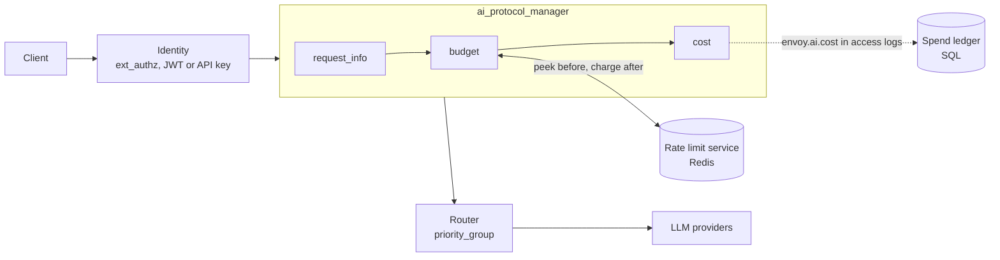
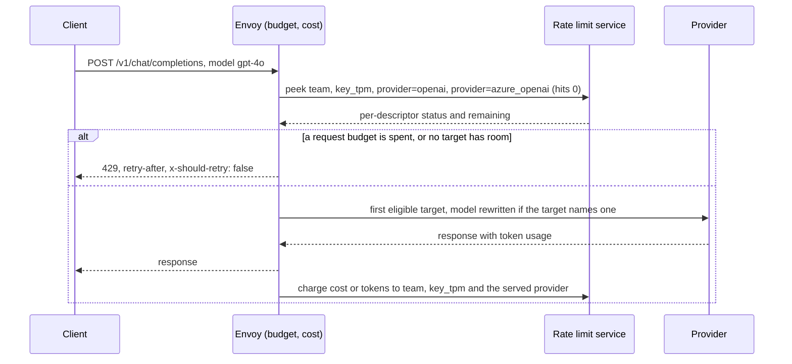
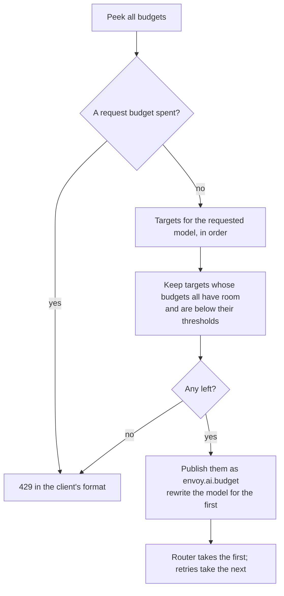

# Budget-based routing for AI traffic

Status: proposal, no code. Written against upstream/main `9c3d9aff1a`. Extension and field names
are proposals; everything not marked as new exists today.

Revision 2 (2026-10-06) is simpler and more general than revision 1. Budgets are now cost-weighted
rate limits on the existing rate limit service, so the dedicated budget service API and its
reference server are gone. One charging rule covers requests, tokens and money. Budget routing
publishes a plain list of eligible targets that general routing extensions consume. Section 9
lists what changed.

## Summary

Operators running Envoy as an LLM gateway want what LiteLLM and agentgateway offer: a price for
each model, budgets for keys, teams and providers, and traffic that stops or moves when a budget
runs out. The AI Protocol Manager (APM) already parses the request and extracts the token usage the
provider reports. What is missing is a price, a counter shared across Envoy instances, and a way
for a budget to choose the upstream.

The design splits the problem into three steps. Each one builds on a general Envoy mechanism, and
only the first knows about AI:

| Step | Question | Built on | New |
|---|---|---|---|
| Meter | What did this request cost? | token usage from APM | `cost` AI filter publishes `envoy.ai.cost` |
| Limit | May it run, and what is left? | rate limit descriptors in the rate limit service (RLS): check before, charge after | `budget` AI filter; the stock rate limit filter also works |
| Route | Where should it go? | the `priority_group` cluster specifier; the `quota_aware` load balancer (envoyproxy/envoy#47805, open) | `budget` publishes the targets that still have budget |



## 1. The user's view

### 1.1 Journeys

| | Journey | LiteLLM | agentgateway |
|---|---|---|---|
| J1 | Every request's cost reaches access logs, metrics and a ledger | cost tracking, `LiteLLM_SpendLogs` | cost catalog, `gen_ai` cost metric, UI analytics |
| J2 | A key, team, user or global budget per window; past it, a 429 | `max_budget`, `budget_duration` | per-key `budgets` (USD), token rate limits |
| J3 | One model from several providers, each with its own budget; spent providers are skipped | `provider_budget_config` | not found |
| J4 | A team past 80% of its monthly budget is served by a cheaper model until 100% | not found (`soft_budget` only alerts) | not found (conditional routing reads request attributes, not budget state) |
| J5 | Tokens per minute per key, with the same machinery as money | `tpm_limit` (separate feature) | rate limit `type: tokens` |

### 1.2 What the operator writes

A budget is a name and a subject. Its limit and window live in the rate limit service, the same
place as any other rate limit:

```yaml
- name: envoy.filters.http.ai_protocol_manager
  typed_config:
    "@type": type.googleapis.com/envoy.extensions.filters.http.ai_protocol_manager.v3.AiProtocolManager
    request_handling: {}
    response_handling: {token_usage: {}}
    filters:
    - name: envoy.http.ai_filters.request_info
      typed_config:
        "@type": type.googleapis.com/envoy.extensions.http.ai_filters.request_info.v3.RequestInfo
    - name: envoy.http.ai_filters.budget                # new
      typed_config:
        "@type": type.googleapis.com/envoy.extensions.http.ai_filters.budget.v3.Budget
        rate_limit_service:
          grpc_service: {envoy_grpc: {cluster_name: ratelimit}}
          transport_api_version: V3
        domain: llm
        budgets:                                        # checked and charged on every request
        - name: team                                    # money (the default)
          subject: "%DYNAMIC_METADATA(envoy.filters.http.ext_authz:team_id)%"
        - name: key_tpm                                 # tokens
          subject: "%DYNAMIC_METADATA(envoy.filters.http.ext_authz:key_id)%"
          charge: TOKENS
        models:                                         # budget routing, by requested model
          gpt-4o:
            targets:                                    # the first target with room wins
            - cluster: openai
              budgets: [{name: provider}, {name: team, below: {value: 80}}]
            - cluster: azure_openai
              budgets: [{name: provider}, {name: team, below: {value: 80}}]
            - cluster: openai
              model: gpt-4o-mini
    - name: envoy.http.ai_filters.cost                  # new
      typed_config:
        "@type": type.googleapis.com/envoy.extensions.http.ai_filters.cost.v3.Cost
        prices:                                         # per million tokens
          gpt-4o: {input: 2.50, cached_input: 1.25, output: 10.00}
          gpt-4o-mini: {input: 0.15, cached_input: 0.075, output: 0.60}
```

The limits, in the stock rate limit service (`envoyproxy/ratelimit`, backed by Redis). Each budget
is one descriptor, the budget's name as the key and its subject as the value. A target budget
without a subject (`provider` above) is counted per target cluster:

```yaml
domain: llm
descriptors:
- key: team                  # every team: $500 a month, in micro-dollars
  rate_limit: {unit: month, requests_per_unit: 500000000}
- key: key_tpm               # every key: 100k tokens a minute
  rate_limit: {unit: minute, requests_per_unit: 100000}
- key: provider
  value: openai              # $100 a day
  rate_limit: {unit: day, requests_per_unit: 100000000}
- key: provider
  value: azure_openai
  rate_limit: {unit: day, requests_per_unit: 50000000}
```

The route lets the existing `priority_group` specifier take the budget filter's order, and retries
the next target when a provider fails or answers 429:

```yaml
- match: {prefix: /v1/chat/completions}
  request_headers_to_remove: [accept-encoding]      # APM reads usage only from uncompressed bodies
  route:
    inline_cluster_specifier_plugin:
      extension:
        name: envoy.router.cluster_specifier_plugin.priority_group
        typed_config:
          "@type": type.googleapis.com/envoy.extensions.router.cluster_specifiers.priority_group.v3.PriorityGroupClusterSpecifier
          priority_groups:
          - {name: default, clusters: [{cluster_name: openai, weight: 1}]}
          override_metadata_namespace: envoy.ai.budget
    retry_policy:
      retry_on: "5xx,reset,connect-failure,retriable-status-codes"
      retriable_status_codes: [429]
      num_retries: 2
      refresh_cluster_on_retry: true
  typed_per_filter_config:
    envoy.filters.http.ai_protocol_manager:
      "@type": type.googleapis.com/envoy.extensions.filters.http.ai_protocol_manager.v3.AiProtocolManagerPerRoute
      request: {llm_protocol: OPENAI_CHAT_COMPLETIONS}
```

A per-key limit that lives in a database, as LiteLLM's `/key/generate` sets it, comes from the
identity step and overrides the configured limit for that request:

```yaml
- name: key
  subject: "%DYNAMIC_METADATA(envoy.filters.http.ext_authz:key_id)%"
  limit:
    amount: "%DYNAMIC_METADATA(envoy.filters.http.ext_authz:monthly_budget_micros)%"
    unit: MONTH
```

### 1.3 What the client sees

| Team `search` has spent | Result |
|---|---|
| under 80% | `gpt-4o` on OpenAI, or on Azure once OpenAI's daily budget is spent |
| 80% to 100% | `gpt-4o-mini`; the response's `model` field says so |
| 100% | a 429 in the client's own error format |

```
HTTP/1.1 429 Too Many Requests
content-type: application/json
retry-after: 2203200
x-should-retry: false

{"error": {"message": "Budget 'team' is spent until 2026-11-05T00:00:00Z.",
           "type": "insufficient_quota", "param": null, "code": "insufficient_quota"}}
```

`insufficient_quota` is what OpenAI returns for an exhausted billing quota. The OpenAI and Anthropic
SDKs retry a 429 unless the response carries `x-should-retry: false`, so the header keeps them from
retrying against a budget that will not clear for days.

## 2. Design

### 2.1 One charging rule

Every budget charges an amount for each request, chosen by `charge`:

| `charge` | Amount | Charged | Typical use |
|---|---|---|---|
| `COST` (default) | `envoy.ai.cost` in micro-units of the price currency | after the response | money per day or month |
| `TOKENS` | total tokens the provider reported | after the response | tokens per minute |
| `REQUESTS` | 1 | before the request | requests per minute |

Requests, tokens and money go through one code path: the same descriptors, the same check, the
same charge. agentgateway works the same way, debiting an expression over normalized usage for
every limit.

### 2.2 Two phases: peek, then charge



- **Peek.** One `ShouldRateLimit` call before routing carries every distinct descriptor of the
  request budgets and of the candidate targets, each with an explicit per-descriptor `hits_addend`
  of 0. `envoyproxy/ratelimit` treats that as a check that adds nothing. A request-level 0 would
  count as 1, so the per-descriptor value matters.
- **Charge.** One more call after the response adds the amount to each distinct descriptor that
  applied, fire-and-forget, the way the rate limit filter's `apply_on_stream_done` does it.
- **Overshoot.** Admission sees spend as of the peek, so a budget can be overspent by the cost of
  requests already running when it ran out: about concurrency × cost per request. LiteLLM without
  reservations and agentgateway behave the same way.
- **Audit.** A budget with `mode: AUDIT` is peeked and charged but never rejects or reroutes; a
  counter shows what enforcement would have done.

### 2.3 Budget routing: prune an ordered target list



- **Targets come from a model table**, like LiteLLM's `model_list` and agentgateway's
  `virtualModels` failover: the requested model maps to ordered targets, each a cluster with an
  optional upstream `model`. `"*"` matches any model not listed.
- **A target is eligible** when every budget it names has room and is under its `below`
  threshold. A target budget without a subject counts per target cluster, which is how provider
  budgets (J3) work. `below` on a request budget is the soft tier for J4; it is computed from the
  peek's `current_limit` and `limit_remaining`, which are exact while the limit fits the RLS's
  32-bit fields (3.5).
- **The output is one general signal**, dynamic metadata `envoy.ai.budget`:
  - `priority_groups`: one group per eligible target, in order, for the `priority_group` cluster
    specifier, whose override reads exactly this shape;
  - `candidates`: the eligible targets' ids, in the list shape the `quota_aware` load balancer in
    #47805 reads. Today a target id is a cluster name; `quota_aware` matches host ids inside one
    cluster, so it needs targets that name hosts (open question 2).

  The filter also sets the filter state `envoy.ai.budget.target` to the first target, for logs and
  response headers, and asks APM to refresh the route's cluster after the AI filters.
- **Retries walk the list.** With `refresh_cluster_on_retry`, the specifier picks the next group
  on each retry. Retrying on 5xx, connect failures and 429 by default means a provider failure does
  not fail the request. agentgateway's eviction fails the request that triggered it unless retries
  are also configured.
- **Model rewrite.** The MVP rewrites the body once, for the first target. A retry keeps that body,
  so the fallback list keeps only targets that send the same model. Per-attempt rewriting belongs
  in the upstream APM, alongside the model fallback work.

### 2.4 What the configuration compiles to

| The operator writes | Envoy uses |
|---|---|
| `budgets[].name`, `subject` | an RLS descriptor `(name, subject)` |
| a limit and window | the RLS config, or a per-request `limit` override |
| `charge: COST`, `TOKENS`, `REQUESTS` | the descriptor's `hits_addend` at charge time |
| `models.<model>.targets` | `envoy.ai.budget` metadata for `priority_group` or `quota_aware` |
| `prices` | `envoy.ai.cost`, readable as `%FILTER_STATE(envoy.ai.cost:PLAIN)%` |

Nothing below the first column is AI-specific, so a deployment can skip the budget filter. With
only the cost filter, two entries in the stock rate limit filter's own `rate_limits` (route-level
`rate_limits` ignore `hits_addend`) give a money budget (J2):

```yaml
rate_limits:
- actions: [{metadata: {descriptor_key: team, metadata_key: {key: envoy.filters.http.ext_authz, path: [{key: team_id}]}}}]
  hits_addend: {number: 0}                                         # peek before
- actions: [{metadata: {descriptor_key: team, metadata_key: {key: envoy.filters.http.ext_authz, path: [{key: team_id}]}}}]
  hits_addend: {format: "%FILTER_STATE(envoy.ai.cost:PLAIN)%"}     # charge after
  apply_on_stream_done: true
```

The budget filter adds what this pattern lacks: one place to declare budgets, routing, thresholds,
the model rewrite, and a rejection in the client's dialect.

## 3. Details

### 3.1 Pricing (`cost`)

```
uncached = max(0, input - cached - cache_creation)    # TokenUsage counts both inside input
cost     = ceil(uncached       * input
              + cached         * cached_input           # defaults to input
              + cache_creation * cache_write            # defaults to input
              + output         * output)                # output includes reasoning
```

- **Lookup.** Keys are tried in order: `<cluster>/<model>` for a provider-specific price, then
  `<model>`, then `default`. The served cluster is the one that answered. The model is the one in
  the request body after the AI filters ran, then the one the response reports, so a fallback is
  priced as the model that served it. Unpriced requests cost 0 and are counted, like agentgateway's
  lookup-status metric, so a budget that silently charges nothing is visible.
- **Missing usage.** A 2xx response can end without usable counts: the client cut the stream, the
  provider sent none, the body was compressed (APM reads only identity-encoded bodies, hence the
  `accept-encoding` removal in 1.2), or extraction failed and APM published a `FAILED` record.
  All are charged the input estimate (`estimated_input_tokens × input`) when `request_info` has
  `token_estimation`, and 0 otherwise.
- **OpenAI streams** report usage only with `stream_options.include_usage`. With
  `ensure_stream_usage` the cost filter sets it, as the transcoder already does for streams it sends
  to an OpenAI-shaped backend; the client then sees one extra chunk with an empty `choices`.
- **Untrusted counts.** Counts come from the upstream, hence the saturating subtraction and an
  optional `max_cost_per_request`.
- **The record.** `envoy.ai.cost` is a read-only filter state object. It prints as micro-units
  through `:PLAIN`. Its fields `micros`, `input_tokens`, `output_tokens`, `total_tokens`, `model`
  and `source` (`REPORTED`, `ESTIMATED`, `NONE`) are readable with `:FIELD:`, so access logs, the
  stats access logger and `hits_addend` all read the same numbers.

### 3.2 What gets charged

- Only a response that came from an upstream with a 2xx status (response code details
  `via_upstream`). Local replies, including the budget filter's own 429, and upstream errors are
  never charged; the completion hook still runs for them.
- Each descriptor once, even when a budget appears both in `budgets` and on the target.
- Under a subject only when every substitution in it has a value. A missing value would render as
  `-`, so callers without a key would share one counter. The budget does not apply instead, and is
  counted, the way a rate limit descriptor with a missing value is dropped.

### 3.3 Rejection

The reply is a 429 with `retry-after` (the peek's `duration_until_reset`), `x-should-retry: false`,
response code details `ai_budget_exhausted`, and the error body of the client's API:

| Client API | Body |
|---|---|
| OpenAI Chat Completions, Responses | `{"error": {"message": M, "type": "insufficient_quota", "param": null, "code": "insufficient_quota"}}` |
| Anthropic Messages | `{"type": "error", "error": {"type": "rate_limit_error", "message": M}}` |
| Gemini | `{"error": {"code": 429, "message": M, "status": "RESOURCE_EXHAUSTED"}}` |

`M` names the budget and when it resets, never the limit, the spend or the subject.

### 3.4 Failures

| Event | Behavior |
|---|---|
| The RLS fails or times out | `failure_mode_deny: false` (default) admits with every target in order; `true` replies 503 |
| A budget has no limit in the RLS | it never blocks |
| The model matches no `models` entry | request budgets only; the route is untouched |
| The served cluster matches no target | only request budgets are charged |
| A local reply or an upstream error | not charged |

Failing open matches the rate limit filter's default: a budget is a financial guardrail, and an
outage of the counter store should not take the gateway down.

### 3.5 Limits of the stock rate limit service

- `requests_per_unit` is `uint32`. Counted in micro-dollars, a limit tops out near $4,295 per
  window; tokens fit easily. Larger money budgets need an RLS with 64-bit limits. The protocol
  already carries a `uint64` per-descriptor `hits_addend`, so only the server changes.
- Windows are fixed and aligned to the Unix epoch, as in agentgateway. A month is 30 days unless
  the server runs with `USE_CALENDAR_MONTH_RATE_LIMIT`.
- Refunds (`is_negative_hits`) exist, which is what reservations need later (section 8).

### 3.6 Trust

- Subjects must come from something the client cannot forge: ext_authz metadata, JWT claims,
  `api_key_auth`'s forwarded client header (it overwrites the client's), or trusted filter state.
- Token counts are provider-reported, so a budget against an untrusted upstream can be gamed by it.
- The rate limit service is now a write path for money: use mTLS.

## 4. LiteLLM, agentgateway and this design

| | LiteLLM | agentgateway (v1.6.0) | This design |
|---|---|---|---|
| Model table | `model_list` | `llm.models`, `virtualModels` | `budget.models` and clusters |
| Prices | built-in map, USD per token | built-in catalog and overlays, per 1M tokens, context tiers | `cost.prices`, per 1M tokens, optional per cluster |
| Who a budget is for | key, team, user, end user, tag, provider, deployment | API key (USD); any CEL key for token limits | any subject a format string can build |
| Units | USD; tokens and requests separately | requests, tokens, USD | `REQUESTS`, `TOKENS`, `COST`, one path |
| Counters | Postgres, with Redis for cross-instance spend | memory, flushed to SQLite or Postgres; RLS for remote limits | any RLS, e.g. `envoyproxy/ratelimit` with Redis |
| Before and after | check, charge after; optional reservation | check, charge after; token estimate trued up | peek, charge after; refunds allow reservations later |
| Skip spent providers | yes | not found | yes |
| Cheaper model when a budget runs low | not found | not found | yes, `below` thresholds |
| Failover | fallbacks, cooldown on 429 | priority groups, eviction | priority groups, retries on 5xx and 429 |
| Rejection | 400, 401 or 429, varies | 429 and `Retry-After` | 429 in the client's dialect, `retry-after`, `x-should-retry` |

## 5. What exists today

- **APM** parses the body before later filters see the request and runs AI filters, which can
  await, rewrite the body and reject (`ai_filter.h`). `request_info` publishes the model as the
  `envoy.ai.model.request` filter state. Token usage is published at a clean end of stream as typed
  metadata `envoy.ai.token_usage`, never on a reset or non-2xx response.
- **Missing in APM:** a price, a hook that tells AI filters the stream completed (upstream filters
  never get `onStreamComplete()` either), a route refresh after the AI filters, and local replies
  with headers.
- **The RLS client** (`source/extensions/filters/common/ratelimit/`) already sends per-descriptor
  `hits_addend`, `is_negative_hits` and limit overrides, and returns per-descriptor statuses. The
  rate limit filter keeps its stream-done call alive past filter teardown (`OnStreamDoneCallBack`).
- **`priority_group`** re-selects on every `refreshRouteCluster()` and reads a per-request override
  from metadata; an override group needs weight 1 or it is ignored.
- **`envoyproxy/ratelimit`** peeks on an explicit per-descriptor 0, refunds negative hits, accepts
  per-request limit overrides, and has a `quota_mode` that returns the backends still under quota.

## 6. API sketches

```proto
package envoy.extensions.http.ai_filters.cost.v3;

// [#extension: envoy.http.ai_filters.cost]
message Cost {
  // Currency units per million tokens.
  message Price {
    double input = 1 [(validate.rules).double = {gte: 0}];
    double output = 2 [(validate.rules).double = {gte: 0}];
    // Default to input.
    google.protobuf.DoubleValue cached_input = 3;
    google.protobuf.DoubleValue cache_write = 4;
  }

  // Keyed by "<cluster>/<model>", "<model>" or "default".
  map<string, Price> prices = 1;

  // Sets stream_options.include_usage on OpenAI Chat Completions streaming requests.
  bool ensure_stream_usage = 2;

  // Caps one request's cost, in currency units.
  google.protobuf.DoubleValue max_cost_per_request = 3;
}
```

```proto
package envoy.extensions.http.ai_filters.budget.v3;

// [#extension: envoy.http.ai_filters.budget]
message Budget {
  enum Charge {
    COST = 0;
    TOKENS = 1;
    REQUESTS = 2;
  }

  enum Mode {
    ENFORCE = 0;
    AUDIT = 1;
  }

  message Limit {
    // Format string that yields the limit in the budget's units.
    string amount = 1 [(validate.rules).string = {min_len: 1}];
    type.v3.RateLimitUnit unit = 2 [(validate.rules).enum = {defined_only: true}];
  }

  message BudgetDef {
    // The RLS descriptor key.
    string name = 1 [(validate.rules).string = {min_len: 1}];
    // Format string for the descriptor value. If any substitution has no value, the budget does
    // not apply to the request.
    string subject = 2 [(validate.rules).string = {min_len: 1}];
    Charge charge = 3;
    Mode mode = 4;
    // Overrides the RLS limit for this request.
    Limit limit = 5;
  }

  message BudgetRef {
    // A request budget's name, or any other name for a budget counted per target cluster.
    string name = 1 [(validate.rules).string = {min_len: 1}];
    // Eligible while spend is below this share of the limit. Defaults to 100%.
    type.v3.Percent below = 2;
  }

  message Target {
    string cluster = 1 [(validate.rules).string = {min_len: 1}];
    // Replaces the request's model when this target serves the initial attempt.
    string model = 2;
    repeated BudgetRef budgets = 3;
  }

  message Targets {
    repeated Target targets = 1 [(validate.rules).repeated = {min_items: 1}];
  }

  config.ratelimit.v3.RateLimitServiceConfig rate_limit_service = 1
      [(validate.rules).message = {required: true}];
  string domain = 2 [(validate.rules).string = {min_len: 1}];
  bool failure_mode_deny = 3;

  // Checked and charged on every request.
  repeated BudgetDef budgets = 4;

  // Keyed by the requested model; "*" matches any model not listed.
  map<string, Targets> models = 5;
}
```

APM core, all small and useful beyond budgets:

- `AiFilter::onStreamComplete(const AiStreamCompletion&)`, a no-op by default, with the
  `StreamInfo` and the published `TokenUsage` (null when none). APM's `onStreamComplete()` calls it
  in reverse chain order, before the access log.
- A way for an AI filter to ask for `refreshRouteCluster()` after the chain, instead of the
  `refresh_route_cluster` knob on the `apm-refresh-route-cluster` branch, so routing works with no
  extra setting.
- `LocalReplier` takes extra headers, response code details and an error type; with a type and a
  known API, the body is that API's error JSON (3.3).

## 7. MVP breakdown

| # | PR | Scope | Unlocks |
|---|---|---|---|
| 1 | `ai_protocol_manager: add an AI filter stream-complete hook` | hook, call order; tests for reset, non-2xx and missing usage | 2, 5 |
| 2 | `ai_filters: add a cost filter` | prices, `envoy.ai.cost`, `ensure_stream_usage`, lookup stats | J1; J2 and J5 with the stock rate limit filter |
| 3 | `ai_protocol_manager: let AI filters refresh the route cluster` | builds on `apm-refresh-route-cluster` | 6 |
| 4 | `ai_protocol_manager: let AI filters reply with headers and a dialect error body` | `LocalReplier`, three error shapes | 5 |
| 5 | `ai_filters: add a budget filter` | budgets, `charge`, `mode`, limit override, peek and charge over the RLS client, 429, failure modes; integration test against a fake RLS | J2, J5 |
| 6 | `ai_filters: route by budget` | `models`, eligibility, `below`, `envoy.ai.budget`, model rewrite; integration test with `priority_group` and retries | J3, J4 |

There is no new service API and nothing to deploy besides the stock rate limit service and Redis.
PRs 1 and 2 are useful on their own; 3 and 4 can land in parallel with them.

## 8. After the MVP

- **Reservations.** Peek with the request's maximum cost as `hits_addend`, then settle the
  difference at completion with `is_negative_hits`. This closes most of the overshoot in 2.2 using
  the same protocol.
- **Per-attempt rewriting** of the model, path and credentials in the upstream APM, so a fallback
  can change the model. It is the same ordered target list the model fallback work needs.
- **Prices as data:** a price file through a `DataSource`, importable from LiteLLM's map or
  models.dev, with context-length tiers and service tiers.
- **A local cache of peek results**, so a busy subject stops costing one RLS call per request.
- **Generic HTTP form.** The budget filter's limit and route steps are not AI-specific. Once
  rewriting moves upstream, they could become an HTTP filter usable by any metered API.

## 9. What changed from revision 1

- **Counters:** a new `BudgetService` gRPC API with a reference server → the existing RLS protocol
  and `envoyproxy/ratelimit`.
- **Units:** money only → one `charge` rule for requests, tokens and money.
- **Configuration:** subjects repeated on every target, plus explicit `budgets` and `routing`
  lists → budgets named once and referenced by name, and a `models` map. The routing knob
  (`refresh_route_cluster`) is gone.
- **Routing output:** a `priority_group` override only → one `envoy.ai.budget` signal read by both
  `priority_group` and `quota_aware`.
- **Ledger:** `RecordSpend` rows → access logs that carry `envoy.ai.cost`.
- **Kept from revision 1:** the cost filter, the charging rules from its review (3.2), dialect
  rejections, and the three APM core hooks.

Considered and not chosen:

- **ext_authz plus access logs** only: works for J2 and J3 today, but cannot downgrade the model,
  and every operator rewrites pricing.
- **A dedicated budget service**, as in revision 1: worth adding only if the RLS protocol proves
  insufficient, for example for a per-request ledger written synchronously.

## 10. Open questions

1. Should the budget filter grow into a generic HTTP filter now, or after per-attempt rewriting
   exists upstream?
2. Targets name clusters. Should they also be able to name `quota_aware` host ids, for deployments
   that put every provider in one cluster?
3. Failure mode default: open, like the rate limit filter. agentgateway defaults to closed.
4. Rejection: 429 with OpenAI's `insufficient_quota`, or 402?
5. Should `cost` prices be a map keyed by `<cluster>/<model>`, or a list with explicit `cluster` and
   `models` fields?
