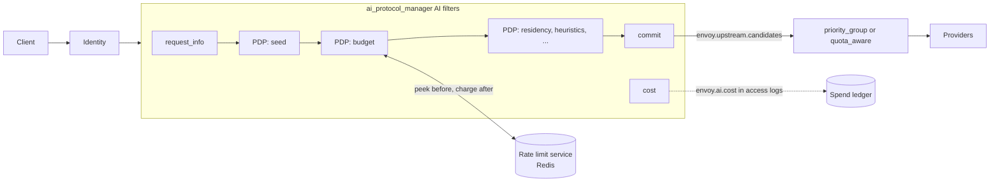
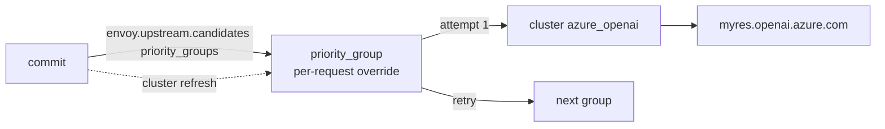
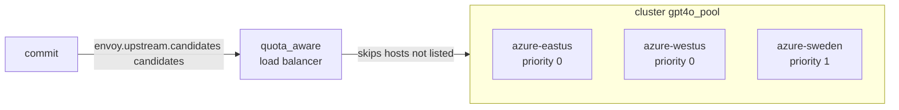

# Budget- and quota-based routing for AI traffic

Status: proposal, no code. Written against upstream/main `9c3d9aff1a`. Extension, field and filter
state names are proposals; everything not marked as new exists today.

Revision 4 (2026-10-06):

- The list of eligible targets is now a general object, `envoy.upstream.candidates`. Any policy
  decision point (PDP) can seed it, exclude from it or reorder it. Budget is one PDP; heuristic
  routing, data residency and external policy servers are others.
- The list is committed once, after the last AI filter, into the `priority_group` cluster specifier
  (envoyproxy/envoy#46640, merged; used unchanged) or the `quota_aware` load balancer
  (envoyproxy/envoy#47805, open).
- Budgets and quotas are still cost-weighted rate limits on the rate limit service (RLS).
- Section 5 lists what is stored where, and which calls sit on the request path.

## Summary

| Step | Question | Built on | New |
|---|---|---|---|
| Meter | What did this request cost? | token usage from APM | `cost` AI filter, filter state `envoy.ai.cost` |
| Limit | May it run, and what is left? | RLS descriptors: peek before, charge after | `budget` AI filter |
| Decide | Which targets may serve it? | — | filter state `envoy.upstream.candidates`, changed by any PDP |
| Route | Where does each attempt go? | `priority_group` (#46640) across clusters, `quota_aware` (#47805) across hosts | the commit that hands the list to them |

A budget is money over a long window; a quota is tokens or requests over a short one. Both are a
named counter for a subject, charged an amount per request.

## 1. Critical user journeys

### 1.1 Who

- **Platform admin**: runs the gateway, connects providers, sets prices and provider budgets.
- **Budget owner** (team lead, finance): gives teams and keys their limits and reads spend.
- **Developer**: calls the gateway with a key from an OpenAI, Anthropic or Gemini SDK.

### 1.2 The journeys

| CUJ | Who | Does | Sees | LiteLLM | agentgateway |
|---|---|---|---|---|---|
| 1. Connect providers and price models | admin | lists providers, models and prices once | requests reach providers; each has a cost | `model_list`, built-in price map | `llm.models`, model catalog |
| 2. Give a team a monthly budget | budget owner | sets $500/month for team `search` | team spend stops at $500 | team `max_budget`, `budget_duration` | not supported |
| 3. Issue a key with its own budget | budget owner | creates a key with $20/month | that key stops at $20 | `/key/generate` | per-key `budgets` |
| 4. Hit a budget | developer | keeps calling | a 429 their SDK understands, with when it resets; optionally the remaining budget on every response | 400/401/429, varies | 429, `Retry-After` |
| 5. Cap tokens per minute | admin | sets 100k tokens/min per key | bursts are throttled, not billed | `tpm_limit` | rate limit `type: tokens` |
| 6. Spread a model over providers or deployments with their own budgets or quotas | admin | gives OpenAI $100/day, Azure $50/day, or each deployment its TPM quota | exhausted ones are skipped; 429 only when all are | `provider_budget_config`, deployment budgets | failover on health only |
| 7. Downgrade near the limit | budget owner | asks for `gpt-4o-mini` once the team passes 80% | cheaper responses, no errors, until 100% | not found (`soft_budget` alerts) | not found |
| 8. See spend | budget owner | asks for spend by team and model | a ledger and a dashboard | `/spend/logs`, UI | cost metric, UI analytics |
| 9. Try a budget first | admin | adds a budget in dry-run | counts of what would have been blocked | none | `onBudgetExceeded: Audit` |
| 10. Keep a tenant in its region | admin | allows EU teams only EU deployments | EU traffic never leaves the EU, budgets still apply | `allowed_model_region` on keys | conditional routing on CEL |

CUJ 10 is not about budgets; it is here because it changes the same list. Every journey from 6 on
is "remove or reorder targets for this request, then route".

### 1.3 What Envoy has to provide

1. A price per model, and a cost per response (CUJ 1, 8).
2. Counters keyed by who pays, shared across Envoy instances, with limits from config or from the
   key's database row (CUJ 2, 3, 5).
3. A check before the request and a charge after it, in money, tokens or requests (CUJ 2-5).
4. A rejection in the client's dialect, with `retry-after` and `x-should-retry: false` (CUJ 4).
5. One list of candidate targets that several policies can narrow or reorder, and that routing
   then follows, including a switch to a cheaper model (CUJ 6, 7, 10).
6. Spend in access logs and metrics (CUJ 8), and a dry-run mode (CUJ 9).

## 2. Design overview



- **Identity** puts the caller in filter state (`envoy.ai.caller.*`, section 4).
- **`request_info`** (exists) publishes the requested model.
- **PDPs** change `envoy.upstream.candidates`, in chain order. The first one seeds it from a model
  table; later ones exclude or reorder. `budget` excludes targets out of budget and rejects when a
  request budget is spent.
- **The commit** runs once, after the last AI filter. It picks the model and hands the list to
  routing.
- **`cost`** prices the response at completion; `budget` charges it.

## 3. Upstream candidates

### 3.1 The object

`envoy.upstream.candidates` is a filter state object with life span `FilterChain`. PDPs may change
it until the commit, which seals it. It holds an ordered list:

| Field | Example | Meaning |
|---|---|---|
| `name` | `gpt-4o-azure` | unique in the list; how PDPs refer to a candidate |
| `id` | `azure_openai` | what routing matches: a cluster name, or a host's `envoy.lb.id` |
| `weight` | `1` | share within a priority group |
| `attributes` | `model: gpt-4o-mini` | free-form; `model` is the one the commit reads |
| `excluded` | `{by: budget, reason: "provider: spent"}` | set when a PDP removes it; empty means eligible |

PDPs never delete entries. They mark them excluded, with who and why, so the access log can answer
"why did this request go to Azure?":

```
%FILTER_STATE(envoy.upstream.candidates:PLAIN)%
gpt-4o-azure,gpt-4o-openai(budget: provider spent),gpt-4o-mini(budget: not needed)
```

### 3.2 What a PDP can do

| Operation | Rule | Example |
|---|---|---|
| seed | only if the list does not exist yet; the first seeder wins | a model table: `gpt-4o` → OpenAI, Azure, mini |
| exclude | mark a candidate, with a reason | budget: provider spent; residency: not in the EU |
| reorder | move eligible candidates; excluded ones stay excluded | heuristics: long prompts to the large-context target first |
| annotate | set an attribute | a PDP that maps `gpt-4o` to an Azure deployment name |

Who can be a PDP:

- **AI filters**, through the object's C++ interface: `budget`, heuristic routing, residency, a
  health or latency scorer.
- **HTTP filters before APM** that can set filter state (`set_filter_state`, dynamic modules). They
  can seed the list, since the object has a JSON factory.
- **Policy servers outside Envoy**, through an AI filter that calls them, such as the AI-native
  callout in #44681, and applies what they return.

### 3.3 The commit

After the last AI filter and before the body is serialized, APM commits the list once, if it exists:

1. It seals the object.
2. If nothing is eligible and no PDP has already replied, it replies 503 in the client's dialect.
   A PDP that excludes the last candidate for its own reason should reply itself; `budget` replies
   429.
3. It takes the first eligible candidate. If that candidate has a `model` attribute, it rewrites
   the body's model.
4. It keeps the eligible candidates that send the same model. The body is written once, so a retry
   cannot change the model.
5. It renders them into dynamic metadata `envoy.upstream.candidates`, in both shapes routing reads
   today:
   - `priority_groups`: one group per candidate, named by `name`, holding `id` at `weight`, for the
     `priority_group` override (#46640);
   - `candidates`: the ids, for `quota_aware` (#47805).

   It also sets `envoy.ai.backend.upstream` to the first id, for the `matcher` cluster specifier.
6. It asks for a route cluster refresh, so the first attempt follows the list.

Rendering into the metadata both consumers already read means neither has to change. Later, they
could read the object directly.

## 4. Filter state and metadata contract

Every key below has life span `FilterChain` (an internal redirect resets it) and is written by the
first writer only, except `envoy.upstream.candidates`, which PDPs change until the commit.

| Key | Kind | Written by, when | Read by | Holds |
|---|---|---|---|---|
| `envoy.ai.caller.key`, `.team`, `.user` | filter state, string | `set_filter_state` after the identity filter (convention, no new code) | `budget` subjects, access logs | who pays |
| `envoy.ai.model.request` (exists) | filter state, string | `request_info`, before the PDPs | seeding model tables, logs | the model the client asked for |
| `envoy.ai.request_info` (exists) | typed metadata | `request_info`, before the PDPs | `cost` estimate | `max_output_tokens`, `estimated_input_tokens` |
| `envoy.upstream.candidates` (new) | filter state, object | PDPs, then the commit | PDPs, logs | the candidates and who excluded what |
| `envoy.upstream.candidates` (new) | dynamic metadata | the commit | `priority_group`, `quota_aware` | the eligible candidates, rendered |
| `envoy.ai.backend.upstream` (new, shared) | filter state, string | the commit | the `matcher` cluster specifier, logs | the first eligible id |
| `envoy.ai.budget.decision` (new) | filter state, object | `budget` | logs, response headers | outcome, limiting budget, remaining, reset |
| `envoy.ai.token_usage` (exists) | typed metadata | APM, at a clean end of stream | the completion hook | token counts |
| `envoy.ai.cost` (new) | filter state, object | `cost`, at stream completion | `budget` charge, logs, stats, `hits_addend` | cost and tokens |
| `envoy.lb.id` (#47805) | host metadata | the cluster config | `quota_aware`, attribution | a deployment's id |

`envoy.ai.caller.*` is a naming convention, so budgets read the same keys whatever the identity
source:

```yaml
- name: envoy.filters.http.set_filter_state
  typed_config:
    "@type": type.googleapis.com/envoy.extensions.filters.http.set_filter_state.v3.Config
    on_request_headers:
    - object_key: envoy.ai.caller.team
      factory_key: envoy.string
      skip_if_empty: true
      format_string:
        omit_empty_values: true
        text_format_source: {inline_string: "%DYNAMIC_METADATA(envoy.filters.http.ext_authz:team_id)%"}
```

`envoy.ai.budget.decision` fields: `outcome` (`:PLAIN`; `ALLOWED`, `REROUTED`, `REJECTED`,
`AUDITED`, `FAILED_OPEN`), `budget`, `remaining`, `reset_seconds`. CUJ 4's remaining budget on
every response is a route header:
`x-ai-budget-remaining: %FILTER_STATE(envoy.ai.budget.decision:FIELD:remaining)%`.

`envoy.ai.cost` fields: `micros` (`:PLAIN`), `input_tokens`, `output_tokens`, `total_tokens`,
`model`, `source` (`REPORTED`, `ESTIMATED`, `NONE`).

## 5. Where state lives, and what is called per request

Envoy never speaks SQL or the Redis protocol. On the request path it makes gRPC calls: to the
rate limit service always, and to a key service only if one is used for identity.

| State | Stored in | Accessed by | Per request |
|---|---|---|---|
| budget and quota counters | Redis, behind the rate limit service (`envoyproxy/ratelimit`) | `budget` → RLS, gRPC | one peek before routing; one charge after the response, which the client does not wait for |
| limits | the RLS config, or a per-request override from identity metadata | RLS; the identity step | none extra |
| keys, teams, per-key limits (optional) | SQL, behind a key service | ext_authz → key service | one call, which the service can cache |
| prices | Envoy config | `cost` | none |
| candidates, decisions, cost | filter state, in memory | AI filters | none |
| spend ledger | SQL or a warehouse, fed by access logs | the access log sink, asynchronously | none |

For comparison:

- **LiteLLM** reads keys and spend from Postgres through an in-memory cache synced with Redis, and
  batches its spend writes.
- **agentgateway** keeps budget counters in memory and flushes them to SQLite or Postgres every 5
  seconds; its remote rate limits use the same RLS protocol as this design.

## 6. Design A: a cluster per provider, `priority_group` (#46640) unchanged

**When.** Providers differ in host, TLS, credential, path or API, as with OpenAI and Azure OpenAI.
This is how most Envoy configs already look, and #46640 was written for exactly this case. It is
the MVP.



### 6.1 Configuration

The route's own groups are the default when no list was committed, for example for a model nobody
seeded:

```yaml
- match: {prefix: /v1/chat/completions}
  request_headers_to_remove: [accept-encoding]        # APM reads usage only from uncompressed bodies
  response_headers_to_add:
  - header: {key: x-ai-budget-remaining, value: "%FILTER_STATE(envoy.ai.budget.decision:FIELD:remaining)%"}
  route:
    inline_cluster_specifier_plugin:
      extension:
        name: envoy.router.cluster_specifier_plugin.priority_group
        typed_config:
          "@type": type.googleapis.com/envoy.extensions.router.cluster_specifiers.priority_group.v3.PriorityGroupClusterSpecifier
          priority_groups:
          - {name: default, clusters: [{cluster_name: openai, weight: 1}]}
          override_metadata_namespace: envoy.upstream.candidates
    retry_policy:
      retry_on: "5xx,reset,connect-failure,retriable-status-codes"
      retriable_status_codes: [429]
      num_retries: 2
      refresh_cluster_on_retry: true
  typed_per_filter_config:
    envoy.filters.http.ai_protocol_manager:
      "@type": type.googleapis.com/envoy.extensions.filters.http.ai_protocol_manager.v3.AiProtocolManagerPerRoute
      request: {llm_protocol: OPENAI_CHAT_COMPLETIONS}
```

The AI filters. `budget` seeds the list from its `models` table when no earlier PDP has, and names
the budgets each candidate draws on:

```yaml
filters:
- name: envoy.http.ai_filters.request_info
  typed_config:
    "@type": type.googleapis.com/envoy.extensions.http.ai_filters.request_info.v3.RequestInfo
- name: envoy.http.ai_filters.budget
  typed_config:
    "@type": type.googleapis.com/envoy.extensions.http.ai_filters.budget.v3.Budget
    rate_limit_service: {grpc_service: {envoy_grpc: {cluster_name: ratelimit}}, transport_api_version: V3}
    domain: llm
    budgets:
    - name: team                                   # every request, in money
      subject: "%FILTER_STATE(envoy.ai.caller.team:PLAIN)%"
    - name: key_tpm                                # every request, in tokens (CUJ 5)
      subject: "%FILTER_STATE(envoy.ai.caller.key:PLAIN)%"
      charge: TOKENS
    - name: provider                               # per candidate id, in money (CUJ 6)
      scope: TARGET
    models:
      gpt-4o:
      - {name: gpt-4o-openai, id: openai, budgets: [{name: provider}, {name: team, below: {value: 80}}]}
      - {name: gpt-4o-azure, id: azure_openai, budgets: [{name: provider}, {name: team, below: {value: 80}}]}
      - {name: gpt-4o-mini, id: openai, model: gpt-4o-mini}     # CUJ 7
- name: envoy.http.ai_filters.cost
  typed_config:
    "@type": type.googleapis.com/envoy.extensions.http.ai_filters.cost.v3.Cost
    prices:
      gpt-4o: {input: 2.50, cached_input: 1.25, output: 10.00}
      gpt-4o-mini: {input: 0.15, cached_input: 0.075, output: 0.60}
```

The limits, in `envoyproxy/ratelimit`. A target-scoped budget's subject is the candidate's id, so
`provider` counts per cluster:

```yaml
domain: llm
descriptors:
- {key: team, rate_limit: {unit: month, requests_per_unit: 500000000}}       # $500, micro-dollars
- {key: key_tpm, rate_limit: {unit: minute, requests_per_unit: 100000}}      # 100k tokens
- {key: provider, value: openai, rate_limit: {unit: day, requests_per_unit: 100000000}}
- {key: provider, value: azure_openai, rate_limit: {unit: day, requests_per_unit: 50000000}}
```

### 6.2 Walk-through

Team `search` has spent $300 of $500 (60%); OpenAI has used its whole daily budget.

| # | Component | Does | `envoy.upstream.candidates` after |
|---|---|---|---|
| 1 | HCM | matches the route; with no override yet, `priority_group` picks `default` (`openai`), provisionally | — |
| 2 | identity, `set_filter_state` | resolves the caller into `envoy.ai.caller.*` | — |
| 3 | `request_info` | publishes `envoy.ai.model.request = gpt-4o` | — |
| 4 | `budget` | seeds from `models.gpt-4o` | openai, azure, mini |
| 5 | `budget` | one RLS peek, `hits_addend` 0: `team=search`, `key_tpm=k1`, `provider=openai`, `provider=azure_openai` | — |
| 6 | `budget` | excludes `gpt-4o-openai` (provider spent) and `gpt-4o-mini` (a premium target is eligible); writes `envoy.ai.budget.decision = REROUTED` | azure; openai and mini excluded |
| 7 | other PDPs, if any | e.g. residency excludes non-EU candidates | — |
| 8 | commit | first eligible is `gpt-4o-azure`, model unchanged; renders `priority_groups = [gpt-4o-azure: azure_openai]` and `candidates = [azure_openai]`; asks for a cluster refresh | sealed |
| 9 | `priority_group` | re-selects with the override; attempt 1 → `azure_openai` | — |
| 10 | router | sends the request | — |
| 11 | `cost` | at stream completion, prices the response into `envoy.ai.cost` | — |
| 12 | `budget` | one RLS charge: `team=search`, `key_tpm=k1`, `provider=azure_openai` | — |
| 13 | access log | writes the ledger row, including the candidates and why each was excluded | — |

At 84% instead, both premium candidates fail their `below` threshold, the commit's first eligible
candidate is `gpt-4o-mini`, the body's model becomes `gpt-4o-mini`, and `priority_group` picks
`openai`.

### 6.3 Retries, failures, attribution

- A retry (5xx, reset, connect failure, 429) refreshes the cluster again; `priority_group` takes
  the next override group, and the last one repeats.
- Cross-cluster retries are off with per-try-timeout hedging, and the first cluster's circuit
  breakers still apply (`router.cc:858`, `doRetry()`).
- If the RLS is unreachable, `failure_mode_deny: false` excludes nothing and records `FAILED_OPEN`;
  `true` replies 503.
- Override clusters are not validated at load, so an unknown id fails with "no cluster"; the commit
  counts ids that name no known cluster.
- The served candidate is the committed candidate whose id is the stream's upstream cluster at
  completion. `budget` charges the request budgets plus that candidate's target budgets, each
  descriptor once, only for a 2xx response from an upstream.

## 7. Design B: one cluster of deployments, `quota_aware` (#47805)

**When.** Many deployments of one API share a path and a credential, and each has its own budget or
quota. Examples: Azure OpenAI deployments in several regions behind one Entra ID token, Bedrock in
several regions behind one IAM role, or a pool of vLLM replicas. The providers' own TPM quotas are
the usual reason: Envoy skips a deployment before it starts answering 429.



### 7.1 Configuration

The deployments are endpoints of one cluster. `envoy.lb.id` names each for `quota_aware`;
`transport_socket_matches` gives each its own SNI; the route's `auto_host_rewrite` sets `Host`
from the endpoint's `hostname`:

```yaml
- name: gpt4o_pool
  type: STRICT_DNS
  load_balancing_policy:
    policies:
    - typed_extension_config:
        name: envoy.load_balancing_policies.quota_aware               # envoyproxy/envoy#47805
        typed_config:
          "@type": type.googleapis.com/envoy.extensions.load_balancing_policies.quota_aware.v3.QuotaAware
          metadata_namespace: envoy.upstream.candidates
          candidates_key: candidates
          fallback_policy:
            policies:
            - typed_extension_config:
                name: envoy.load_balancing_policies.round_robin
                typed_config:
                  "@type": type.googleapis.com/envoy.extensions.load_balancing_policies.round_robin.v3.RoundRobin
  load_assignment:
    cluster_name: gpt4o_pool
    endpoints:
    - priority: 0
      lb_endpoints:
      - endpoint:
          address: {socket_address: {address: eastus.example.openai.azure.com, port_value: 443}}
          hostname: eastus.example.openai.azure.com
        metadata:
          filter_metadata:
            envoy.lb: {id: azure-eastus}
            envoy.transport_socket_match: {deployment: azure-eastus}
      # azure-westus: the same at priority 0; azure-sweden at priority 1
  transport_socket_matches:
  - name: azure-eastus
    match: {deployment: azure-eastus}
    transport_socket:
      name: envoy.transport_sockets.tls
      typed_config:
        "@type": type.googleapis.com/envoy.extensions.transport_sockets.tls.v3.UpstreamTlsContext
        sni: eastus.example.openai.azure.com
```

The route needs no cluster specifier. Retries try another eligible host, then the next priority:

```yaml
route:
  cluster: gpt4o_pool
  auto_host_rewrite: true
  retry_policy:
    retry_on: "5xx,reset,connect-failure,retriable-status-codes"
    retriable_status_codes: [429]
    num_retries: 2
    retry_host_predicate:
    - name: envoy.retry_host_predicates.previous_hosts
      typed_config:
        "@type": type.googleapis.com/envoy.extensions.retry.host.previous_hosts.v3.PreviousHostsPredicate
    retry_priority:
      name: envoy.retry_priorities.previous_priorities
      typed_config:
        "@type": type.googleapis.com/envoy.extensions.retry.priority.previous_priorities.v3.PreviousPrioritiesConfig
        update_frequency: 1
```

In the budget filter the candidate ids are host ids, and the deployment quotas are in tokens:

```yaml
budgets:
- name: team
  subject: "%FILTER_STATE(envoy.ai.caller.team:PLAIN)%"
- name: deployment_tpm                    # per candidate id, in tokens (CUJ 6)
  scope: TARGET
  charge: TOKENS
models:
  gpt-4o:
  - {name: eastus, id: azure-eastus, budgets: [{name: deployment_tpm}]}
  - {name: westus, id: azure-westus, budgets: [{name: deployment_tpm}]}
  - {name: sweden, id: azure-sweden, budgets: [{name: deployment_tpm}]}
```

```yaml
domain: llm
descriptors:
- {key: deployment_tpm, value: azure-eastus, rate_limit: {unit: minute, requests_per_unit: 450000}}
- {key: deployment_tpm, value: azure-westus, rate_limit: {unit: minute, requests_per_unit: 450000}}
- {key: deployment_tpm, value: azure-sweden, rate_limit: {unit: minute, requests_per_unit: 300000}}
```

### 7.2 Walk-through

East US has used its tokens for this minute.

| # | Component | Does |
|---|---|---|
| 1 | HCM | matches the route; the cluster `gpt4o_pool` is final |
| 2-4 | identity, `request_info`, `budget` | as in 6.2; `budget` seeds eastus, westus and sweden |
| 5 | `budget` | peeks `team=search` and `deployment_tpm` for the three hosts; excludes `eastus` |
| 6 | commit | renders `candidates = [azure-westus, azure-sweden]`; no cluster refresh is needed |
| 7 | router | host selection: `quota_aware` skips East US, so priority 0 has only West US |
| 8 | router, on retry | `previous_priorities` moves to priority 1, where Sweden is listed |
| 9 | `cost`, `budget` | price, then charge `team=search` and `deployment_tpm=<served host's envoy.lb.id>` |

### 7.3 What one cluster cannot do yet

- **Different providers in one cluster.** Hosts would need their own credential, path and model.
  `credential_injector` works per cluster, and the body is rewritten once, before host selection.
  Per-attempt rewriting in the upstream APM, from host metadata, would close this. It is the same
  work the model fallback track needs.
- **`quota_aware` itself** is an open PR (#47805).
- **Downgrade (CUJ 7)** works only when the cheaper model's hosts are in the same cluster.

## 8. A or B

| | A: a cluster per provider | B: one cluster of deployments |
|---|---|---|
| Fits | different providers | many deployments of one API |
| Consumer | `priority_group` (#46640, merged, unchanged) | `quota_aware` (#47805, open) |
| Rendered shape | `priority_groups` | `candidates` |
| Candidate ids | cluster names | host `envoy.lb.id` |
| When the list is applied | the cluster refresh after the commit, then every retry | every host selection |
| Credential, TLS, path | per cluster | shared; SNI per host via `transport_socket_matches` |
| Downgrade | yes | only within the cluster |
| Attribution | served cluster | served host's `envoy.lb.id` |

The PDPs and the commit are the same in both; only the ids differ. The two also combine: a cluster
in A can itself be a B pool.

## 9. Budget details

### 9.1 Charging rule

| `charge` | Amount | When |
|---|---|---|
| `COST` (default) | `envoy.ai.cost` micros | after the response |
| `TOKENS` | `total_tokens` | after the response |
| `REQUESTS` | 1 | at the peek |

`scope: REQUEST` (default) budgets are checked and charged on every request. `scope: TARGET` budgets
are checked for every candidate that names them, are counted per candidate id unless the reference
gives a `subject`, and are charged only for the candidate that served. `mode: AUDIT` peeks and
charges, but never excludes or rejects (CUJ 9).

### 9.2 Peek and charge

- The peek is one `ShouldRateLimit` call with every distinct descriptor and an explicit
  per-descriptor `hits_addend` of 0. `envoyproxy/ratelimit` treats that as a check. A request-level
  0 would count as 1.
- The charge is one more call after the response, fire-and-forget, kept alive past filter teardown
  the way the rate limit filter's `OnStreamDoneCallBack` does it.
- `below` thresholds use the peek's `current_limit` and `limit_remaining`.

### 9.3 What gets charged

- Only a 2xx response that came from an upstream. Local replies and upstream errors cost nothing.
- Each descriptor once, even when a budget is both a request budget and named by the candidate.
- A budget whose subject has a substitution without a value does not apply and is counted, as a rate
  limit descriptor with a missing value is dropped.
- Usage that is missing on a 2xx response (cut stream, no usage sent, compressed body, a `FAILED`
  record) is charged the input estimate when `request_info` estimates tokens, and 0 otherwise.

### 9.4 Pricing

`cost = max(0, input - cached - cache_creation) × input + cached × cached_input +
cache_creation × cache_write + output × output`, rounded up to a micro-unit. Prices are per million
tokens. Lookup tries `<cluster>/<model>`, `<model>`, then `default`, using the served cluster and
the model actually sent, so a fallback is priced as what served it. Unpriced requests cost 0 and are
counted. `ensure_stream_usage` adds `stream_options.include_usage` to OpenAI Chat streams;
`max_cost_per_request` caps one inflated usage report.

### 9.5 Rejection

A 429 with `retry-after` (the blocking budget's reset), `x-should-retry: false`, response code
details `ai_budget_exhausted`, and the client's error shape: OpenAI `insufficient_quota`, Anthropic
`rate_limit_error`, Gemini `RESOURCE_EXHAUSTED`. The message names the budget and its reset time,
never the limit, the spend or the subject.

### 9.6 How firm a budget is, and the stock RLS

- Admission sees spend as of the peek, so a budget can be overspent by the requests already
  running when it ran out: about concurrency × cost per request. Reservations (section 12) close
  most of it.
- `requests_per_unit` is 32-bit: a money budget tops out near $4,295 per window in micro-dollars,
  and tokens fit easily. Larger budgets need an RLS with 64-bit limits; the protocol already
  carries a 64-bit per-descriptor `hits_addend`.
- Windows are fixed and aligned to the Unix epoch. A month is 30 days unless the server runs with
  `USE_CALENDAR_MONTH_RATE_LIMIT`.
- Subjects come from identity filters, not client headers; token counts are provider-reported; the
  RLS is a write path for money, so use mTLS to it.

## 10. API sketches

The candidates object, for PDPs inside Envoy:

```cpp
// Filter state envoy.upstream.candidates. Changed by PDPs until the commit seals it.
class UpstreamCandidates : public StreamInfo::FilterState::Object {
public:
  struct Candidate {
    std::string name;
    std::string id;
    uint32_t weight{1};
    absl::flat_hash_map<std::string, std::string> attributes;
    std::string excluded_by; // Empty while eligible.
    std::string reason;
  };

  // Returns false once sealed.
  bool exclude(absl::string_view name, absl::string_view by, absl::string_view reason);
  bool moveToFront(absl::string_view name);
  bool setAttribute(absl::string_view name, absl::string_view key, absl::string_view value);

  const std::vector<Candidate>& candidates() const;
  bool sealed() const;
};
```

Its JSON form, for `set_filter_state` and for logs, is the list of candidates with the fields of
3.1.

The budget filter:

```proto
package envoy.extensions.http.ai_filters.budget.v3;

// [#extension: envoy.http.ai_filters.budget]
message Budget {
  enum Charge {
    COST = 0;
    TOKENS = 1;
    REQUESTS = 2;
  }

  enum Scope {
    // Checked and charged on every request.
    REQUEST = 0;
    // Checked for the candidates that name it; counted per candidate id.
    TARGET = 1;
  }

  enum Mode {
    ENFORCE = 0;
    AUDIT = 1;
  }

  message Limit {
    // Format string that yields the limit in the budget's unit.
    string amount = 1 [(validate.rules).string = {min_len: 1}];
    type.v3.RateLimitUnit unit = 2 [(validate.rules).enum = {defined_only: true}];
  }

  message BudgetDef {
    // The RLS descriptor key.
    string name = 1 [(validate.rules).string = {min_len: 1}];
    // Format string for the descriptor value. Required for REQUEST budgets.
    string subject = 2;
    Charge charge = 3;
    Scope scope = 4;
    Mode mode = 5;
    // Overrides the RLS limit for this request, e.g. from the key's database row.
    Limit limit = 6;
  }

  message BudgetRef {
    string name = 1 [(validate.rules).string = {min_len: 1}];
    // Eligible while spend is below this share of the limit. Defaults to 100%.
    type.v3.Percent below = 2;
    // For a TARGET budget: the descriptor value. Defaults to the candidate id.
    string subject = 3;
  }

  message Candidate {
    // Unique among the model's candidates; how this filter finds a candidate seeded elsewhere.
    string name = 1 [(validate.rules).string = {min_len: 1}];
    // A cluster name for priority_group, or a host's envoy.lb.id for quota_aware.
    string id = 2;
    // Model to send when this candidate is first; becomes the model attribute.
    string model = 3;
    repeated BudgetRef budgets = 4;
  }

  message Candidates {
    repeated Candidate candidates = 1 [(validate.rules).repeated = {min_items: 1}];
  }

  config.ratelimit.v3.RateLimitServiceConfig rate_limit_service = 1
      [(validate.rules).message = {required: true}];
  string domain = 2 [(validate.rules).string = {min_len: 1}];
  bool failure_mode_deny = 3;
  repeated BudgetDef budgets = 4;
  // Keyed by the requested model; "*" matches any model not listed. Seeds
  // envoy.upstream.candidates when no earlier PDP has, and names each candidate's budgets either
  // way.
  map<string, Candidates> models = 5;
}
```

The `cost` filter is unchanged from revision 2: a `prices` map keyed by `<cluster>/<model>`,
`<model>` or `default`, `ensure_stream_usage`, and `max_cost_per_request`.

## 11. MVP breakdown

| # | PR | Scope | Unlocks |
|---|---|---|---|
| 1 | `ai_protocol_manager: add an AI filter stream-complete hook` | hook with the final usage | 2, 5 |
| 2 | `ai_filters: add a cost filter` | `envoy.ai.cost` | CUJ 1, 8; money and token caps with the stock rate limit filter |
| 3 | `ai_protocol_manager: add upstream candidates and their commit` | `envoy.upstream.candidates`, seal, model rewrite, rendering for `priority_group` and `quota_aware`, cluster refresh | 6, any other PDP |
| 4 | `ai_protocol_manager: let AI filters reply with headers and a dialect error body` | `LocalReplier` | 5 |
| 5 | `ai_filters: add a budget filter` | budgets, `charge`, `scope`, `mode`, limit override, peek and charge, `envoy.ai.budget.decision` | CUJ 2-5, 9 |
| 6 | `ai_filters: make the budget filter a candidates PDP` | `models` seed, exclusion with reasons, `below` thresholds, attribution by served cluster or host | CUJ 6, 7 |

Design A needs nothing beyond these: #46640 is merged and used as is. Design B also needs #47805.
Other PDPs, such as heuristic routing or residency (CUJ 10), plug into PR 3 without touching the
budget filter.

## 12. After the MVP

- **Reservations**: peek with the request's maximum cost, settle the difference with
  `is_negative_hits`.
- **Per-attempt upstream rewriting** of model, path and credential from the candidate or host
  metadata. It lets a fallback change the model, and lets one cluster hold different providers.
- **Consumers that read the object directly**, instead of rendered metadata. The DFP host list in
  #47424 could be a third rendering.
- **Prices as data**, from a file, importable from LiteLLM's map or models.dev, with context tiers.
- **A local cache of peek results** for busy subjects.

## 13. Open questions

1. Name and home of the candidates object: generic (`envoy.upstream.candidates`, in a common
   library any filter can use) as proposed, or AI-scoped (`envoy.ai.upstream.candidates`)?
2. Who commits: APM at the end of the AI chain, as proposed, or an explicit last AI filter?
3. Should the seed live in its own small model-table filter, as agentgateway's `virtualModels` and
   LiteLLM's `model_list` do, rather than in whichever PDP runs first?
4. Failure mode default: open, like the rate limit filter, or closed, like agentgateway?
5. Rejection: 429 with `insufficient_quota`, or 402?
