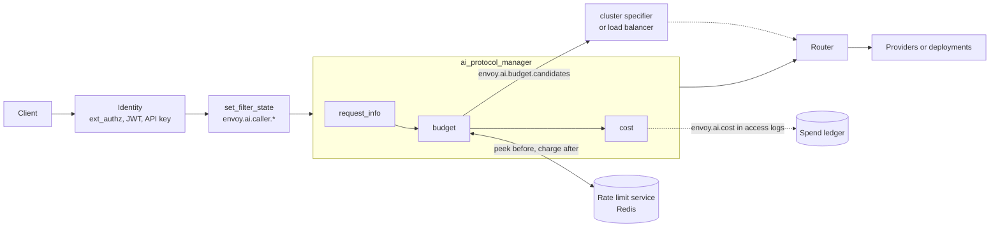
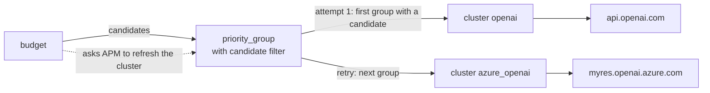
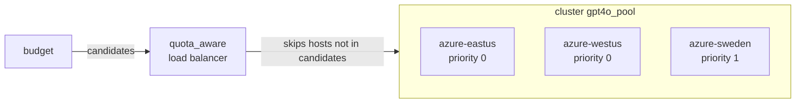

# Budget- and quota-based routing for AI traffic

Status: proposal, no code. Written against upstream/main `9c3d9aff1a`. Extension, field and filter
state names are proposals; everything not marked as new exists today.

Revision 3 (2026-10-06) starts from the critical user journeys (CUJs) that LiteLLM and agentgateway
serve. It then gives the end-to-end Envoy design for two topologies — a cluster per provider, then
one cluster of deployments — and the filter state each step reads and writes. The mechanism is
revision 2's: budgets and quotas are cost-weighted rate limits on the rate limit service (RLS).

## Summary

| Step | Question | Built on | New |
|---|---|---|---|
| Meter | What did this request cost? | token usage from APM | `cost` AI filter, filter state `envoy.ai.cost` |
| Limit | May it run, and what is left? | RLS descriptors: peek before, charge after | `budget` AI filter, filter state `envoy.ai.budget.decision` |
| Route | Where should it go? | across clusters, the `priority_group` cluster specifier; across hosts, the `quota_aware` load balancer (envoyproxy/envoy#47805, open) | metadata `envoy.ai.budget.candidates`, and a candidate filter on `priority_group` |

The budget filter decides **eligibility**: which targets still have budget, and which model to send.
The route decides **order and failover**: the cluster specifier across clusters, the load balancer
across hosts. Both read one list, `candidates`, so the producer does not care about the topology.

A budget is money over a long window; a quota is tokens or requests over a short one. Both are the
same object here: a named counter for a subject, charged an amount per request.

## 1. Critical user journeys

### 1.1 Who

- **Platform admin**: runs the gateway, connects providers, sets prices and provider budgets.
- **Budget owner** (team lead, finance): gives teams and keys their limits and reads spend.
- **Developer**: calls the gateway with a key from an OpenAI, Anthropic or Gemini SDK.

### 1.2 The journeys

| CUJ | Who | Does | Sees | LiteLLM | agentgateway |
|---|---|---|---|---|---|
| 1. Connect providers and price models | admin | lists providers, models and prices once | requests reach providers; each has a cost | `model_list`, built-in price map | `llm.models`, model catalog |
| 2. Give a team a monthly budget | budget owner | sets $500/month for team `search` | team spend stops at $500 | team `max_budget`, `budget_duration` | not supported |
| 3. Issue a key with its own budget | budget owner | creates a key with $20/month | that key stops at $20 | `/key/generate` | per-key `budgets` |
| 4. Hit a budget | developer | keeps calling | a 429 their SDK understands, with when it resets; optionally the remaining budget on every response | 400/401/429, varies | 429, `Retry-After` |
| 5. Cap tokens per minute | admin | sets 100k tokens/min per key | bursts are throttled, not billed | `tpm_limit` | rate limit `type: tokens` |
| 6. Spread a model over providers or deployments with their own budgets or quotas | admin | gives OpenAI $100/day, Azure $50/day, or each deployment its TPM quota | exhausted ones are skipped; 429 only when all are | `provider_budget_config`, deployment budgets, TPM routing | failover on health only |
| 7. Downgrade near the limit | budget owner | asks for `gpt-4o-mini` once the team passes 80% | cheaper responses, no errors, until 100% | not found (`soft_budget` alerts) | not found |
| 8. See spend | budget owner | asks for spend by team and model | a ledger and a dashboard | `/spend/logs`, UI | cost metric, UI analytics |
| 9. Try a budget first | admin | adds a budget in dry-run | counts of what would have been blocked | none | `onBudgetExceeded: Audit` |

### 1.3 What Envoy has to provide

1. A price per model, and a cost per response (CUJ 1, 8).
2. Counters keyed by who pays, shared across Envoy instances, with limits from config or from the
   key's database row (CUJ 2, 3, 5).
3. A check before the request and a charge after it, in money, tokens or requests (CUJ 2-5).
4. A rejection in the client's dialect, with `retry-after` and `x-should-retry: false` (CUJ 4).
5. Routing that skips targets out of budget and can switch to a cheaper model (CUJ 6, 7).
6. Spend in access logs and metrics (CUJ 8), and a dry-run mode (CUJ 9).

## 2. Design overview



- **Identity** puts the caller in filter state (`envoy.ai.caller.*`, section 3).
- **`request_info`** (exists) publishes the requested model.
- **`budget`** peeks every budget that applies in one RLS call. It then rejects, or publishes the
  eligible targets as `candidates` and rewrites the model if needed. After the response it charges
  in one more call.
- **`cost`** prices the response and publishes `envoy.ai.cost`.
- **Routing** skips anything not in `candidates`: `priority_group` across clusters (section 4),
  `quota_aware` across hosts (section 5).

## 3. Filter state and metadata contract

Every key below has life span `FilterChain` (an internal redirect resets it), is read-only once set,
and is written by the first writer only. The routing output is dynamic metadata because its
consumers, the cluster specifier and the load balancer, read dynamic metadata.

| Key | Kind | Written by, when | Read by | Holds |
|---|---|---|---|---|
| `envoy.ai.caller.key`, `.team`, `.user` | filter state, string | `set_filter_state` after the identity filter (convention, no new code) | `budget` subjects, access logs | who pays |
| `envoy.ai.model.request` (exists) | filter state, string | `request_info`, before routing | `budget` model table, logs | the model the client asked for |
| `envoy.ai.request_info` (exists) | typed metadata | `request_info`, before routing | `cost` estimate | `max_output_tokens`, `estimated_input_tokens` |
| `envoy.ai.budget.decision` (new) | filter state, object | `budget`, before routing | logs, response headers | the outcome of the check |
| `envoy.ai.budget` (new) | dynamic metadata | `budget`, before routing | `priority_group` (section 4), `quota_aware` (section 5) | `candidates`: the eligible target ids |
| `envoy.ai.backend.upstream` (new, shared) | filter state, string | `budget`, before routing | the `matcher` cluster specifier, logs | the first eligible target |
| `envoy.ai.token_usage` (exists) | typed metadata | APM, at a clean end of stream | the completion hook | token counts |
| `envoy.ai.cost` (new) | filter state, object | `cost`, at stream completion | `budget` charge, logs, stats, `hits_addend` | the cost and tokens |
| `envoy.lb.id` (#47805) | host metadata | the cluster config | `quota_aware`, `budget` attribution | a deployment's id |

### 3.1 `envoy.ai.caller.*`

A naming convention, so budgets read the same keys whatever the identity source:

```yaml
- name: envoy.filters.http.set_filter_state
  typed_config:
    "@type": type.googleapis.com/envoy.extensions.filters.http.set_filter_state.v3.Config
    on_request_headers:
    - object_key: envoy.ai.caller.team
      factory_key: envoy.string
      skip_if_empty: true
      format_string:
        omit_empty_values: true
        text_format_source: {inline_string: "%DYNAMIC_METADATA(envoy.filters.http.ext_authz:team_id)%"}
```

The value must come from an identity filter, never from a client header.

### 3.2 `envoy.ai.budget.decision`

| Field | Example | Meaning |
|---|---|---|
| `outcome` (`:PLAIN`) | `ALLOWED`, `REROUTED`, `REJECTED`, `AUDITED`, `FAILED_OPEN` | what the check decided |
| `budget` | `team` | the budget that limited the request: the one that blocked it, or the tightest |
| `remaining` | `79500000` | that budget's remaining amount, in its unit |
| `reset_seconds` | `2203200` | until its window resets |
| `model` | `gpt-4o-mini` | the model the request is sent with |

CUJ 4's "remaining budget on every response" is a route response header:
`x-ai-budget-remaining: %FILTER_STATE(envoy.ai.budget.decision:FIELD:remaining)%`.

### 3.3 `envoy.ai.budget`

```yaml
envoy.ai.budget:
  candidates: [openai, azure_openai]
```

A target id is what the consumer matches: a cluster name for `priority_group`, a host's
`envoy.lb.id` for `quota_aware`. The list holds only targets that send the same model, because the
body is rewritten once, before routing. Its order is the budget filter's preference; the consumer
keeps its own order and only drops what is missing.

### 3.4 `envoy.ai.backend.upstream`

The same key as the heuristic routing design: one target name that the `matcher` cluster specifier
maps to a cluster, for routing without fallback (section 4.6). The budget filter writes the first
candidate. The key is first-writer-wins, so with a feature-based router in the same chain the
order matters: `budget` first for eligibility, then a selector over `candidates` (open question 2).

### 3.5 `envoy.ai.cost`

| Field | Example | Meaning |
|---|---|---|
| `micros` (`:PLAIN`) | `4750` | cost in micro-units of the price currency |
| `input_tokens`, `output_tokens`, `total_tokens` | `1200`, `300`, `1500` | the counts that were priced |
| `model` | `gpt-4o` | the model that was priced |
| `source` | `REPORTED`, `ESTIMATED`, `NONE` | where the counts came from |

## 4. Design A: a cluster per provider, chosen by a cluster specifier

**When.** Providers differ in host, TLS, credential, path or API, as with OpenAI and Azure OpenAI.
This is how most Envoy configs already look, and it is the MVP.



### 4.1 Which cluster specifier

| Option | Order comes from | Fallback on retry | Change |
|---|---|---|---|
| `priority_group` with a candidate filter (recommended) | the route's groups and weights | yes | new option, below |
| `priority_group` with today's override | the budget filter, as `priority_groups` metadata | yes | none |
| `matcher` on `envoy.ai.backend.upstream` | the budget filter, first candidate only | no | none |

The candidate filter is a general addition to `priority_group`, not tied to AI. For each selection —
the first attempt and every retry — it drops clusters missing from a per-request list, drops groups
left empty, and takes the group for this attempt from what remains. Weights apply among the
remaining clusters of a group:

```proto
// New field on envoy.extensions.router.cluster_specifiers.priority_group.v3.PriorityGroupClusterSpecifier.
message Candidates {
  // Dynamic metadata namespace holding the list, e.g. envoy.ai.budget.
  string metadata_namespace = 1 [(validate.rules).string = {min_len: 1}];
  // Key of the list in that namespace. Defaults to "candidates".
  string key = 2;
  // With no list in the request: false selects as if every cluster were listed.
  bool fail_closed_on_missing = 3;
}

Candidates candidates = 5;
```

The same list from a different producer works too. The stock rate limit filter with
`envoyproxy/ratelimit` in `quota_mode` returns `passedBackends`, which this option can read from
`envoy.filters.http.ratelimit`.

### 4.2 Configuration

The route owns the clusters, their order and their weights:

```yaml
- match: {prefix: /v1/chat/completions}
  request_headers_to_remove: [accept-encoding]        # APM reads usage only from uncompressed bodies
  response_headers_to_add:
  - header: {key: x-ai-budget-remaining, value: "%FILTER_STATE(envoy.ai.budget.decision:FIELD:remaining)%"}
  route:
    inline_cluster_specifier_plugin:
      extension:
        name: envoy.router.cluster_specifier_plugin.priority_group
        typed_config:
          "@type": type.googleapis.com/envoy.extensions.router.cluster_specifiers.priority_group.v3.PriorityGroupClusterSpecifier
          priority_groups:
          - {name: primary, clusters: [{cluster_name: openai, weight: 1}]}
          - {name: secondary, clusters: [{cluster_name: azure_openai, weight: 1}]}
          candidates: {metadata_namespace: envoy.ai.budget}     # new
    retry_policy:
      retry_on: "5xx,reset,connect-failure,retriable-status-codes"
      retriable_status_codes: [429]
      num_retries: 2
      refresh_cluster_on_retry: true
  typed_per_filter_config:
    envoy.filters.http.ai_protocol_manager:
      "@type": type.googleapis.com/envoy.extensions.filters.http.ai_protocol_manager.v3.AiProtocolManagerPerRoute
      request: {llm_protocol: OPENAI_CHAT_COMPLETIONS}
```

Each provider cluster carries its own TLS SNI and an upstream `credential_injector`. The budget
filter owns eligibility and the model, and names targets by cluster:

```yaml
filters:
- name: envoy.http.ai_filters.request_info
  typed_config:
    "@type": type.googleapis.com/envoy.extensions.http.ai_filters.request_info.v3.RequestInfo
- name: envoy.http.ai_filters.budget
  typed_config:
    "@type": type.googleapis.com/envoy.extensions.http.ai_filters.budget.v3.Budget
    rate_limit_service: {grpc_service: {envoy_grpc: {cluster_name: ratelimit}}, transport_api_version: V3}
    domain: llm
    route_cache_action: REFRESH_CLUSTER
    budgets:
    - name: team                                   # every request, in money
      subject: "%FILTER_STATE(envoy.ai.caller.team:PLAIN)%"
    - name: key_tpm                                # every request, in tokens (CUJ 5)
      subject: "%FILTER_STATE(envoy.ai.caller.key:PLAIN)%"
      charge: TOKENS
    - name: provider                               # per target, in money (CUJ 6)
      scope: TARGET
    models:
      gpt-4o:
        targets:                                   # premium while the team is under 80%
        - {id: openai, budgets: [{name: provider}, {name: team, below: {value: 80}}]}
        - {id: azure_openai, budgets: [{name: provider}, {name: team, below: {value: 80}}]}
        - {id: openai, model: gpt-4o-mini}         # CUJ 7
- name: envoy.http.ai_filters.cost
  typed_config:
    "@type": type.googleapis.com/envoy.extensions.http.ai_filters.cost.v3.Cost
    prices:
      gpt-4o: {input: 2.50, cached_input: 1.25, output: 10.00}
      gpt-4o-mini: {input: 0.15, cached_input: 0.075, output: 0.60}
```

The limits, in `envoyproxy/ratelimit`. A target-scoped budget's subject is the target id, so
`provider` counts per cluster:

```yaml
domain: llm
descriptors:
- {key: team, rate_limit: {unit: month, requests_per_unit: 500000000}}       # $500, micro-dollars
- {key: key_tpm, rate_limit: {unit: minute, requests_per_unit: 100000}}      # 100k tokens
- {key: provider, value: openai, rate_limit: {unit: day, requests_per_unit: 100000000}}
- {key: provider, value: azure_openai, rate_limit: {unit: day, requests_per_unit: 50000000}}
```

### 4.3 Walk-through

Team `search` has spent $300 of $500 (60%), and OpenAI has used its whole daily budget.

| # | Component | Reads | Does | Writes |
|---|---|---|---|---|
| 1 | HCM | request headers | matches the route; with no list yet, `priority_group` picks `primary` (`openai`), provisionally | — |
| 2 | ext_authz, `set_filter_state` | the key | resolves the caller | `envoy.ai.caller.key`, `.team` |
| 3 | `request_info` | body | publishes the model | `envoy.ai.model.request = gpt-4o` |
| 4 | `budget` | caller keys, model | one RLS peek: `team=search`, `key_tpm=k1`, `provider=openai`, `provider=azure_openai`, all with `hits_addend` 0 | — |
| 5 | `budget` | peek statuses | `openai` is over its provider budget; `azure_openai` is eligible and serves `gpt-4o`, so the mini target is not needed | `envoy.ai.budget.candidates = [azure_openai]`, `envoy.ai.budget.decision` (`REROUTED`), `envoy.ai.backend.upstream = azure_openai` |
| 6 | `cost` | body | looks up the price of `gpt-4o` | — |
| 7 | APM | the refresh request | after the last AI filter, calls `refreshRouteCluster()`; `primary` has no candidate, so `priority_group` takes `secondary` | — |
| 8 | router | cluster | sends attempt 1 to `azure_openai` | — |
| 9 | APM, `cost` | token usage | at stream completion, prices the response | `envoy.ai.cost` |
| 10 | `budget` | `envoy.ai.cost`, served cluster | one RLS charge: `team=search`, `key_tpm=k1`, `provider=azure_openai` | — |
| 11 | access log | all of the above | writes the ledger row | — |

At 84% instead, both premium targets fail their `below` threshold. The candidates become `[openai]`
for the mini target, the body's model becomes `gpt-4o-mini`, and `priority_group` picks `primary`.

### 4.4 Retries and failures

- A retry (5xx, reset, connect failure, 429) makes the router refresh the cluster; `priority_group`
  takes the next group that still has a candidate, and the last one repeats.
- Cross-cluster retries are off with per-try-timeout hedging, and the first cluster's circuit
  breakers still apply (`router.cc:858`, `doRetry()`).
- If the RLS is unreachable, `failure_mode_deny: false` admits with every target's id as a
  candidate (outcome `FAILED_OPEN`); `true` replies 503.

### 4.5 Charging and attribution

The served target is the candidate whose id is the stream's upstream cluster at completion; a
cross-cluster retry updates that cluster. `budget` charges the request budgets plus the served
target's budgets, each descriptor once, and only for a 2xx response from an upstream.

### 4.6 Without fallback

With the `matcher` cluster specifier over `envoy.matching.inputs.filter_state` on
`envoy.ai.backend.upstream`, the first candidate selects a single cluster and retries stay on it.
This is the heuristic routing design's wiring.

## 5. Design B: one cluster of deployments, chosen by the load balancer

**When.** Many deployments of one API share a path and a credential, and each has its own budget or
quota. Examples: Azure OpenAI deployments in several regions behind one Entra ID token, Bedrock in
several regions behind one IAM role, or a pool of vLLM replicas. The providers' own TPM quotas are
the usual reason: Envoy skips a deployment before it starts answering 429.



### 5.1 Configuration

The deployments are endpoints of one cluster. `envoy.lb.id` names each one for `quota_aware`.
`transport_socket_matches` gives each its own SNI, and the route's `auto_host_rewrite` sets `Host`
from the endpoint's `hostname`:

```yaml
- name: gpt4o_pool
  type: STRICT_DNS
  load_balancing_policy:
    policies:
    - typed_extension_config:
        name: envoy.load_balancing_policies.quota_aware               # envoyproxy/envoy#47805
        typed_config:
          "@type": type.googleapis.com/envoy.extensions.load_balancing_policies.quota_aware.v3.QuotaAware
          metadata_namespace: envoy.ai.budget
          candidates_key: candidates
          fallback_policy:
            policies:
            - typed_extension_config:
                name: envoy.load_balancing_policies.round_robin
                typed_config:
                  "@type": type.googleapis.com/envoy.extensions.load_balancing_policies.round_robin.v3.RoundRobin
  load_assignment:
    cluster_name: gpt4o_pool
    endpoints:
    - priority: 0
      lb_endpoints:
      - endpoint:
          address: {socket_address: {address: eastus.example.openai.azure.com, port_value: 443}}
          hostname: eastus.example.openai.azure.com
        metadata:
          filter_metadata:
            envoy.lb: {id: azure-eastus}
            envoy.transport_socket_match: {deployment: azure-eastus}
      # azure-westus: the same at priority 0; azure-sweden at priority 1
  transport_socket_matches:
  - name: azure-eastus
    match: {deployment: azure-eastus}
    transport_socket:
      name: envoy.transport_sockets.tls
      typed_config:
        "@type": type.googleapis.com/envoy.extensions.transport_sockets.tls.v3.UpstreamTlsContext
        sni: eastus.example.openai.azure.com
```

The route needs no cluster specifier. Retries try another eligible host, then the next priority:

```yaml
route:
  cluster: gpt4o_pool
  auto_host_rewrite: true
  retry_policy:
    retry_on: "5xx,reset,connect-failure,retriable-status-codes"
    retriable_status_codes: [429]
    num_retries: 2
    retry_host_predicate:
    - name: envoy.retry_host_predicates.previous_hosts
      typed_config:
        "@type": type.googleapis.com/envoy.extensions.retry.host.previous_hosts.v3.PreviousHostsPredicate
    retry_priority:
      name: envoy.retry_priorities.previous_priorities
      typed_config:
        "@type": type.googleapis.com/envoy.extensions.retry.priority.previous_priorities.v3.PreviousPrioritiesConfig
        update_frequency: 1
```

The budget filter's target ids are now host ids, and the deployment quotas are in tokens:

```yaml
budgets:
- name: team
  subject: "%FILTER_STATE(envoy.ai.caller.team:PLAIN)%"
- name: deployment_tpm                    # per target, in tokens (CUJ 6)
  scope: TARGET
  charge: TOKENS
models:
  gpt-4o:
    targets:
    - {id: azure-eastus, budgets: [{name: deployment_tpm}]}
    - {id: azure-westus, budgets: [{name: deployment_tpm}]}
    - {id: azure-sweden, budgets: [{name: deployment_tpm}]}
```

```yaml
domain: llm
descriptors:
- {key: deployment_tpm, value: azure-eastus, rate_limit: {unit: minute, requests_per_unit: 450000}}
- {key: deployment_tpm, value: azure-westus, rate_limit: {unit: minute, requests_per_unit: 450000}}
- {key: deployment_tpm, value: azure-sweden, rate_limit: {unit: minute, requests_per_unit: 300000}}
```

### 5.2 Walk-through

East US has used its tokens for this minute.

| # | Component | Reads | Does | Writes |
|---|---|---|---|---|
| 1 | HCM | request headers | matches the route; the cluster `gpt4o_pool` is final | — |
| 2-3 | identity, `request_info` | key, body | as in 4.3 | `envoy.ai.caller.*`, `envoy.ai.model.request` |
| 4 | `budget` | caller keys, model | one RLS peek: `team=search`, and `deployment_tpm` for the three hosts | — |
| 5 | `budget` | peek statuses | East US is over; West US and Sweden are eligible | `envoy.ai.budget.candidates = [azure-westus, azure-sweden]`, `envoy.ai.budget.decision` (`REROUTED`) |
| 6 | router | cluster | host selection; `quota_aware` drops East US, so priority 0 has only West US | — |
| 7 | router, on retry | — | host selection again; `previous_priorities` moves to priority 1, where Sweden is a candidate | — |
| 8 | APM, `cost`, `budget` | usage, served host's `envoy.lb.id` | prices, then charges `team=search` and `deployment_tpm=<served host>` | `envoy.ai.cost` |

No route refresh is needed: the list is applied at every host selection, retries included.

### 5.3 What one cluster cannot do yet

- **Different providers in one cluster.** Hosts would need their own credential, path and model.
  `credential_injector` works per cluster, and the body is rewritten once, before host selection.
  Per-attempt rewriting in the upstream APM, from host metadata, would close this. It is the same
  work the model fallback track needs.
- **`quota_aware` itself** is an open PR (#47805).
- **Downgrade (CUJ 7)** works only when the cheaper model's hosts are in the same cluster; the list
  then holds only those hosts.

## 6. A or B

| | A: a cluster per provider | B: one cluster of deployments |
|---|---|---|
| Fits | different providers | many deployments of one API |
| Who orders and fails over | the cluster specifier (`priority_group`) | the load balancer (priorities, then `quota_aware`'s fallback policy) |
| Target ids in `candidates` | cluster names | host `envoy.lb.id` |
| When the list is applied | at the cluster refresh after the AI filters, and at every retry | at every host selection |
| New pieces besides the AI filters | the candidate filter on `priority_group`; an AI-filter cluster refresh | `quota_aware` (#47805) |
| Credential, TLS, path | per cluster | shared; SNI per host via `transport_socket_matches` |
| Downgrade | yes | only within the cluster |
| Attribution | served cluster | served host's `envoy.lb.id` |

The budget filter is the same in both; only the ids change. They also combine: a cluster in A can
itself be a B pool.

## 7. Shared details

### 7.1 Charging rule

| `charge` | Amount | When |
|---|---|---|
| `COST` (default) | `envoy.ai.cost` micros | after the response |
| `TOKENS` | `total_tokens` | after the response |
| `REQUESTS` | 1 | at the peek |

`scope: REQUEST` (default) budgets are checked and charged on every request. `scope: TARGET` budgets
are checked only through a target that names them, are counted per target id unless the reference
gives a `subject`, and are charged only for the target that served. `mode: AUDIT` peeks and charges
but never blocks or reroutes (CUJ 9).

### 7.2 Peek and charge

- The peek is one `ShouldRateLimit` call with every distinct descriptor and an explicit
  per-descriptor `hits_addend` of 0. `envoyproxy/ratelimit` treats that as a check. A request-level
  0 would count as 1.
- The charge is one more call after the response, fire-and-forget, kept alive past filter teardown
  the way the rate limit filter's `OnStreamDoneCallBack` does it.
- `below` thresholds use the peek's `current_limit` and `limit_remaining`.

### 7.3 What gets charged

- Only a 2xx response that came from an upstream. Local replies and upstream errors cost nothing.
- Each descriptor once, even when a budget is both a request budget and named by the target.
- A budget whose subject has a substitution without a value does not apply and is counted, as a rate
  limit descriptor with a missing value is dropped.
- Usage that is missing on a 2xx response (cut stream, no usage sent, compressed body, a `FAILED`
  record) is charged the input estimate when `request_info` estimates tokens, and 0 otherwise.

### 7.4 Pricing

`cost = max(0, input - cached - cache_creation) × input + cached × cached_input +
cache_creation × cache_write + output × output`, rounded up to a micro-unit. Prices are per million
tokens. Lookup tries `<cluster>/<model>`, `<model>`, then `default`, using the served cluster and the
model actually sent (or reported), so a fallback is priced as what served it. Unpriced requests
cost 0 and are counted. `ensure_stream_usage` adds `stream_options.include_usage` to OpenAI Chat
streams, and `max_cost_per_request` caps a single inflated usage report.

### 7.5 Rejection

A 429 with `retry-after` (the blocking budget's reset), `x-should-retry: false`, response code
details `ai_budget_exhausted`, and the client's error shape: OpenAI `insufficient_quota`, Anthropic
`rate_limit_error`, Gemini `RESOURCE_EXHAUSTED`. The message names the budget and its reset time,
never the limit, the spend or the subject.

### 7.6 How firm a budget is

Admission sees spend as of the peek, so a budget can be overspent by the requests already running
when it ran out: about concurrency × cost per request. Reservations (section 10) close most of it.

### 7.7 The stock rate limit service

- `requests_per_unit` is 32-bit: a money budget tops out near $4,295 per window in micro-dollars,
  and tokens fit easily. Larger budgets need an RLS with 64-bit limits; the protocol already carries
  a 64-bit per-descriptor `hits_addend`.
- Windows are fixed and aligned to the Unix epoch. A month is 30 days unless the server runs with
  `USE_CALENDAR_MONTH_RATE_LIMIT`.

### 7.8 Trust

Subjects come from identity filters, not client headers. Token counts are provider-reported. The
RLS is a write path for money, so use mTLS to it.

## 8. API sketches

```proto
package envoy.extensions.http.ai_filters.budget.v3;

// [#extension: envoy.http.ai_filters.budget]
message Budget {
  enum Charge {
    COST = 0;
    TOKENS = 1;
    REQUESTS = 2;
  }

  enum Scope {
    // Checked and charged on every request.
    REQUEST = 0;
    // Checked through the targets that name it; counted per target.
    TARGET = 1;
  }

  enum Mode {
    ENFORCE = 0;
    AUDIT = 1;
  }

  message Limit {
    // Format string that yields the limit in the budget's unit.
    string amount = 1 [(validate.rules).string = {min_len: 1}];
    type.v3.RateLimitUnit unit = 2 [(validate.rules).enum = {defined_only: true}];
  }

  message BudgetDef {
    // The RLS descriptor key.
    string name = 1 [(validate.rules).string = {min_len: 1}];
    // Format string for the descriptor value. Required for REQUEST budgets.
    string subject = 2;
    Charge charge = 3;
    Scope scope = 4;
    Mode mode = 5;
    // Overrides the RLS limit for this request, e.g. from the key's database row.
    Limit limit = 6;
  }

  message BudgetRef {
    string name = 1 [(validate.rules).string = {min_len: 1}];
    // Eligible while spend is below this share of the limit. Defaults to 100%.
    type.v3.Percent below = 2;
    // For a TARGET budget: the descriptor value. Defaults to the target id.
    string subject = 3;
  }

  message Target {
    // What routing matches: a cluster name for priority_group, a host's envoy.lb.id for
    // quota_aware.
    string id = 1 [(validate.rules).string = {min_len: 1}];
    // Replaces the request's model when this target is the first candidate.
    string model = 2;
    repeated BudgetRef budgets = 3;
  }

  message Targets {
    repeated Target targets = 1 [(validate.rules).repeated = {min_items: 1}];
  }

  config.ratelimit.v3.RateLimitServiceConfig rate_limit_service = 1
      [(validate.rules).message = {required: true}];
  string domain = 2 [(validate.rules).string = {min_len: 1}];
  bool failure_mode_deny = 3;
  repeated BudgetDef budgets = 4;
  // Keyed by the requested model; "*" matches any model not listed.
  map<string, Targets> models = 5;
  // From the AI filter route-cache work; REFRESH_CLUSTER for design A.
  type.ai.v3.RouteCache.Action route_cache_action = 6;
  // Where the candidate list is written. Defaults to "envoy.ai.budget".
  string metadata_namespace = 7;
}
```

The `cost` filter is unchanged from revision 2: a `prices` map keyed by `<cluster>/<model>`,
`<model>` or `default`, `ensure_stream_usage`, and `max_cost_per_request`.

## 9. MVP breakdown

| # | PR | Scope | Unlocks |
|---|---|---|---|
| 1 | `ai_protocol_manager: add an AI filter stream-complete hook` | hook with the final usage | 2, 5 |
| 2 | `ai_filters: add a cost filter` | `envoy.ai.cost` | CUJ 1, 8; money and token caps with the stock rate limit filter |
| 3 | AI filter cluster refresh | the heuristic routing work's `route_cache_action` | 6 |
| 4 | `ai_protocol_manager: let AI filters reply with headers and a dialect error body` | `LocalReplier` | 5 |
| 5 | `ai_filters: add a budget filter` | budgets, `charge`, `scope`, `mode`, limit override, peek and charge, `envoy.ai.budget.decision` | CUJ 2-5, 9 |
| 6 | `ai_filters: route by budget` | `models`, targets, `below`, `candidates`, model rewrite, attribution by served cluster or host | CUJ 6, 7 |
| 7 | `priority_group: skip clusters missing from a per-request candidate list` | the candidate filter | design A |

Design A ships with PR 7. Until it lands, the filter can also write today's `priority_groups`
override, with its own order instead of the route's. Design B needs only #47805 besides PRs 1-6.

## 10. After the MVP

- **Reservations**: peek with the request's maximum cost, settle the difference with
  `is_negative_hits`.
- **Per-attempt upstream rewriting** of model, path and credential from cluster or host metadata.
  It lets a fallback change the model, and lets one cluster hold different providers.
- **Prices as data**, from a file, importable from LiteLLM's map or models.dev, with context tiers.
- **A local cache of peek results** for busy subjects.

## 11. Open questions

1. `envoy.ai.caller.*`: a documented convention only, or keys the budget filter reads by name, e.g.
   `subject: {caller: TEAM}`?
2. Composition with heuristic routing: does a feature-based selector run after `budget` and pick
   among `candidates`, owning `envoy.ai.backend.upstream`?
3. The candidate filter: an option on `priority_group`, as proposed, or a standalone cluster
   specifier mirroring `quota_aware`?
4. Failure mode default: open, like the rate limit filter, or closed, like agentgateway?
5. Rejection: 429 with `insufficient_quota`, or 402?
