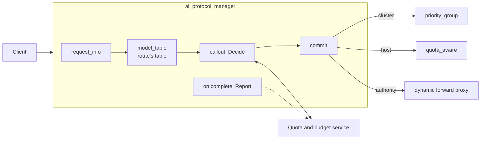
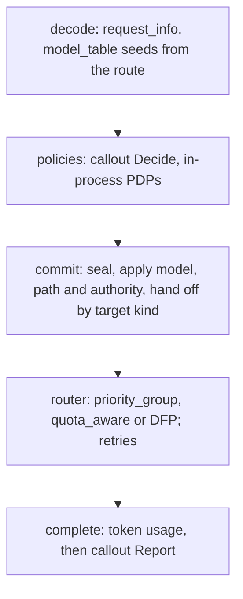

# Budget- and quota-based routing for AI traffic

Status: proposal, no code. Written against upstream/main `9c3d9aff1a`. Extension, field and filter
state names are proposals; everything not marked as new exists today.

Revision 7 (2026-10-07):

- **The model list belongs to the route, not to an AI filter.** `model_table` keeps the seeding
  logic, but reads its table from per-route config, a new general way to configure any AI filter
  per route. A listener-level table remains as a default.
- **Each candidate says what it targets:** a `cluster`, a `host` in a cluster, or an `authority`
  for a dynamic forward proxy (DFP) cluster. The commit hands each kind to the matching routing
  mechanism.
- **One configuration covers three topologies:** several provider clusters, one DFP cluster, and a
  single provider.

Kept from revision 6: the limit check is an APM callout (`Decide` before routing, `Report` after the
response) to a quota and budget service that owns keys, budgets, prices and the ledger.

## Summary



| | Envoy | Quota and budget service |
|---|---|---|
| Owns | parsing; per-route model lists; candidates; routing; token usage; rejections in the client's API | keys, budgets, limits, windows, prices, reservations, the spend ledger |
| Per request | one `Decide` before routing, one `Report` after the response | answers `Decide`, records `Report` |
| Config | per route: which targets serve which model; once: where the service is | all policy |

## 1. Critical user journeys

| CUJ | Who | Does | Sees | LiteLLM | agentgateway |
|---|---|---|---|---|---|
| 1. Connect providers and price models | admin | lists models and the providers that serve them; sets prices in the service | requests reach providers; each has a cost | `model_list`, price map | `llm.models`, model catalog |
| 2. Give a team a monthly budget | budget owner | sets $500/month for team `search` | team spend stops at $500 | team `max_budget` | not supported |
| 3. Issue a key with its own budget and models | budget owner | creates a key with $20/month and two allowed models | that key stops at $20; other models are refused | `/key/generate`, key `models` | per-key `budgets`, `allowedModels` |
| 4. Hit a limit | developer | keeps calling | a 429 their SDK understands, with when it resets | 400/401/429, varies | 429, `Retry-After` |
| 5. Cap tokens per minute | admin | sets 100k tokens/min per key | bursts are throttled | `tpm_limit` | rate limit `type: tokens` |
| 6. Spread a model over providers or servers with their own budgets or quotas | admin | gives OpenAI $100/day and Azure $50/day, or each vLLM server its own token quota | a spent target is skipped; a failing one is retried on the next | `provider_budget_config`, fallbacks | failover on health only |
| 7. Downgrade near the limit | budget owner | asks for `gpt-4o-mini` once the team passes 80% | cheaper responses, no errors, until 100% | not found | not found |
| 8. See spend | budget owner | asks for spend by team and model | a ledger and a dashboard | `/spend/logs`, UI | cost metric, UI |
| 9. Try a limit first | admin | adds an org-wide cap in dry-run | what would have been blocked | none | `Audit` |
| 10. Keep a tenant in its region | admin | allows EU teams only EU deployments | EU traffic stays in the EU | `allowed_model_region` | conditional routing |
| 11. Budget a single provider | admin | puts budgets on an Anthropic-only route | the same limits, with no routing choice | key budgets | per-key `budgets` |

Policy (CUJs 2-5 and 7-11) lives in the service. Envoy config changes only when targets change
(CUJs 1, 6).

## 2. Envoy design

### 2.1 One lifecycle, four records



| Record | Holds | Produced by | Status |
|---|---|---|---|
| `envoy.ai.request_info` (typed metadata) | API, model, stream, `max_output_tokens`, `estimated_input_tokens` | `request_info` | exists |
| `envoy.ai.caller` (filter state) | key, user, team, org, end user, attributes | an identity filter, or the callout from `Decide` | new |
| `envoy.ai.upstream.candidates` (filter state) | where the request may go, and who excluded what | `model_table`, then policies; sealed by the commit | new |
| `envoy.ai.token_usage` (typed metadata) | the usage the provider reported | APM, at a clean end of stream | exists |

### 2.2 Where the model list lives

| Home | Scope | Updated through | Beside the routing it drives | Verdict |
|---|---|---|---|---|
| The AI filter's own config | every route on the listener | the listener (or ECDS) | no; cluster names live in two places | a default only |
| **Per-route AI filter config** | one route | RDS | yes: beside the cluster specifier, retry policy and timeouts | **the table** |
| Cluster metadata | one provider | CDS | partly: what a cluster serves, not the order | per-provider facts, later |
| The cluster specifier's config | one route | RDS | yes | no: specifiers run before the body is parsed, and AI filters cannot read their config |

The list is routing data: which upstreams may serve this route's models, and in what order. Envoy
keeps routing data in the route. There it is scoped per API, per virtual host or tenant, and updated
through RDS without touching listeners. The seeding logic is AI work, though: it needs the parsed
model and must run before the policies. So `model_table` stays an AI filter and takes its table from
the route.

That needs one general APM capability: per-route config for AI filters, keyed by filter name, as
`typed_per_filter_config` does for HTTP filters. The callout and the transcoder can use it later the
same way.

### 2.3 Candidates and target kinds

`envoy.ai.upstream.candidates` is an ordered list. Every candidate names exactly one target, and all
candidates for one model use the same kind:

| Field | Example | Meaning |
|---|---|---|
| `name` | `azure` | unique in the list; defaults to the target |
| `cluster` / `host` / `authority` | `azure_openai`, `azure-eastus`, `vllm-a.internal:8000` | the target, one kind per list |
| `weight` | `1` | share within a group |
| `model`, `path` | `gpt-4o-mini`, `/openai/v1/chat/completions` | sent instead of the client's when this candidate is first |
| `llm_protocol` | `ANTHROPIC_MESSAGES` | the upstream API, for the transcoder's dynamic target work |
| `attributes` | `region: eu` | free-form, for policies |
| `excluded` | `{by: callout, reason: "provider budget spent"}` | empty while eligible |

Policies exclude with a reason, reorder, or annotate. They never delete, so
`%FILTER_STATE(envoy.ai.upstream.candidates:PLAIN)%` in an access log says why a request went where
it did.

### 2.4 The commit

After the last AI filter, if a list exists, APM:

1. seals it;
2. replies 503 in the client's dialect if nothing is eligible and no policy has replied;
3. applies the first eligible candidate's `model` to the body and its `path` to `:path`;
4. keeps the eligible candidates with the same `model`, `path` and `llm_protocol`, since the request
   is written once;
5. hands them to routing by kind:

   | Kind | Hand-off | Fallback on retry |
   |---|---|---|
   | `cluster` | dynamic metadata `envoy.ai.upstream.candidates`, key `priority_groups`, for the `priority_group` override (#46640), plus a route cluster refresh | yes: the next cluster |
   | `host` | the same namespace, key `candidates`, for `quota_aware` (#47805) | yes: host selection skips the rest |
   | `authority` | `:authority` set to the first candidate, which the DFP cluster resolves and uses for SNI | not yet: needs the host list of #47424 and per-attempt hosts |

6. sets `envoy.ai.backend.upstream` to the first target, for logs and the `matcher` cluster
   specifier.

### 2.5 Topologies

| Topology | Model list | Candidate kind | Route | Credentials |
|---|---|---|---|---|
| Several provider clusters | per route | `cluster` | `priority_group` + `refresh_cluster_on_retry` | per cluster (`credential_injector`) |
| One DFP cluster (a fleet of one API) | per route | `authority` | `cluster: <dfp>` and the DFP filter | shared by the fleet |
| One cluster of static deployments | per route | `host` | `cluster: <pool>` + `previous_hosts`, `previous_priorities` | shared; SNI per host |
| A single provider | none | — | `cluster: <provider>` | per cluster |

A single provider needs no list. The callout still checks budgets and reports usage; with no
candidates, `Decide` only allows or denies.

### 2.6 The callout

`envoy.http.ai_filters.callout` is an AI filter:

- **`Decide`, during decode.** It sends `request_info`, the caller, the eligible candidates and the
  configured request headers. It applies the answer: exclusions and order go to the candidates, the
  caller to `envoy.ai.caller`, headers to the response. A deny becomes a local reply in the client's
  API.
- **`Report`, at completion.** It sends the token usage, the served target, the status and whether
  the stream finished. The call is fire-and-forget.
- **Failure.** A failed `Decide` fails closed by default (503), like `ext_authz`, because the
  service may also authenticate keys. `failure_mode_allow` admits with the list unchanged.

## 3. The service interface

| Interface | Gaps for budgets and quotas |
|---|---|
| Rate limit service, `envoyproxy/ratelimit` | 32-bit limits; limits in static config; no reservations, ledger, identity or candidates |
| RLQS | counts requests, not tokens or money; no per-request decision |
| `ext_authz` | sees headers, not the parsed request; nothing after the response; no candidates |
| `ext_proc` | streams HTTP bodies; no AI types; heavy for a yes/no and a usage report |
| **AI callout: `Decide` + `Report` (recommended)** | none of the above; a new, small API |

Two unary RPCs, over gRPC or over HTTP with the proto3 JSON mapping. The messages reuse APM's
records:

```proto
package envoy.service.ai.callout.v3;

service AiCallout {
  // Called once the request is parsed, before it is routed.
  rpc Decide(DecideRequest) returns (DecideResponse);

  // Called once the response is complete. The service applies a request_id once.
  rpc Report(ReportRequest) returns (ReportResponse);
}

message Caller {
  string key = 1;
  string user = 2;
  string team = 3;
  string org = 4;
  string end_user = 5;
  map<string, string> attributes = 6;
}

message Candidate {
  string name = 1;
  // The cluster, host id or authority.
  string target = 2;
  string model = 3;
  map<string, string> attributes = 4;
}

message DecideRequest {
  // Generated by Envoy; Report carries the same id.
  string request_id = 1;
  envoy.data.ai.v3.RequestInfo request = 2;
  Caller caller = 3;
  // The eligible candidates, in order. Empty on a route without a model list.
  repeated Candidate candidates = 4;
  // The request headers the filter is configured to forward, such as authorization.
  map<string, string> headers = 5;
}

message DecideResponse {
  message Allow {
    message Exclusion {
      string name = 1;
      string reason = 2;
    }

    repeated Exclusion exclude = 1;
    // A new order for the eligible candidates, by name. Empty keeps the order.
    repeated string order = 2;
  }

  message Deny {
    type.v3.HttpStatus status = 1;
    // Shown to the client, inside its API's error shape.
    string message = 2;
    // The error type in the client's API, e.g. insufficient_quota.
    string error_type = 3;
    google.protobuf.Duration retry_after = 4;
  }

  oneof decision {
    Allow allow = 1;
    Deny deny = 2;
  }

  // The caller the service resolved, e.g. from an API key. Published as envoy.ai.caller.
  Caller caller = 3;

  // Returned unchanged in Report, e.g. to tie a reservation to the request.
  bytes context = 4;

  repeated config.core.v3.HeaderValueOption response_headers_to_add = 5;
}

message ReportRequest {
  string request_id = 1;
  bytes context = 2;
  Caller caller = 3;
  // The candidate that served the final attempt; empty if no upstream answered.
  string served = 4;
  // The usage the provider reported; unset when none was published.
  envoy.data.ai.v3.TokenUsage usage = 5;
  // The status sent to the client, and whether the response finished cleanly.
  uint32 status = 6;
  bool complete = 7;
}

message ReportResponse {
}
```

What a quota and budget service does with it:

- **`Decide`**:
  1. Authenticate the forwarded key; resolve user and team.
  2. Refuse models the key may not use (403).
  3. Check the caller's budgets: `spent + reserved + estimate <= limit`, or deny 429 with
     `insufficient_quota` and the reset as `retry_after`.
  4. Exclude candidates whose own budget or quota is used, with soft rules as further exclusions
     (CUJs 7, 10).
  5. Deny 429 if nothing is left; otherwise reserve the estimate and return it in `context`.
- **`Report`**: price the usage, charge the caller's and the served candidate's budgets, release the
  reservation, write the ledger row, and ignore a repeated request id.
- **State**: keys, budgets, limits and prices in SQL; counters and reservations in Redis, with TTLs
  so a lost `Report` cannot leak a reservation.

## 4. Filter state and metadata contract

| Key | Kind | Written by | Read by |
|---|---|---|---|
| `envoy.ai.request_info` (exists) | typed metadata | `request_info` | callout `Decide`, logs |
| `envoy.ai.model.request` (exists) | filter state, string | `request_info` | `model_table` |
| `envoy.ai.caller` (new) | filter state, object; JSON factory for `set_filter_state` | an identity filter, or the callout | callout, logs, stats tags |
| `envoy.ai.upstream.candidates` (new) | filter state, object | `model_table`, then policies; sealed by the commit | policies, logs |
| `envoy.ai.upstream.candidates` (new) | dynamic metadata: `priority_groups`, `candidates` | the commit | `priority_group`, `quota_aware` |
| `envoy.ai.backend.upstream` (new, shared) | filter state, string | the commit | `matcher` cluster specifier, logs |
| `envoy.ai.callout` (new) | filter state, object | callout | logs: `outcome`, `reason`, latency |
| `envoy.ai.token_usage` (exists) | typed metadata | APM, at a clean end of stream | callout `Report` |

All have life span `FilterChain`. Only the candidates change after they are first written, and only
until the commit.

## 5. The whole configuration

One listener serves all three topologies. The filter chain is the same for every route; each route
brings its own model list:

- `/v1/chat/completions`: `gpt-4o` on OpenAI, then Azure OpenAI, with `gpt-4o-mini` as the cheaper
  tier.
- `/fleet/v1/chat/completions`: a fleet of OpenAI-compatible vLLM servers behind one DFP cluster.
- `/v1/messages`: Anthropic only, with budgets and no routing choice.

```yaml
node: {id: llm-gateway, cluster: llm-gateway}          # SDS-delivered provider keys need both
static_resources:
  listeners:
  - name: llm_gateway
    address:
      socket_address: {address: 0.0.0.0, port_value: 10000}
    filter_chains:
    - filters:
      - name: envoy.filters.network.http_connection_manager
        typed_config:
          "@type": type.googleapis.com/envoy.extensions.filters.network.http_connection_manager.v3.HttpConnectionManager
          stat_prefix: llm_gateway
          access_log:
          - name: envoy.access_loggers.file
            typed_config:
              "@type": type.googleapis.com/envoy.extensions.access_loggers.file.v3.FileAccessLog
              path: /var/log/envoy/llm.jsonl
              log_format:
                json_format:
                  team: "%FILTER_STATE(envoy.ai.caller:FIELD:team)%"
                  requested_model: "%FILTER_STATE(envoy.ai.model.request:PLAIN)%"
                  cluster: "%UPSTREAM_CLUSTER%"
                  host: "%UPSTREAM_HOST%"
                  candidates: "%FILTER_STATE(envoy.ai.upstream.candidates:PLAIN)%"
                  callout: "%FILTER_STATE(envoy.ai.callout:PLAIN)%"
                  status: "%RESPONSE_CODE%"
          http_filters:
          - name: envoy.filters.http.ai_protocol_manager
            typed_config:
              "@type": type.googleapis.com/envoy.extensions.filters.http.ai_protocol_manager.v3.AiProtocolManager
              request_handling: {}
              response_handling:
                token_usage: {}
              filters:
              - name: envoy.http.ai_filters.request_info
                typed_config:
                  "@type": type.googleapis.com/envoy.extensions.http.ai_filters.request_info.v3.RequestInfo
                  token_estimation: {tokens_per_byte: 0.3}
              # New. Seeds candidates from the route's table; this listener-level config is empty.
              - name: envoy.http.ai_filters.model_table
                typed_config:
                  "@type": type.googleapis.com/envoy.extensions.http.ai_filters.model_table.v3.ModelTable
              # New. Decide before routing, Report after the response.
              - name: envoy.http.ai_filters.callout
                typed_config:
                  "@type": type.googleapis.com/envoy.extensions.http.ai_filters.callout.v3.Callout
                  grpc_service:
                    envoy_grpc: {cluster_name: quota_service}
                    timeout: 0.1s
                  forward_headers: [authorization]
          # Resolves the fleet's hosts; a no-op on routes to other clusters.
          - name: envoy.filters.http.dynamic_forward_proxy
            typed_config:
              "@type": type.googleapis.com/envoy.extensions.filters.http.dynamic_forward_proxy.v3.FilterConfig
              dns_cache_config: {name: fleet_dns, dns_lookup_family: V4_ONLY}
          - name: envoy.filters.http.router
            typed_config:
              "@type": type.googleapis.com/envoy.extensions.filters.http.router.v3.Router
          route_config:
            name: llm
            virtual_hosts:
            - name: llm
              domains: ["*"]
              request_headers_to_remove: [accept-encoding]     # APM reads usage from plain bodies
              routes:
              # Several provider clusters.
              - match: {prefix: /v1/chat/completions}
                route:
                  timeout: 300s
                  auto_host_rewrite: true
                  inline_cluster_specifier_plugin:
                    extension:
                      name: envoy.router.cluster_specifier_plugin.priority_group
                      typed_config:
                        "@type": type.googleapis.com/envoy.extensions.router.cluster_specifiers.priority_group.v3.PriorityGroupClusterSpecifier
                        priority_groups:                       # when no list was committed
                        - {name: default, clusters: [{cluster_name: openai, weight: 1}]}
                        override_metadata_namespace: envoy.ai.upstream.candidates
                  retry_policy:
                    retry_on: "5xx,reset,connect-failure,retriable-status-codes"
                    retriable_status_codes: [429]
                    num_retries: 2
                    refresh_cluster_on_retry: true
                typed_per_filter_config:
                  envoy.filters.http.ai_protocol_manager:
                    "@type": type.googleapis.com/envoy.extensions.filters.http.ai_protocol_manager.v3.AiProtocolManagerPerRoute
                    request: {llm_protocol: OPENAI_CHAT_COMPLETIONS}
                    filters:                                   # new: per-route AI filter config
                      envoy.http.ai_filters.model_table:
                        "@type": type.googleapis.com/envoy.extensions.http.ai_filters.model_table.v3.ModelTable
                        models:
                          gpt-4o:
                            candidates:
                            - {cluster: openai}
                            - {cluster: azure_openai, path: /openai/v1/chat/completions}
                            - {name: mini, cluster: openai, model: gpt-4o-mini}
              # One DFP cluster: a vLLM fleet, each server with its own quota in the service.
              - match: {prefix: /fleet/v1/chat/completions}
                route:
                  cluster: fleet
                  prefix_rewrite: /v1/chat/completions
                  timeout: 300s
                typed_per_filter_config:
                  envoy.filters.http.ai_protocol_manager:
                    "@type": type.googleapis.com/envoy.extensions.filters.http.ai_protocol_manager.v3.AiProtocolManagerPerRoute
                    request: {llm_protocol: OPENAI_CHAT_COMPLETIONS}
                    filters:
                      envoy.http.ai_filters.model_table:
                        "@type": type.googleapis.com/envoy.extensions.http.ai_filters.model_table.v3.ModelTable
                        models:
                          "*":
                            candidates:
                            - {authority: "vllm-a.internal:8000"}
                            - {authority: "vllm-b.internal:8000"}
              # A single provider: no model list; the callout still checks budgets.
              - match: {prefix: /v1/messages}
                route:
                  cluster: anthropic
                  timeout: 300s
                  auto_host_rewrite: true
                typed_per_filter_config:
                  envoy.filters.http.ai_protocol_manager:
                    "@type": type.googleapis.com/envoy.extensions.filters.http.ai_protocol_manager.v3.AiProtocolManagerPerRoute
                    request: {llm_protocol: ANTHROPIC_MESSAGES}
  clusters:
  - name: openai
    type: LOGICAL_DNS
    load_assignment:
      cluster_name: openai
      endpoints:
      - lb_endpoints:
        - endpoint:
            address: {socket_address: {address: api.openai.com, port_value: 443}}
            hostname: api.openai.com
    transport_socket:
      name: envoy.transport_sockets.tls
      typed_config:
        "@type": type.googleapis.com/envoy.extensions.transport_sockets.tls.v3.UpstreamTlsContext
        sni: api.openai.com
    typed_extension_protocol_options:
      envoy.extensions.upstreams.http.v3.HttpProtocolOptions:
        "@type": type.googleapis.com/envoy.extensions.upstreams.http.v3.HttpProtocolOptions
        explicit_http_config: {http_protocol_options: {}}
        http_filters:
        - name: envoy.filters.http.credential_injector
          typed_config:
            "@type": type.googleapis.com/envoy.extensions.filters.http.credential_injector.v3.CredentialInjector
            overwrite: true
            credential:
              name: envoy.http.injected_credentials.generic
              typed_config:
                "@type": type.googleapis.com/envoy.extensions.http.injected_credentials.generic.v3.Generic
                credential:
                  name: openai_key
                  sds_config: {path_config_source: {path: /etc/envoy/secrets/openai.yaml}}
                header_value_prefix: "Bearer "
        - name: envoy.filters.http.upstream_codec
          typed_config:
            "@type": type.googleapis.com/envoy.extensions.filters.http.upstream_codec.v3.UpstreamCodec
  - name: azure_openai
    type: LOGICAL_DNS
    load_assignment:
      cluster_name: azure_openai
      endpoints:
      - lb_endpoints:
        - endpoint:
            address: {socket_address: {address: myres.openai.azure.com, port_value: 443}}
            hostname: myres.openai.azure.com
    transport_socket:
      name: envoy.transport_sockets.tls
      typed_config:
        "@type": type.googleapis.com/envoy.extensions.transport_sockets.tls.v3.UpstreamTlsContext
        sni: myres.openai.azure.com
    typed_extension_protocol_options:
      envoy.extensions.upstreams.http.v3.HttpProtocolOptions:
        "@type": type.googleapis.com/envoy.extensions.upstreams.http.v3.HttpProtocolOptions
        explicit_http_config: {http_protocol_options: {}}
        http_filters:
        - name: envoy.filters.http.credential_injector
          typed_config:
            "@type": type.googleapis.com/envoy.extensions.filters.http.credential_injector.v3.CredentialInjector
            overwrite: true
            credential:
              name: envoy.http.injected_credentials.generic
              typed_config:
                "@type": type.googleapis.com/envoy.extensions.http.injected_credentials.generic.v3.Generic
                credential:
                  name: azure_key
                  sds_config: {path_config_source: {path: /etc/envoy/secrets/azure.yaml}}
                header: api-key
        - name: envoy.filters.http.upstream_codec
          typed_config:
            "@type": type.googleapis.com/envoy.extensions.filters.http.upstream_codec.v3.UpstreamCodec
  - name: anthropic
    type: LOGICAL_DNS
    load_assignment:
      cluster_name: anthropic
      endpoints:
      - lb_endpoints:
        - endpoint:
            address: {socket_address: {address: api.anthropic.com, port_value: 443}}
            hostname: api.anthropic.com
    transport_socket:
      name: envoy.transport_sockets.tls
      typed_config:
        "@type": type.googleapis.com/envoy.extensions.transport_sockets.tls.v3.UpstreamTlsContext
        sni: api.anthropic.com
    typed_extension_protocol_options:
      envoy.extensions.upstreams.http.v3.HttpProtocolOptions:
        "@type": type.googleapis.com/envoy.extensions.upstreams.http.v3.HttpProtocolOptions
        explicit_http_config: {http_protocol_options: {}}
        http_filters:
        - name: envoy.filters.http.credential_injector
          typed_config:
            "@type": type.googleapis.com/envoy.extensions.filters.http.credential_injector.v3.CredentialInjector
            overwrite: true
            credential:
              name: envoy.http.injected_credentials.generic
              typed_config:
                "@type": type.googleapis.com/envoy.extensions.http.injected_credentials.generic.v3.Generic
                credential:
                  name: anthropic_key
                  sds_config: {path_config_source: {path: /etc/envoy/secrets/anthropic.yaml}}
                header: x-api-key
        - name: envoy.filters.http.upstream_codec
          typed_config:
            "@type": type.googleapis.com/envoy.extensions.filters.http.upstream_codec.v3.UpstreamCodec
  # One cluster for the whole fleet; the host comes from :authority, which the commit sets.
  - name: fleet
    lb_policy: CLUSTER_PROVIDED
    cluster_type:
      name: envoy.clusters.dynamic_forward_proxy
      typed_config:
        "@type": type.googleapis.com/envoy.extensions.clusters.dynamic_forward_proxy.v3.ClusterConfig
        dns_cache_config: {name: fleet_dns, dns_lookup_family: V4_ONLY}
  - name: quota_service
    type: STRICT_DNS
    load_assignment:
      cluster_name: quota_service
      endpoints:
      - lb_endpoints:
        - endpoint:
            address: {socket_address: {address: quota-service, port_value: 9000}}
    typed_extension_protocol_options:
      envoy.extensions.upstreams.http.v3.HttpProtocolOptions:
        "@type": type.googleapis.com/envoy.extensions.upstreams.http.v3.HttpProtocolOptions
        explicit_http_config: {http2_protocol_options: {}}
```

Three things stay out of the config on purpose:

- **Keys, budgets, quotas, prices.** These live in the service, so CUJs 2-5 and 7-11 add rows there,
  not YAML here.
- **Response headers such as remaining budget.** The service returns them from `Decide`.
- **A model listing endpoint (`/v1/models`).** It can be one more route to the service's HTTP API,
  which knows each key's models.

### 5.1 Walk-through

**Several clusters.** Team `search` is at 60%, and OpenAI's daily budget is spent.

1. `model_table` seeds `openai`, `azure_openai`, `mini` from the route.
2. `Decide` excludes `openai` (provider budget spent) and `mini` (a premium target is eligible).
3. The commit applies Azure's path and renders `priority_groups`; the cluster is refreshed.
4. Attempt 1 goes to `azure_openai`, which injects its `api-key`.
5. `Report` sends the usage with `served: azure_openai`.

At 84%, the service excludes both premium targets and `mini` serves. At 100%, `Decide` denies with
429.

**One DFP cluster.** `vllm-a` has used its tokens for the minute.

1. `Decide` excludes it.
2. The commit sets `:authority` to `vllm-b.internal:8000`.
3. The DFP filter resolves it, and the router sends to `fleet`.
4. `Report` names `vllm-b.internal:8000`.

A retry stays on `vllm-b`.

**Single provider.** There is no list.

1. `Decide` checks the caller's budgets and allows or denies.
2. The route's `anthropic` cluster serves.
3. `Report` charges the usage.

## 6. One cluster of static deployments

For deployments of one API that share a path and a credential but have their own quotas, such as
Azure OpenAI regions behind one Entra ID token. The candidates are `host`s, the route is a plain
cluster, and the cluster uses `quota_aware` (#47805, open):

```yaml
# Per-route model table.
models:
  gpt-4o:
    candidates:
    - {host: azure-eastus}
    - {host: azure-westus}
    - {host: azure-sweden}
```

```yaml
# Route: retries go to another eligible host, then the next priority.
route:
  cluster: gpt4o_pool
  auto_host_rewrite: true
  retry_policy:
    retry_on: "5xx,reset,connect-failure,retriable-status-codes"
    retriable_status_codes: [429]
    num_retries: 2
    retry_host_predicate:
    - name: envoy.retry_host_predicates.previous_hosts
      typed_config:
        "@type": type.googleapis.com/envoy.extensions.retry.host.previous_hosts.v3.PreviousHostsPredicate
    retry_priority:
      name: envoy.retry_priorities.previous_priorities
      typed_config:
        "@type": type.googleapis.com/envoy.extensions.retry.priority.previous_priorities.v3.PreviousPrioritiesConfig
        update_frequency: 1
```

```yaml
# Cluster: quota_aware skips hosts that are not candidates; each host gets its own SNI.
- name: gpt4o_pool
  type: STRICT_DNS
  load_balancing_policy:
    policies:
    - typed_extension_config:
        name: envoy.load_balancing_policies.quota_aware       # envoyproxy/envoy#47805
        typed_config:
          "@type": type.googleapis.com/envoy.extensions.load_balancing_policies.quota_aware.v3.QuotaAware
          metadata_namespace: envoy.ai.upstream.candidates
          candidates_key: candidates
          fallback_policy:
            policies:
            - typed_extension_config:
                name: envoy.load_balancing_policies.round_robin
                typed_config:
                  "@type": type.googleapis.com/envoy.extensions.load_balancing_policies.round_robin.v3.RoundRobin
  load_assignment:
    cluster_name: gpt4o_pool
    endpoints:
    - priority: 0
      lb_endpoints:
      - endpoint:
          address: {socket_address: {address: eastus.example.openai.azure.com, port_value: 443}}
          hostname: eastus.example.openai.azure.com
        metadata:
          filter_metadata:
            envoy.lb: {id: azure-eastus}
            envoy.transport_socket_match: {deployment: azure-eastus}
      # azure-westus: the same at priority 0; azure-sweden at priority 1
  transport_socket_matches:
  - name: azure-eastus
    match: {deployment: azure-eastus}
    transport_socket:
      name: envoy.transport_sockets.tls
      typed_config:
        "@type": type.googleapis.com/envoy.extensions.transport_sockets.tls.v3.UpstreamTlsContext
        sni: eastus.example.openai.azure.com
```

DFP or static pool? A DFP cluster suits a fleet that changes often, named by DNS, with no
per-attempt fallback yet. A static pool suits a fixed set of deployments, with fallback through host
selection.

## 7. Details

- **Rejections.** A `Deny` becomes a local reply with the given status, `retry-after`,
  `x-should-retry: false`, and the client API's error shape. Response code details are
  `ai_callout_denied`.
- **Retries.** A retry to another cluster refreshes it again. Cross-cluster retries are off with
  per-try-timeout hedging, and the first cluster's circuit breakers still apply.
- **Usage.** `Report` carries what APM extracted, which needs an uncompressed body, hence the
  `accept-encoding` removal. For OpenAI streams it needs `stream_options.include_usage`. With no
  usage, the service charges its reservation estimate.
- **Different providers in one DFP or static cluster.** That needs per-host credentials and
  per-attempt rewriting upstream, which is the model fallback track's work. Until then, one cluster
  means one API and one credential.
- **Trust.** Forwarded headers can carry API keys, so the service must be trusted and reached over
  mTLS. Token counts are provider-reported.

## 8. API sketches

```proto
// New field on envoy.extensions.filters.http.ai_protocol_manager.v3.AiProtocolManagerPerRoute.
// Per-route configuration for AI filters, keyed by AI filter name. It replaces that filter's
// listener-level configuration on this route.
map<string, google.protobuf.Any> filters = 3;
```

```proto
package envoy.extensions.http.ai_filters.model_table.v3;

// [#extension: envoy.http.ai_filters.model_table]
message ModelTable {
  message Candidate {
    // Defaults to the target; unique within a model.
    string name = 1;

    // One kind for all candidates of a model.
    oneof target {
      option (validate.required) = true;
      // A cluster, handed to the priority_group override.
      string cluster = 2;
      // A host's envoy.lb.id, handed to quota_aware.
      string host = 3;
      // A host:port, written to :authority for a dynamic forward proxy cluster.
      string authority = 4;
    }

    google.protobuf.UInt32Value weight = 5;
    // Sent instead of the client's model or :path when this candidate is first.
    string model = 6;
    string path = 7;
    type.ai.v3.LLMProtocol llm_protocol = 8;
    map<string, string> attributes = 9;
  }

  message Candidates {
    repeated Candidate candidates = 1 [(validate.rules).repeated = {min_items: 1}];
  }

  // Keyed by the requested model; "*" matches any model not listed. A route's table replaces this
  // one.
  map<string, Candidates> models = 1;
}
```

```proto
package envoy.extensions.http.ai_filters.callout.v3;

// [#extension: envoy.http.ai_filters.callout]
message Callout {
  oneof service {
    option (validate.required) = true;
    config.core.v3.GrpcService grpc_service = 1;
    // POSTs the proto3 JSON mapping of DecideRequest and ReportRequest.
    config.core.v3.HttpService http_service = 2;
  }

  // Request headers sent in Decide, e.g. authorization.
  repeated string forward_headers = 3;

  // Admit with the candidates unchanged when Decide fails. Defaults to false: 503.
  bool failure_mode_allow = 4;

  // Skip Report, for a policy that needs no usage.
  bool disable_report = 5;
}
```

APM core gains five general capabilities. Any AI filter can use them:

| Capability | Interface |
|---|---|
| Completion hook | `AiFilter::onStreamComplete(const AiStreamCompletion&)` with the final `TokenUsage` |
| Per-route AI filter config | `AiProtocolManagerPerRoute.filters`, resolved per stream and passed in `AiFilterContext` |
| Candidates and commit | `envoy.ai.upstream.candidates`, sealed at the end of the chain and handed off by target kind |
| Awaitable callouts | a coroutine-friendly gRPC and HTTP client on `AiFilterContext`, with timeout and cancellation |
| Replies and headers | `LocalReplier` with status, error type, `retry-after` and headers in the client's API; response headers from AI filters |

## 9. MVP breakdown

| # | PR | Scope |
|---|---|---|
| 1 | `ai_protocol_manager: add an AI filter stream-complete hook` | hook with the final usage |
| 2 | `ai_protocol_manager: add per-route config for AI filters` | `AiProtocolManagerPerRoute.filters` |
| 3 | `ai_protocol_manager: add upstream candidates and commit them` | seal; model, path and authority; hand-off by kind; cluster refresh |
| 4 | `ai_filters: add a model table filter` | listener default and per-route tables |
| 5 | `ai_protocol_manager: let AI filters reply in the client's API and add response headers` | `LocalReplier`, response headers |
| 6 | `ai_protocol_manager: add awaitable callouts for AI filters` | gRPC and HTTP clients on the context |
| 7 | `api: add the AI callout service` and `ai_filters: add a callout filter` | `Decide`, `Report`, `envoy.ai.caller`, `envoy.ai.callout` |
| 8 | examples: a quota and budget service | Redis and SQL; keys, budgets, prices, ledger, admin API; an e2e sandbox |

#46640 is used unchanged. Static pools also need #47805; fallback across DFP hosts needs #47424 and
per-attempt host selection.

## 10. Alternatives

- **The model list in the AI filter's listener-level config only.** It is simpler to implement, but
  it couples routing data to the listener, cannot differ per route or tenant, and puts cluster names
  in two places. It remains as the default table.
- **Budgets as rate limit descriptors in Envoy config** (revisions 2-5). It needs no new API, but
  policy lives in Envoy config, money is capped by 32-bit limits, and there are no reservations,
  ledger, identity or per-key models.
- **`ext_authz` before routing plus access logs after.** Works today, but cannot see the parsed
  request or change candidates.

## 11. Decisions and open questions

Decided:

- The key is `envoy.ai.upstream.candidates`.
- APM commits it at the end of the AI filter chain.
- A `model_table` filter seeds it.
- The limit check is an APM callout with `Decide` and `Report`, and policy lives in the service.
- (Revision 7) The model list is per-route config; candidates name a `cluster`, `host` or
  `authority`.

Open:

1. API package: `envoy.service.ai.callout.v3`, or a name tied to quotas?
2. Should `Decide` be able to add candidates, not only exclude and reorder?
3. Should per-route AI filter config merge with the listener's, or replace it, as proposed?
4. HTTP/JSON in the first callout PR, or after gRPC?
