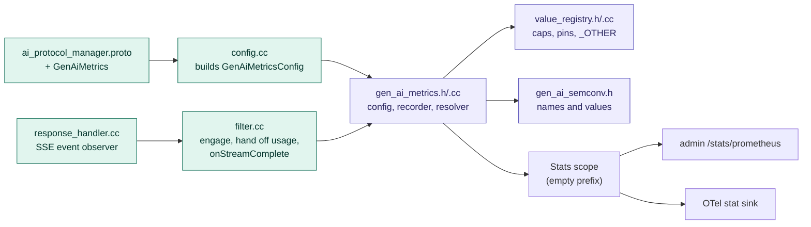
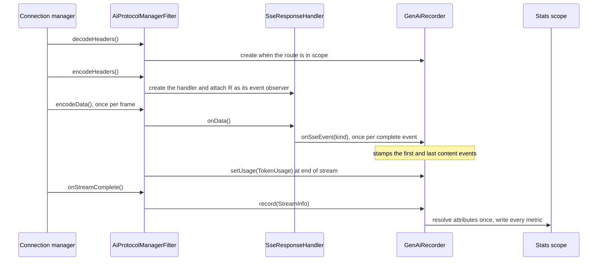
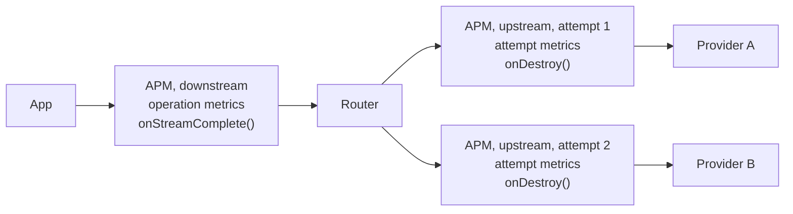
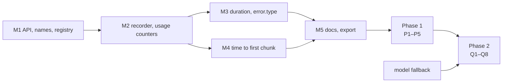

# GenAI metrics for the AI Protocol Manager

Status: proposal. Scope: metrics for LLM inference traffic. MCP, agent metrics, spans and events
are out of scope.

Spec: [semantic-conventions-genai](https://github.com/open-telemetry/semantic-conventions-genai)
at `cb10b70c15`.
- It is unreleased and still making breaking changes (#374 replaced `gen_ai.client.token.usage`).
- Envoy therefore ships this as `work_in_progress`.

## 1. Summary

- **Envoy emits the spec's client metrics.** There is one operation per downstream request,
  measured from when the request reaches Envoy.
- **Spec names are used verbatim.** Anything the spec lacks goes under `envoy.ai.*`.
- **They are plain Envoy stats.** Spec attributes become tags. The admin Prometheus endpoint and
  the OTel stat sink export them unchanged.
- **Model names and custom attributes are capped.** Values past the cap are reported as
  `_OTHER`.
- **Phases:**
  - **MVP:** token usage, request duration with `error.type`, time to first chunk.
  - **Phase 1:** attribution and depth.
  - **Phase 2:** per-attempt and cost metrics.

## 2. Convention

### 2.1 Rules

1. **Client metrics only.** The spec reserves `gen_ai.server.*` for model servers.
2. **One operation per downstream request.** Retries and fallback stay inside the operation,
   matching #476. Per-attempt data is `envoy.ai.client.attempt.*`.
3. **Only provider-reported token counts,** never tokenizer estimates.
4. **Every attribute is bounded,** by configuration or by a capped registry.
5. **No identity attributes** (API key, user, IP) unless an operator configures one.
6. **`error.type` uses a closed, documented list.**

### 2.2 Metrics

| Metric | Type | Phase | Answers |
|---|---|---|---|
| `gen_ai.client.inference.usage.*` (input, output, cache_read, cache_write, reasoning) | counters | MVP | Who spends which tokens on which model |
| `gen_ai.client.operation.duration` | histogram | MVP | Rate, errors, latency |
| `gen_ai.client.operation.time_to_first_chunk` | histogram | MVP | Streaming responsiveness |
| `envoy.ai.client.operation.time_per_output_token` | histogram | P1 | Decode speed |
| `gen_ai.client.inference.operation.{input,output}_tokens` | histograms | P1 | Prompt and response size |
| `envoy.ai.client.attempt.*` | histograms | P2 | Retries, fallback, provider vs gateway time |
| `gen_ai.client.operation.time_per_output_chunk` | histogram | P2, opt-in | Gaps between chunks |
| `envoy.ai.client.cost` | counter | P2 | Chargeback |
| `envoy.ai.client.rate_limit.remaining` | gauge | P2 | Quota headroom |
| `envoy.ai.client.operation.finish_reason` | counter | P2 | Truncation and content filtering |

Not planned:
- `gen_ai.server.*`
- `gen_ai.client.token.usage` (removed from the spec)
- agent and tool metrics
- a built-in price catalog
- tokenizer estimates

### 2.3 Attributes

| Attribute | Source |
|---|---|
| `gen_ai.operation.name` | Protocol of the provider call: `chat`, or `generate_content` for Gemini |
| `gen_ai.provider.name` | First found: the cluster's metadata; the filter's default; the protocol family (`openai`, `anthropic`, `gcp.gen_ai`) |
| `gen_ai.request.model` | `envoy.ai.model.request` filter state, written by `request_info` |
| `gen_ai.response.model` | `TokenUsage.model` |
| `server.address`, `server.port` | Upstream host |
| `error.type` | Section 2.5 (duration metrics only) |
| `gen_ai.token.modality` | `unknown` until P2 |
| Custom and `envoy.*` attributes | P1, opt-in |

Request and response models share one cap (default 256), and configured models can be pinned. A
request model is only kept after a 2xx from the provider.

### 2.4 Timing

- **Start:** when the request reaches Envoy.
- **Duration:** start to the response's end of stream.
- **Time to first chunk:** start to the first event that carries generated output.

| Protocol | First-chunk event |
|---|---|
| OpenAI Chat | First `data:` event other than `[DONE]` |
| OpenAI Responses | First `response.*.delta` |
| Anthropic | First `content_block_delta` (not `message_start` or `ping`) |
| Gemini | First `data:` event |

### 2.5 `error.type`

| Condition | Value |
|---|---|
| Upstream status ≥ 400 | The status code, e.g. `"429"` |
| Envoy rejected the request (bad JSON, AI-filter rejection) | `invalid_request` |
| Rate limited | `rate_limited` |
| Timeout | `timeout` |
| No upstream, connect failure, overflow | `no_healthy_upstream`, `connection_failure`, `overflow` |
| Upstream reset, client cancelled | `upstream_reset`, `cancelled` |
| AI Protocol Manager 5xx | `internal` |
| Anything else, including in-band stream errors | `_OTHER` |

## 3. Implementation

### 3.1 Code map (MVP)



Purple is new, green is changed, and white is existing and unchanged.

### 3.2 Per-stream flow



- `onStreamComplete()` runs for every downstream stream before access logging, including local
  replies and resets.
- The handler calls the observer before its usage classifier drops events. That is how it sees
  Anthropic `content_block_delta` events.

### 3.3 Placement (Phase 2)



- Only the connection manager calls `onStreamComplete()`. An upstream filter ends in `onDestroy()`
  and reads the attempt's timing from `upstreamCallbacks()->upstreamStreamInfo()`.
- Operation metrics come from the downstream instance and attempt metrics from the upstream ones,
  so nothing is counted twice.

### 3.4 Tasks



Within each later phase the tasks are independent, with two exceptions: Q1 waits for model
fallback, and Q8 builds on P2.

| Task | Code |
|---|---|
| M1 API, names, registry | `ai_protocol_manager.proto`; new `gen_ai_semconv.h`, `value_registry.{h,cc}`; `config.cc` |
| M2 Recorder, usage counters | New `gen_ai_metrics.{h,cc}`. `filter.cc`: `decodeHeaders()`, `finalizeResponseHandling()`, new `onStreamComplete()` |
| M3 Duration, `error.type` | `gen_ai_metrics.cc`, mapping `StreamInfo` response code, details and flags |
| M4 Time to first chunk | `response_handler.{h,cc}`: an observer called from `handleCompleteEvent()` |
| M5 Docs, export | `ai_protocol_manager_filter.rst`, changelog, integration test |
| P1 Custom attributes | Proto `CustomAttribute`; the resolver evaluates a `Formatter` at completion |
| P2 `include_usage` injection | New AI filter under `source/extensions/http/ai_filters/` |
| P3, P4 TPOT, token histograms | `gen_ai_metrics.cc` |
| P5 OTel sink units | `stat_sinks/open_telemetry/open_telemetry_impl.cc` and the sink proto |
| Q1 Attempt metrics | `filter.cc`: `onDestroy()` in the upstream chain |
| Q2 Per-chunk latency | `gen_ai_metrics.cc`: one record per content-event gap |
| Q3 Modality split | `llm_protocol_adapters.cc`, `token_usage.h` |
| Q4 Provider error codes | `response_handler.cc`: error events and non-2xx bodies |
| Q5 Cost | Proto prices; `gen_ai_metrics.cc` |
| Q6 Rate-limit headroom | `filter.cc`: `encodeHeaders()`, before the non-2xx exit |
| Q7 Finish reasons | `llm_protocol_adapters.cc` |
| Q8 Strip injected usage | The P2 filter's `encodeSSE()` |

Tests go in `test/extensions/filters/http/ai_protocol_manager/`:
- new `gen_ai_metrics_test.cc` (uses `SimulatedTimeSystem`)
- `filter_test.cc` (tag sets)
- `response_handler_test.cc` (the observer)
- `ai_protocol_manager_integration_test.cc` (admin `/stats/prometheus`)

### 3.5 Configuration

```proto
message ResponseHandling {
  TokenUsageExtraction token_usage = 1;

  // Requires ``token_usage``.
  GenAiMetrics gen_ai_metrics = 2;
}

message GenAiMetrics {
  // Leave the prefix empty so stat names are the spec names.
  type.v3.Scope stats_scope = 1;

  string default_provider_name = 2;

  // Default 256 values; pinned names are always kept.
  ValueLimits model_values = 3;

  // Phase 1.
  repeated CustomAttribute custom_attributes = 4;

  // Later fields are opt-ins: token histograms, per-chunk latency, prices, rate-limit headroom.
}
```

### 3.6 Export and cost

- **Prometheus:** admin `/stats/prometheus`.
- **OTLP:** the OTel stat sink, whose defaults keep the names and export tags as attributes.
- **Units:** Envoy histograms hold integers, ms for durations and µs for per-token times. Until
  P5, an OTel Collector `transform` processor rescales them to seconds.
- **Buckets:** bootstrap `stats_config.histogram_bucket_settings`. The docs ship the spec's
  boundaries.
- **Per-stream cost:**
  - About seven tagged stat lookups, and no locks once a series exists.
  - The registry answers from a thread-local cache.
  - It keeps Envoy under the scope's stat limit, because past that limit every lookup takes the
    store-wide lock.

## 4. Open decisions

1. Measure from arrival at Envoy (proposed) or from forwarding.
2. One operation per request plus an attempt family (proposed), or spec metrics per attempt.
3. No `gen_ai.server.*` compatibility mode (proposed).
4. First chunk is the first content event (proposed), or the first event of any kind.
5. Request model kept only after a 2xx or when pinned; cap of 256 (proposed).
6. Local rejections recorded as failed operations (proposed), or excluded.
7. `envoy.ai.*` names now (proposed), or wait for `gen_ai.gateway.*` (#299).

## Appendix: what other gateways do

| Implementation | Emits | Takeaway |
|---|---|---|
| agentgateway `118c624c31` | Prometheus; `gen_ai_server_*` latency; one token histogram that includes cache types | Copy: content-based first token, per-request TPOT. Avoid: `error.type` always `_OTHER`, uncapped labels |
| LiteLLM `126e79c967` | About 88 Prometheus families; opt-in OTel | Copy: split latency into gateway and provider time; one counter per token type; caps with an `other` value. Avoid: identity labels (memory and PII issues) |
| Envoy AI Gateway, now agent-router `8060279130` | `gen_ai.server.*`, recorded per attempt | Copy: header-to-attribute mapping. Avoid: `_OTHER` for every error |
| Kong `8927af6d5e` | Prometheus and OTel | Copy: gateway vs provider time, consumer label |
| Higress `bda81f1067` | Dynamic Envoy counters | Avoid: sums only, so no percentiles; uncapped |
| llm-d / GIE `d4b8afd3c2` | Request, TTFT, TPOT, ITL, tokens | Copy: model cap of 1000 with `other` and pinned names; closed error set |
| vLLM `cbe1f9740d` | Server-side phases | Model-server metrics, not a gateway's |
