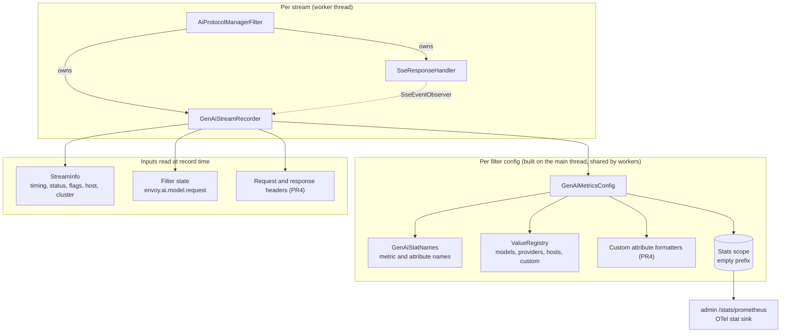
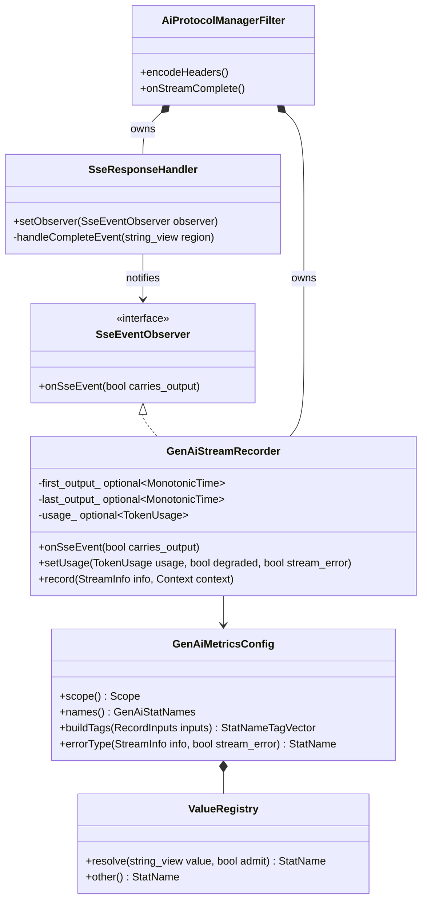
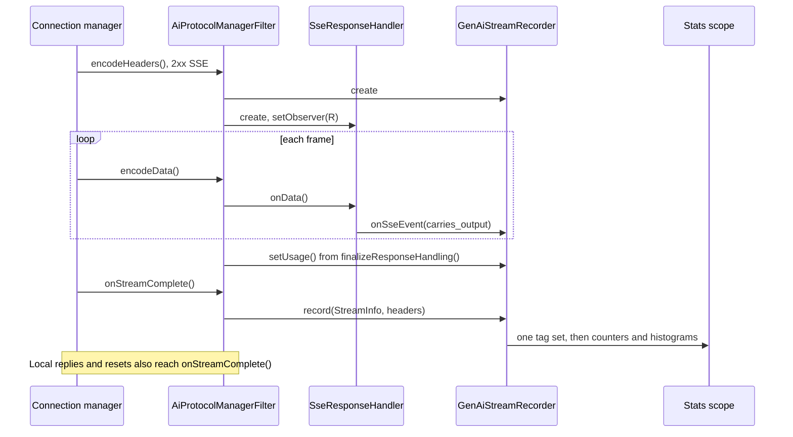
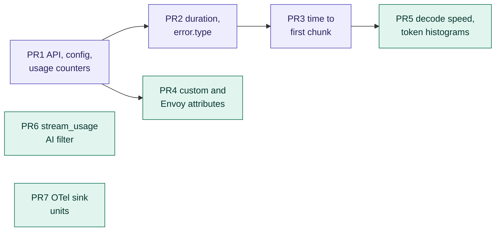

# GenAI metrics for the AI Protocol Manager

**Status:** proposal.

**Scope:** metrics for LLM inference traffic. This revision details the MVP and Phase 1; Phase 2 is
listed in section 6. MCP, agent metrics, spans and events are out of scope.

**Spec:** [semantic-conventions-genai](https://github.com/open-telemetry/semantic-conventions-genai)
at `cb10b70c15`. It is unreleased and still making breaking changes (#374 replaced
`gen_ai.client.token.usage`), so the API ships as `work_in_progress`.

## 1. Summary

- **What Envoy emits:** the spec's client metrics, one operation per downstream request, measured
  from when the request reaches Envoy.
- **Naming:** spec names are used verbatim; anything the spec lacks goes under `envoy.ai.*`.
- **Storage and export:** the metrics are plain Envoy stats with the spec's attributes as tags. The
  admin Prometheus endpoint and the OTel stat sink export them unchanged.
- **Bounded cardinality:** model names and custom attributes go through capped registries. A value
  past the cap is reported as `_OTHER`.
- **Work plan:**
  - The MVP is three PRs: token usage, request duration with `error.type`, and time to first chunk.
  - Phase 1 is four PRs: custom attributes, decode speed and token histograms, a `stream_usage` AI
    filter, and units in the OTel sink.

## 2. Convention

### 2.1 Rules

1. **Client metrics only.** The spec reserves `gen_ai.server.*` for model servers.
2. **One operation per downstream request.** Retries and fallback stay inside it (#476).
3. **Provider-reported token counts only,** never tokenizer estimates.
4. **Every attribute is bounded,** either by configuration or by a capped registry.
5. **No identity attributes** unless an operator configures them.
6. **`error.type` comes from a closed, documented list.**

### 2.2 Metrics

| Metric | Type (Envoy unit) | PR | Answers |
|---|---|---|---|
| `gen_ai.client.inference.usage.*`: input, output, cache_read, cache_write, reasoning | counters | PR1 | Who spends which tokens on which model |
| `gen_ai.client.operation.duration` | histogram (ms) | PR2 | Rate, errors, latency |
| `gen_ai.client.operation.time_to_first_chunk` | histogram (ms) | PR3 | Streaming responsiveness |
| `envoy.ai.client.operation.time_per_output_token` | histogram (µs) | PR5 | Decode speed |
| `gen_ai.client.inference.operation.{input,output}_tokens` | histograms, opt-in | PR5 | Prompt and response size |

Recording rules:
- Input and output counters are recorded whenever the provider reports them.
- Cache and reasoning counters are recorded only when the count is above zero.
- Usage is recorded for `COMPLETE` and `PARTIAL` extraction results.

### 2.3 Attributes

| Attribute | Source | Bound |
|---|---|---|
| `gen_ai.operation.name` | Provider protocol: `chat`, or `generate_content` for Gemini | Closed list |
| `gen_ai.provider.name` | First found: cluster metadata; `default_provider_name`; the protocol's family | Registry, cap 64 |
| `gen_ai.request.model` | `envoy.ai.model.request` filter state | Model registry; admitted only on a 2xx response or if pinned |
| `gen_ai.response.model` | `TokenUsage.model` | Model registry (shared cap, 256) |
| `server.address`, `server.port` | Upstream host `hostname()` and port | Registry, cap 128 |
| `error.type` | Section 2.5 | Closed list plus status codes |
| `gen_ai.token.modality` | `unknown` (a split is Phase 2) | Closed list |
| Custom (PR4) | A substitution format string | Per-attribute registry, cap 100 |
| `envoy.ai.stream`, `envoy.cluster.name`, `envoy.route.name` (PR4) | Response type, `StreamInfo` | Configuration |

Details:
- **Provider metadata key:** cluster `filter_metadata["envoy.filters.http.ai_protocol_manager"]["gen_ai.provider.name"]`.
- **Value rejection:** a value longer than 128 bytes, or containing a control character, is reported
  as `_OTHER`.
- **Port type:** `server.port` is exported as a string, because Envoy tag values are strings.

### 2.4 Timing

| Anchor | Source |
|---|---|
| Start | `StreamInfo::startTimeMonotonic()`: the request reached Envoy |
| First chunk | The first SSE event that carries output, stamped from the dispatcher's time source |
| End | `lastDownstreamTxByteSent()`, or the time of `onStreamComplete()` if the stream was cut |

An event carries output if it is any of these:
- an unnamed `data:` event other than `[DONE]` (OpenAI Chat, Gemini);
- `content_block_delta` (Anthropic);
- a `response.*.delta` event (OpenAI Responses).

`message_start`, `ping` and the other lifecycle events do not count. Time to first chunk is recorded
for SSE responses only.

### 2.5 `error.type`

| Condition, first match wins | Value |
|---|---|
| Upstream response with status ≥ 400 | The status code, e.g. `"429"` |
| Local reply `ai_protocol_manager_invalid_json`, or an AI-filter rejection with a 4xx | `invalid_request` |
| Response flag `RateLimited` | `rate_limited` |
| `UpstreamRequestTimeout`, `StreamIdleTimeout` | `timeout` |
| `NoHealthyUpstream`, `UpstreamConnectionFailure`, `UpstreamOverflow` | `no_healthy_upstream`, `connection_failure`, `overflow` |
| `UpstreamRemoteReset`, `UpstreamConnectionTermination`, `DownstreamConnectionTermination` | `upstream_reset`, `upstream_reset`, `cancelled` |
| AI Protocol Manager 5xx (replay, external buffer, response pipeline) | `internal` |
| A 2xx stream with an in-band error event, or anything else | `_OTHER` |

## 3. Design

### 3.1 Components



| Component | Lifetime | Thread safety |
|---|---|---|
| `GenAiMetricsConfig` | Owned by `FilterConfig`, built at config load | Read-only after construction |
| `GenAiStatNames` | Interned once from a `StatNamePool` | Read-only |
| `ValueRegistry` | One per attribute class, owned by the config | `absl::Mutex` around a map and a `StatNamePool` |
| `GenAiStreamRecorder` | One per stream. Created in `encodeHeaders()` with the SSE handler, or lazily in `onStreamComplete()` | Worker thread only |
| Stats scope | Created from `serverScope()`, with optional `envoy.type.v3.Scope` limits | Store-managed |

The registry takes a short mutex once per value per recorded stream. LLM requests are expensive
and low-rate next to that cost, so a thread-local cache is not worth its complexity until
profiling says otherwise. It also keeps Envoy below the scope's stat limit, because past that limit
every lookup takes the store-wide lock.

### 3.2 Classes



- **Member order:** the filter declares the recorder before the response handler, so the recorder
  outlives the handler's observer pointer.
- **Where the observer is called:** `handleCompleteEvent()` calls it before the usage classifier
  and the parse budget run.
- **When timing is unreliable:** if the handler stops early (budget exhausted, or `degraded()`),
  the recorder treats its last-output time as unreliable and skips decode speed.

### 3.3 Per-stream flow



A stream is recorded when all of these hold:
1. `gen_ai_metrics` is configured.
2. The stream reached this filter.
3. The final route is in scope: it has a per-route config, or `include_unconfigured_routes` is set.
4. A protocol is known: the route's response protocol, then its request protocol, then the
   detected protocol, then `default_llm_protocol`. Otherwise `gen_ai_metrics_skipped` is
   incremented.

In the MVP the upstream filter chain rejects `gen_ai_metrics` at config load. Its filters never
receive `onStreamComplete()`; attempt metrics come in Phase 2.

### 3.4 API

```proto
message AiProtocolManager {
  RequestHandling request_handling = 1;
  ResponseHandling response_handling = 2;
  repeated config.core.v3.TypedExtensionConfig filters = 3;

  // Requires ``response_handling.token_usage``.
  GenAiMetrics gen_ai_metrics = 4;
}

message GenAiMetrics {
  // Defaults to an empty prefix, which keeps stat names equal to the spec names.
  // ``sharing_name`` is rejected.
  type.v3.Scope stats_scope = 1;

  string default_provider_name = 2;

  // Shared by gen_ai.request.model and gen_ai.response.model.
  ValueLimits model_values = 3;

  // PR4.
  repeated CustomAttribute custom_attributes = 4 [(validate.rules).repeated = {max_items: 16}];
  repeated EnvoyAttribute envoy_attributes = 5;

  // PR5.
  bool record_token_histograms = 6;
}

message ValueLimits {
  google.protobuf.UInt32Value max_values = 1 [(validate.rules).uint32 = {gte: 1}];
  repeated string pinned = 2;
}

message CustomAttribute {
  string name = 1 [(validate.rules).string = {min_len: 1}];

  // Substitution format, e.g. ``%REQ(x-tenant-id)%`` or ``%CEL(...)%``.
  string value_format = 2 [(validate.rules).string = {min_len: 1}];

  // Defaults to 100 values.
  ValueLimits limits = 3;

  // Used when the format yields an empty value; when unset, the attribute is left out.
  string default_value = 4;
}

enum EnvoyAttribute {
  STREAM = 0;
  CLUSTER_NAME = 1;
  ROUTE_NAME = 2;
}
```

A minimal configuration that also sets the spec's bucket boundaries:

```yaml
# HTTP filter
gen_ai_metrics:
  default_provider_name: openai
  model_values: {max_values: 256, pinned: ["gpt-4o"]}
response_handling:
  token_usage: {}

# Bootstrap: spec boundaries in ms for duration and time to first chunk
stats_config:
  histogram_bucket_settings:
  - match: {prefix: "gen_ai.client.operation."}
    buckets: [10, 20, 40, 80, 160, 320, 640, 1280, 2560, 5120, 10240, 20480, 40960, 81920]
```

Deployments with a restrictive `stats_config.stats_matcher` must include the `gen_ai.` and
`envoy.ai.` prefixes.

New counters under the filter's existing `ai_protocol_manager.` prefix:

| Counter | Meaning |
|---|---|
| `gen_ai_metrics_recorded` | Streams recorded |
| `gen_ai_metrics_skipped` | Streams in scope whose protocol could not be resolved |
| `gen_ai_metrics_value_overflow` | Values reported as `_OTHER` because a registry was full |

### 3.5 Phase 1 designs

**PR4: custom and Envoy attributes.**
- **Evaluation:** `FormatterImpl::create()` builds each format at config load. At record time it is
  evaluated with `Formatter::Context(request_headers, response_headers, response_trailers)` and
  `StreamInfo`.
- **Bounding:** each attribute has its own registry. Custom keys may not reuse a built-in key.
- **Scope:** custom attributes go on every metric.
- **`envoy.ai.stream`:** `"true"` for an SSE response, `"false"` for JSON, left out when there is no
  response.

**PR5: decode speed and token histograms.**
- **Decode speed:** `time_per_output_token` = (last output − first output) / (output tokens − 1).
- **When it is recorded:** for successful SSE operations whose timeline is complete and that
  produced at least two output tokens.
- **Token histograms:** recorded with the base attributes, without modality, only when
  `record_token_histograms` is set.

**PR6: the `stream_usage` AI filter** (`envoy.http.ai_filters.stream_usage`).
- **Problem:** OpenAI Chat streams carry no usage unless the client sets
  `stream_options.include_usage`, so they report no tokens.
- **Behavior:** a `SyncAiFilter`. For OpenAI Chat requests with `stream: true` it sets
  `stream_options.include_usage: true`, unless the client set `include_usage` itself.
- **Requirements:**
  - It needs `reserialize_body: ALWAYS` (the default), because with `DISABLE` edits are not sent.
  - Place it before the transcoder.
- **Client-visible change:** the client receives one extra final chunk with empty `choices` and a
  `usage` object.
- **Counters:** `injected` and `skipped_explicit`.

**PR7: OTel stat sink units.**
- **API:** new `SinkConfig` fields:
  - `emit_histogram_units = 11` maps `Histogram::Unit` to `ms`, `us` or `By`.
  - `convert_time_histograms_to_seconds = 12` scales bucket bounds and sums, and sets `s`.
  - `ConversionAction.unit = 4` gives counters a unit, such as `{token}`.
- **Before it lands:** an OTel Collector `transform` processor rescales histograms to seconds.

## 4. PR plan



MVP is purple and Phase 1 is green. PR6 and PR7 can land in any order.

Sizes include tests.

| PR | Title | Size |
|---|---|---|
| PR1 | `ai_protocol_manager: add GenAI metrics API and token usage counters` | L |
| PR2 | `ai_protocol_manager: record GenAI operation duration and error.type` | M |
| PR3 | `ai_protocol_manager: record GenAI time to first chunk` | M |
| PR4 | `ai_protocol_manager: add custom and Envoy GenAI metric attributes` | M |
| PR5 | `ai_protocol_manager: record decode speed and token histograms` | S |
| PR6 | `ai_filters: add stream_usage filter for OpenAI streaming usage` | M |
| PR7 | `open_telemetry: export histogram units and seconds` | M |

**PR1. API, config, usage counters**
- **API:** `GenAiMetrics` and `ValueLimits`. Config validation:
  - `gen_ai_metrics` requires `token_usage`;
  - `sharing_name` is rejected;
  - the upstream filter chain is rejected.
- **New code:**
  - `gen_ai_semconv.h`: the names and closed value lists, pinned to `cb10b70c15`.
  - `value_registry.{h,cc}`.
  - `gen_ai_metrics.{h,cc}`: `GenAiMetricsConfig` and a `GenAiStreamRecorder` with the usage
    counters and base attributes.
- **Changed code:**
  - `filter.{h,cc}`: a new `onStreamComplete()`; `finalizeResponseHandling()` passes the usage on.
  - `stats.h`: the three `gen_ai_metrics_*` counters.
  - `config.cc`, `BUILD`.
- **Tests:**
  - `value_registry_test.cc`: caps, pins, `_OTHER`, rejected values.
  - `gen_ai_metrics_test.cc`: attribute resolution, sparse counters.
  - `filter_test.cc` and `config_test.cc`.
  - The integration test checks `/stats/prometheus`.
- **Docs:** the filter `.rst` gets a GenAI metrics section (metrics, attributes, bounds, export,
  `stats_matcher` note), plus a changelog entry.

**PR2. Duration and `error.type`**
- **Recording:** records `operation.duration` for every stream in scope, including non-2xx
  responses, local replies and resets.
- **Changed code:**
  - `GenAiMetricsConfig::errorType()` maps response code, response-code details and flags (table
    2.5).
  - `ResponseHandler` exposes `streamError()`.
- **Tests:** one test per `error.type` row, using `SimulatedTimeSystem` for the duration.

**PR3. Time to first chunk**
- **Changed code:**
  - `response_handler.{h,cc}` gains `SseEventObserver`, `setObserver()`, and output-event
    classification in `handleCompleteEvent()`.
  - The recorder stamps the first and last output events.
- **Tests:**
  - Classification for each protocol (the `ping` and `message_start` exclusions).
  - Events split across frames.
  - Budget exhaustion.
  - A recorder outliving the handler.

**PR4. Custom and Envoy attributes**
- **Changes:** `CustomAttribute` and `EnvoyAttribute`, formatters built at config load, a
  registry per attribute, and key collision checks.
- **Tests:** formats (`%REQ%`, `%FILTER_STATE%`), caps, defaults, collisions.
- **Docs:** a PII warning.

**PR5. Decode speed and token histograms**
- **Changes:** `time_per_output_token` (µs), and the two token histograms behind
  `record_token_histograms`.
- **Tests:** zero, one and many output tokens; degraded timelines.

**PR6. `stream_usage` AI filter**
- **New extension:** API at `envoy.extensions.http.ai_filters.stream_usage.v3`, code at
  `source/extensions/http/ai_filters/stream_usage/`.
- **Extension bookkeeping:** an `extensions_metadata.yaml` entry (alpha, robust to untrusted
  downstream), plus CODEOWNERS.
- **Tests:** injection; respecting the client's explicit `include_usage`; non-OpenAI protocols;
  `stream: false`.

**PR7. OTel stat sink units**
- **Changes:** `open_telemetry.proto` fields 11 and 12 and `ConversionAction.unit`, implemented in
  `open_telemetry_impl.cc`.
- **Tests:** scaled bounds and sums for ms and µs histograms, and an unchanged default.
- **Reviewers:** separate owners (stat sinks).

## 5. Defaults this design assumes

| Decision | Default | Alternative |
|---|---|---|
| Latency start | Arrival at Envoy | Forwarding to the provider |
| Operation scope | One per request; attempts in Phase 2 | Spec metrics per attempt |
| Server metrics | None | `gen_ai.server.*` compatibility mode |
| First chunk | First output-bearing event | First event of any kind |
| Request model | Kept after a 2xx or if pinned; cap 256 | An explicit allowlist |
| Local rejections | Failed operations with an Envoy `error.type` | Not recorded |
| Extension names | `envoy.ai.*` now | Wait for `gen_ai.gateway.*` (#299) |
| API placement | Top-level `gen_ai_metrics` | Under `response_handling` |
| Usage injection | New `stream_usage` AI filter | An option on `request_info` |

## 6. Phase 2 (not detailed)

| Item | Needs |
|---|---|
| Attempt metrics from the upstream chain, recorded in `onDestroy()` | Model fallback |
| Per-chunk latency (`time_per_output_chunk`, opt-in) | PR3 |
| Modality split; provider error codes; finish reasons | Adapter parsing |
| Cost from configured prices; rate-limit headroom gauges | — |
| Stripping the injected usage chunk | PR6 |

## Appendix: what other gateways do

| Implementation | Copy | Avoid |
|---|---|---|
| agentgateway `118c624c31` | Content-based first token; decode speed per request | `error.type` always `_OTHER`; uncapped labels |
| LiteLLM `126e79c967` | Gateway vs provider time; one counter per token type; `other` overflow | Identity labels (memory, PII) |
| Envoy AI Gateway, now agent-router `8060279130` | Header-to-attribute mapping | `gen_ai.server.*` per attempt; `_OTHER` errors |
| Kong `8927af6d5e` | Gateway vs provider time; consumer label | — |
| Higress `bda81f1067` | — | Sums only, no percentiles; uncapped stats |
| llm-d / GIE `d4b8afd3c2` | Model cap 1000 with pinned names; closed error set | — |
