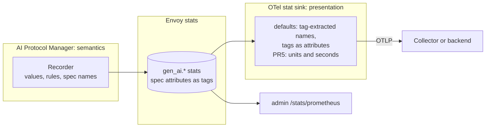
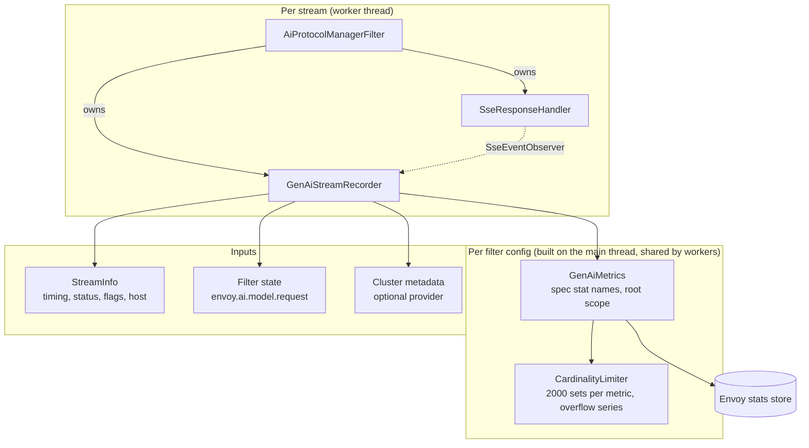
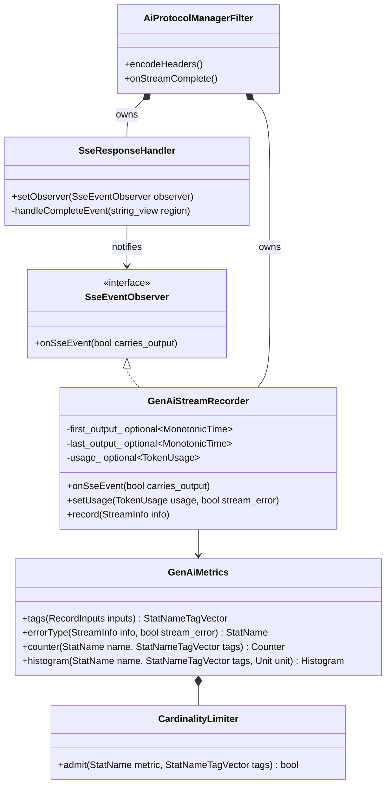
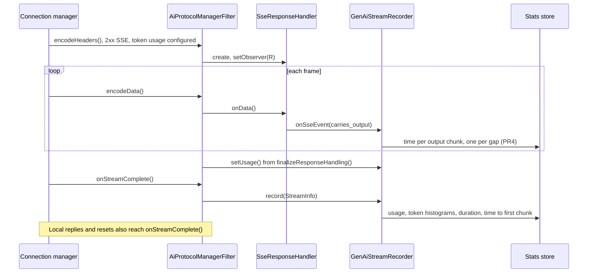
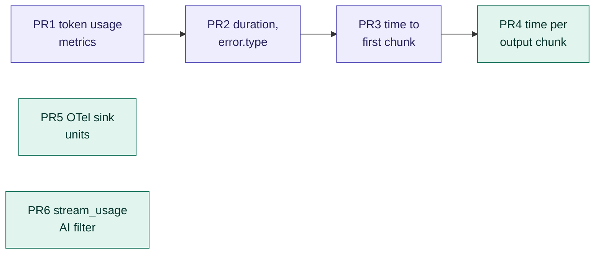

# GenAI metrics for the AI Protocol Manager

**Status:** proposal.

**Scope:** metrics for LLM inference traffic. This covers the MVP and Phase 1 in detail; Phase 2 is
listed in section 7. MCP, agent metrics, spans and events are out of scope.

**Spec:** [semantic-conventions-genai](https://github.com/open-telemetry/semantic-conventions-genai)
at `cb10b70c15`. It is unreleased and still making breaking changes (#374 replaced
`gen_ai.client.token.usage`).

## 1. Summary

- **No configuration.**
  - The convention decides metric names, attributes and values.
  - Envoy emits what it can observe on AI routes, the same way any filter emits its stats.
  - The AI Protocol Manager API does not change for the MVP.
- **The convention is split between two places** (section 3):
  - The AI Protocol Manager computes the semantics and records stats under the spec's names.
  - The OTel stat sink exports them with its default settings. The one missing piece, units, is a
    generic sink change.
- **Opting out and tuning use existing Envoy settings:**
  - `stats_matcher` drops metrics.
  - `histogram_bucket_settings` changes bucket boundaries.
  - Cluster metadata can override the provider name.
- **Plan:** an MVP of three PRs (token usage, duration with `error.type`, time to first chunk), then a
  Phase 1 of three PRs (time per output chunk, units in the OTel sink, an optional `stream_usage`
  filter).

## 2. Convention

### 2.1 Rules

1. **Client metrics only.** The spec reserves `gen_ai.server.*` for model servers.
2. **One operation per downstream request.** Retries and fallback stay inside it (#476).
3. **Only names and attributes from the spec.** Envoy adds no metrics or attributes of its own.
4. **Provider-reported token counts only,** never estimates.
5. **Cardinality follows the OTel SDK limit** (section 2.4).

### 2.2 Metrics

| Metric | Type (Envoy unit) | Emitted when | PR |
|---|---|---|---|
| `gen_ai.client.inference.usage.*`: input, output, cache_read, cache_write, reasoning | counters | Token usage extraction is configured | PR1 |
| `gen_ai.client.inference.operation.{input,output}_tokens` | histograms | Token usage extraction is configured | PR1 |
| `gen_ai.client.operation.duration` | histogram (ms) | Every stream on an AI route | PR2 |
| `gen_ai.client.operation.time_to_first_chunk` | histogram (ms) | SSE responses, token usage extraction configured | PR3 |
| `gen_ai.client.operation.time_per_output_chunk` | histogram (ms) | SSE responses, token usage extraction configured | PR4 |

Metrics that need the response parsed only appear where `response_handling.token_usage` already
parses it, so they add no new parsing. Usage is recorded for `COMPLETE` and `PARTIAL` extraction
results. Cache and reasoning counters are recorded only when they are above zero.

### 2.3 Attributes

| Attribute | Source |
|---|---|
| `gen_ai.operation.name` | Provider protocol: `chat`, or `generate_content` for Gemini |
| `gen_ai.provider.name` | The protocol's family (`openai`, `anthropic`, `gcp.gen_ai`). A cluster can override it with `filter_metadata["envoy.filters.http.ai_protocol_manager"]["gen_ai.provider.name"]` |
| `gen_ai.request.model` | `envoy.ai.model.request` filter state |
| `gen_ai.response.model` | `TokenUsage.model` |
| `server.address`, `server.port` | Upstream host `hostname()` and port; left out when the hostname is empty |
| `error.type` | Section 2.6; duration only |
| `gen_ai.token.modality` | `unknown` on the usage counters |

The spec defines the provider name as the instrumentation's "best knowledge" and as the discriminator
of the telemetry format, so deriving it from the protocol follows the spec. Overriding it is optional.

### 2.4 Cardinality

Two fixed rules, with no settings:

1. **A requested model is reported only after the provider accepted it** (a 2xx response). Otherwise
   it is reported as `_OTHER`, the spec's value for anything outside the known set. A value longer
   than 128 bytes, or containing a control character, is also reported as `_OTHER`.
2. **Each metric keeps at most 2000 attribute sets**, the OTel metrics SDK's default cardinality
   limit. Measurements for new sets beyond that go to one overflow series tagged
   `otel.metric.overflow=true`, so nothing is dropped or counted twice.

### 2.5 Timing

| Anchor | Source |
|---|---|
| Start | `StreamInfo::startTimeMonotonic()`: the request reached Envoy |
| Output event | An SSE event that carries generated output, stamped from the dispatcher's time source |
| End | `lastDownstreamTxByteSent()`, or the time of `onStreamComplete()` if the stream was cut |

An event carries output if it is one of:
- an unnamed `data:` event other than `[DONE]` (OpenAI Chat, Gemini);
- `content_block_delta` (Anthropic);
- `response.*.delta` (OpenAI Responses).

Lifecycle events such as `message_start` and `ping` do not count.

How each metric uses the anchors:
- **Time to first chunk:** start to the first output event.
- **Time per output chunk:** recorded once per gap between consecutive output events.

### 2.6 `error.type`

| Condition, first match wins | Value |
|---|---|
| Upstream response status ≥ 400 | The status code, e.g. `"429"` |
| Envoy rejected the request (invalid JSON, AI-filter 4xx) | `invalid_request` |
| `RateLimited` | `rate_limited` |
| `UpstreamRequestTimeout`, `StreamIdleTimeout` | `timeout` |
| `NoHealthyUpstream`, `UpstreamConnectionFailure`, `UpstreamOverflow` | `no_healthy_upstream`, `connection_failure`, `overflow` |
| `UpstreamRemoteReset`, `UpstreamConnectionTermination`, `DownstreamConnectionTermination` | `upstream_reset`, `upstream_reset`, `cancelled` |
| AI Protocol Manager 5xx | `internal` |
| A 2xx stream with an in-band error event, or anything else | `_OTHER` |

## 3. Where the convention lives

| Concern | Where | Why |
|---|---|---|
| What counts: output events, usage, errors | AI Protocol Manager | Needs protocol knowledge |
| Attribute values: operation, provider, models, `error.type` | AI Protocol Manager | Needs the request, the response and `StreamInfo` |
| Cardinality rules | AI Protocol Manager | Must run before a stat is created |
| Metric names and attribute keys | AI Protocol Manager: the stat names are the spec names | The sink renames metrics only through per-metric rules and cannot rename attributes, so naming at the source needs no sink configuration |
| Tags exported as attributes, tag-extracted names | OTel stat sink | Already its default |
| Units, seconds | OTel stat sink (PR5) | Envoy histograms store integers (ms) |
| Temporality, batching, export | OTel stat sink | Existing settings |

How this maps onto the OTel SDK model:
- The stat sink plays the exporter.
- Envoy's `stats_matcher` and `histogram_bucket_settings` play the role of Views (dropping metrics,
  choosing buckets).
- The spec's bucket boundaries are advice. Envoy's default buckets already cover LLM durations;
  bootstrap settings can apply the spec's boundaries.

## 4. Design

### 4.1 Components

| Component | Lifetime | Thread safety |
|---|---|---|
| `GenAiMetrics` | Built with every `FilterConfig`: interned spec names plus a scope with an empty prefix under `serverScope()` | Read-only |
| `CardinalityLimiter` | One per filter config | `absl::Mutex` around a per-metric set of attribute-set hashes |
| `GenAiStreamRecorder` | Per stream, created on demand: with the SSE handler, at the first output event, or in `onStreamComplete()` | Worker thread only |

Because the stats live under the root scope, every listener shares the same series. That is
intended: the metrics describe calls to providers, not listeners.

### 4.2 Classes

- **Overflow:** `GenAiMetrics::counter()` and `histogram()` ask the limiter first, and return the
  overflow series when a new attribute set does not fit.
- **Member order:** the filter declares the recorder before the response handler, so the recorder
  outlives the handler's observer pointer.
- **Where the observer is called:** `handleCompleteEvent()` calls it before the usage classifier and
  the parse budget run.
- **When the timing is unreliable:** if the handler stops early (budget exhausted), the recorder
  stops recording per-chunk gaps.

### 4.3 Per-stream flow

**Which streams are recorded.** A stream is recorded when all of these hold:
- It reached this filter.
- Its final route has an AI Protocol Manager per-route config, or
  `token_usage.include_unconfigured_routes` is set.
- A protocol is known: the route's response protocol, then its request protocol, then the detected
  protocol, then `default_llm_protocol`.

**Per-chunk attributes.** Per-chunk gaps are recorded as they happen, with the attribute set resolved
at the first output event.
- `gen_ai.response.model` is included when it is known by then.
- The OpenAI Responses API reports its model only at the end, so it is left out there.

**Upstream filter chain.** Filters in the upstream chain never receive `onStreamComplete()`, so they
record nothing. Attempt metrics come in Phase 2.

**New counters** under the filter's existing `ai_protocol_manager.` prefix:

| Counter | Meaning |
|---|---|
| `gen_ai_metrics_recorded` | Streams recorded |
| `gen_ai_metrics_skipped` | Streams on AI routes whose protocol could not be resolved |
| `gen_ai_metrics_overflow` | Measurements sent to the overflow series |

## 5. PR plan

MVP PRs are purple and Phase 1 PRs are green. PR5 and PR6 do not depend on the others. Sizes include
tests.

| PR | Title | API change | Size |
|---|---|---|---|
| PR1 | `ai_protocol_manager: emit GenAI token usage metrics` | None | L |
| PR2 | `ai_protocol_manager: emit GenAI operation duration` | None | M |
| PR3 | `ai_protocol_manager: emit GenAI time to first chunk` | None | M |
| PR4 | `ai_protocol_manager: emit GenAI time per output chunk` | None | S |
| PR5 | `open_telemetry: export histogram units and seconds` | Two sink fields | M |
| PR6 | `ai_filters: add stream_usage filter for OpenAI streaming usage` | New extension | M |

**PR1. Token usage metrics**
- **New code:**
  - `gen_ai_semconv.h`: names and closed value lists, pinned to `cb10b70c15`.
  - `gen_ai_metrics.{h,cc}`: `GenAiMetrics`, `CardinalityLimiter`, and `GenAiStreamRecorder` with
    the usage counters, the token histograms and the attributes.
- **Changed code:**
  - `filter.{h,cc}`: a new `onStreamComplete()`; `finalizeResponseHandling()` passes the usage to
    the recorder.
  - `stats.h`: the three `gen_ai_metrics_*` counters.
  - `BUILD`.
- **Tests:**
  - `gen_ai_metrics_test.cc`: attributes, the requested-model rule, the overflow series, sparse
    counters.
  - `filter_test.cc`: tag sets.
  - The integration test checks `/stats/prometheus`.
- **Docs:**
  - A GenAI metrics section in the filter `.rst`: metrics, attributes, rules, how to opt out with
    `stats_matcher`.
  - A changelog entry noting the new stats.

**PR2. Duration and `error.type`**
- **Behavior:** every stream on an AI route, including non-2xx responses, local replies and resets.
- **Changed code:**
  - `GenAiMetrics::errorType()` (table 2.6).
  - `ResponseHandler::streamError()`.
- **Tests:** one test per `error.type` row; `SimulatedTimeSystem`.

**PR3. Time to first chunk**
- **Changed code:** `response_handler.{h,cc}` gains `SseEventObserver`, `setObserver()`, and
  output-event classification in `handleCompleteEvent()`.
- **Tests:**
  - Classification per protocol.
  - Events split across frames.
  - Budget exhaustion.
  - The recorder outliving the handler.

**PR4. Time per output chunk**
- **Changed code:** the recorder records each gap as it happens, with attributes resolved at the
  first output event.
- **Tests:** gaps within one frame (zero) and across frames; a Responses API stream with no response
  model.

**PR5. OTel stat sink units** (generic; stat sink owners review)
- **API:** new `SinkConfig` fields:
  - `emit_histogram_units = 11` maps `Histogram::Unit` to `ms`, `us` or `By`.
  - `convert_time_histograms_to_seconds = 12` scales bucket bounds and sums, and sets the unit to
    `s`.
- **Why opt-in:** a Prometheus exporter that appends units would otherwise rename existing metrics.
- **Before it lands:** an OTel Collector `transform` processor can rescale to seconds.

**PR6. `stream_usage` AI filter** (optional)
- **Problem:** OpenAI Chat streams carry no usage unless the client sets
  `stream_options.include_usage`, so those streams report no tokens. The spec forbids reporting
  counts Envoy does not have.
- **Behavior:** a `SyncAiFilter` that sets `include_usage: true` on OpenAI Chat streaming requests,
  unless the client set it itself.
- **Requirements:**
  - It needs `reserialize_body: ALWAYS`, the default.
  - The client receives one extra final chunk carrying `usage`.
- **Why it is opt-in:** it changes what the client receives, so it stays a request filter rather than
  a metrics setting.

## 6. Opting out and tuning

| Need | Existing Envoy setting |
|---|---|
| Drop the metrics | Bootstrap `stats_config.stats_matcher`: exclude the prefix `gen_ai.` |
| Spec bucket boundaries | Bootstrap `stats_config.histogram_bucket_settings` with prefix `gen_ai.client.operation.` and buckets `[10, 20, 40, …, 81920]` ms |
| Name the provider for an OpenAI-compatible backend | Cluster `filter_metadata`, as in section 2.3 |
| OTLP export | The OTel stat sink with default settings |

Deployments with an inclusion-only `stats_matcher` must add `gen_ai.` to see the metrics.

## 7. Defaults and Phase 2

| Decision | Default | Alternative |
|---|---|---|
| Switch | None: on wherever the data already exists | An opt-in `gen_ai_metrics` field |
| Naming | Spec names at the source | Envoy names plus sink rename rules |
| Latency start | Arrival at Envoy | Forwarding to the provider |
| Operation scope | One per request | Spec metrics per attempt |
| First chunk | First output event | First event of any kind |
| Local rejections | Failed operations with an Envoy `error.type` | Not recorded |

**Phase 2, not detailed here:**
- Attempt metrics from the upstream chain, recorded in `onDestroy()`.
- Modality split, provider error codes, finish reasons.
- Cost and rate-limit headroom.
- Stripping the injected usage chunk.
- A spec-version selector once the spec releases.

## Appendix: what other gateways do

| Implementation | Copy | Avoid |
|---|---|---|
| agentgateway `118c624c31` | Content-based first token | `error.type` always `_OTHER`; uncapped labels |
| LiteLLM `126e79c967` | One counter per token type; `other` overflow | Identity labels (memory, PII); dozens of knobs |
| Envoy AI Gateway, now agent-router `8060279130` | — | `gen_ai.server.*` per attempt; `_OTHER` errors |
| llm-d / GIE `d4b8afd3c2` | A fixed model cap with an `other` value | — |
