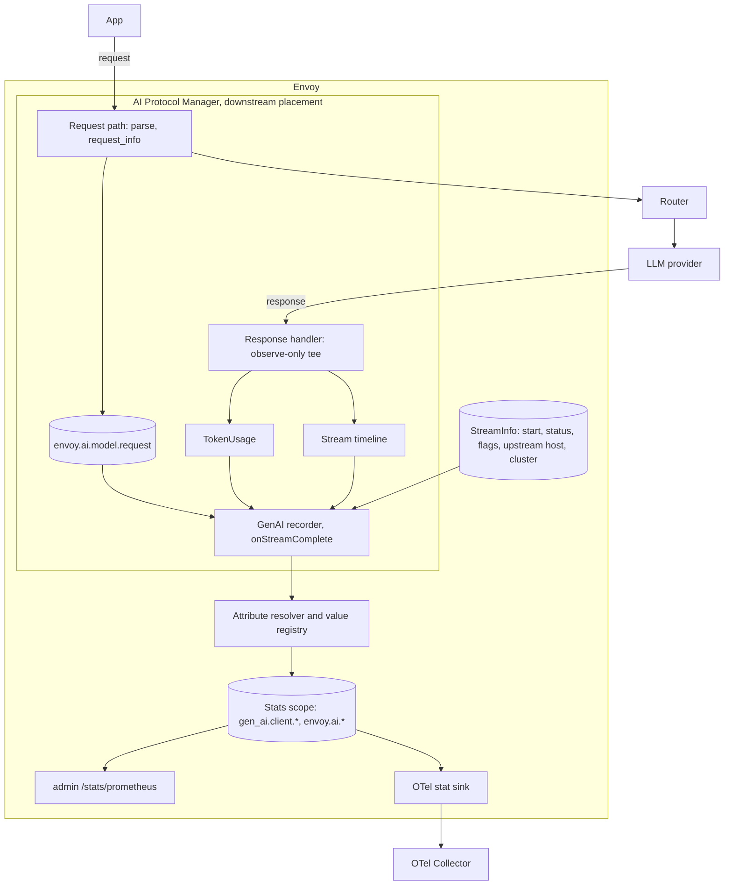
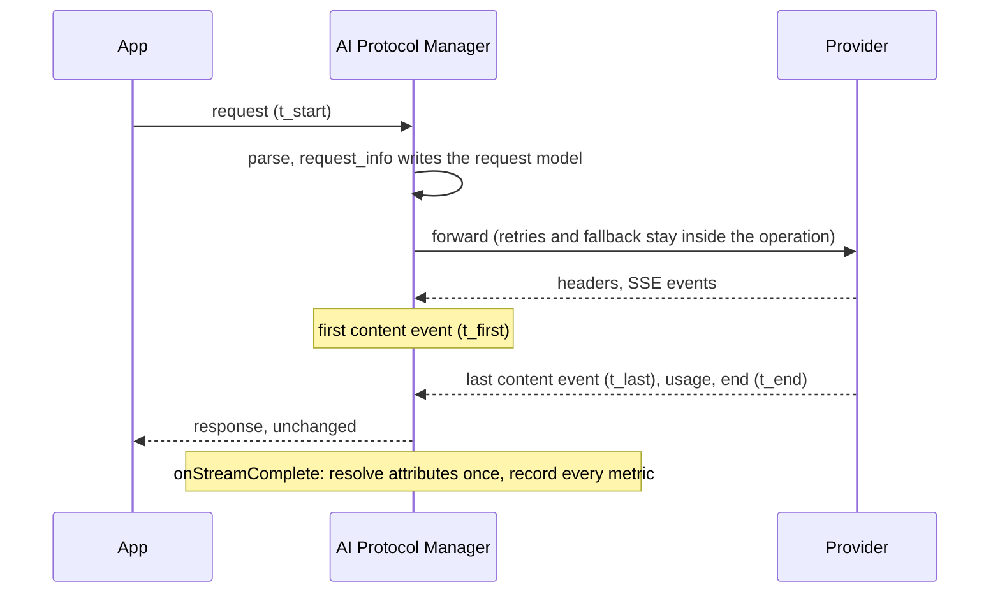

# Envoy GenAI metrics: an OpenTelemetry convention for the AI Protocol Manager

Status: proposal. It replaces the earlier metrics plan on this branch.

Scope: metrics for LLM inference traffic that the AI Protocol Manager handles. Out of scope: MCP;
agent, tool and workflow metrics; spans and events.

Spec: [open-telemetry/semantic-conventions-genai](https://github.com/open-telemetry/semantic-conventions-genai)
at `cb10b70c15` (2026-10-05), schema `gen-ai-dev/1.42.0-dev`.

- That repo has no release yet. The last released GenAI conventions are in semantic-conventions
  v1.41.0.
- The next release replaces `gen_ai.client.token.usage` and its `gen_ai.token.type` attribute
  (#374).
- Every GenAI convention is at Development stability, so the Envoy API ships as
  `work_in_progress`.

## 1. Summary

- **Envoy emits the spec's client metrics.** There is one operation per downstream request:
  retries and fallback stay inside it, and it is measured from when the request reaches Envoy.
- **Spec names are used verbatim.** Metrics the spec does not define live under `envoy.ai.*`.
- **They are ordinary Envoy stats.** The spec attributes become tags, and the admin Prometheus
  endpoint and the OTel stat sink export them unchanged.
- **Every attribute is bounded.** Model names and custom attributes pass through a capped value
  registry, and values past the cap are reported as `_OTHER`.
- **Tiers, ordered by usefulness:**
  - **MVP:** token usage counters, operation duration with a documented `error.type`, and time
    to first chunk.
  - **Phase 1:**
    - custom attributes (tenant, team);
    - injecting the usage option into OpenAI streaming requests;
    - per-request time per output token;
    - token histograms;
    - units in the OTel stat sink.
  - **Phase 2:**
    - per-attempt metrics, including fallback;
    - per-chunk latency;
    - token counts split by modality;
    - provider error codes;
    - cost;
    - rate-limit headroom;
    - finish reasons.

## 2. What other gateways emit

Each implementation was read at a pinned commit (appendix A).

| Implementation | Metrics | Latency definition | `error.type` | Custom dimensions and caps |
|---|---|---|---|---|
| agentgateway | **Prometheus only.** One `gen_ai_client_token_usage` histogram whose type label includes cache types. Four `gen_ai_server_*` latency histograms (request duration, time to first token, time per output token, inter-chunk latency), plus cost and guardrail counters | From downstream arrival; final attempt only; time per output token is a per-request average | always `_OTHER` | CEL fields on every metric; no cap |
| LiteLLM | **About 88 Prometheus families.** Opt-in OTel adds `gen_ai.client.operation.duration`, `gen_ai.client.token.usage`, `gen_ai.server.time_to_first_token`, `gen_ai.server.time_per_output_token` and a vendor cost metric | Split four ways: total, provider (last attempt), provider TTFT, gateway overhead | provider status and exception class | team, key and user labels; a per-metric series cap with an `other` series; unknown models become `other` |
| Envoy AI Gateway (repo now `theagentrouter/agent-router`) | `gen_ai.client.token.usage`, plus `gen_ai.server.*` request duration, time to first token and time per output token | Per upstream attempt, from the upstream request headers | always `_OTHER` | request-header → attribute map; no cap |
| Kong | **OSS Prometheus:** `ai_llm_{requests,cost,tokens}_total` and `ai_llm_provider_latency_ms`. **OTel:** `gen_ai.client.operation.duration` measures Kong's total time; `gen_ai.server.request.duration` measures provider time | gateway total vs provider | `error.type` (OTel) | consumer, workspace |
| Higress | Dynamic Envoy counters per route × cluster × model × consumer | millisecond sums and counts, so no percentiles | failure count | consumer header; no cap |
| GIE / llm-d endpoint picker | Request total, errors and duration; time to first token; time per output token; inter-chunk latency per chunk; normalized TPOT (duration / output tokens); token histograms | From request receipt | closed `error_code` set | model cap of 1000 with `other`; configured names pinned |
| vLLM (a model server) | Time to first token, inter-token latency, time per output token, end to end, queue/prefill/decode phases, `finished_reason` | server-side phases | through `finished_reason` | served model name only |

**Concepts present in three or more implementations:**
- request count and end-to-end duration;
- time to first token and per-request time per output token;
- input, output and cached-input tokens;
- an error breakdown;
- model, provider and tenant/consumer labels;
- a cost counter (gateways only).

**Worth copying:**
- Separate gateway time from provider time (LiteLLM, Kong, Portkey).
- Use one sparse counter per token category. Never use a shared "type" label, which double-counts
  when summed.
- Cap labels the client controls, with an `other` overflow, and pin configured values (endpoint
  picker, LiteLLM).
- Make streaming usage available: LiteLLM and agentgateway inject
  `stream_options.include_usage`.
- Recognize the first token by its content, not by the first event of any kind (agentgateway's
  Anthropic parser).

**Worth avoiding:**
- `gen_ai.server.*` on a proxy. Four gateways use it, and they disagree on what it measures.
- A constant `error.type=_OTHER` (agentgateway, Envoy AI Gateway).
- Uncapped model and header labels (agentgateway, Envoy AI Gateway, Higress).
- Identity labels by default. LiteLLM saw memory growth (#27272) and leaked PII (#24530) this way.
- Tokenizer estimates mixed into reported counts (agentgateway, Kong).
- Per-chunk histograms on by default.
- Truthiness bugs that drop a headroom value of zero (LiteLLM).

## 3. The convention

### 3.1 Rules

1. **Spec names verbatim.** Where the spec defines an instrument, Envoy uses its name, type,
   attributes and (after export) unit.
2. **Envoy is a GenAI client.** Envoy emits `gen_ai.client.*` only. The spec scopes
   `gen_ai.server.*` to model servers.
3. **One operation per logical request.** An operation spans retries and fallback, the way a
   client library's built-in retries do. The spec maintainers take the same position in
   semantic-conventions-genai#476. Per-attempt data goes in the `envoy.ai.client.attempt.*`
   family.
4. **Extensions are namespaced.** Envoy-only metrics use `envoy.ai.*` and Envoy-only attributes
   use `envoy.*`. If the spec standardizes an equivalent (cost in #443, gateway attributes in
   #299), Envoy moves to it behind an explicit version switch.
5. **Reported counts only.** Usage metrics never include tokenizer estimates.
6. **Every attribute is bounded,** by configuration, by a capped registry, or both.
7. **No identity attributes by default.** API keys, users, emails and client IPs appear only
   through custom attributes that an operator configures.
8. **Closed, documented value lists** for `error.type` and `gen_ai.operation.name`.

### 3.2 Operation boundary and timing anchors

| Anchor | Definition |
|---|---|
| `t_start` | The request reached Envoy (`StreamInfo::startTimeMonotonic()`). |
| `t_first` | First content-bearing SSE event seen on the response path. |
| `t_last` | Last content-bearing SSE event. |
| `t_end` | Response end of stream seen by the filter, or stream completion if the stream was cut. |

`t_start` is the application's view, for three reasons:
- It is what the application waits for.
- It is what most gateways measure (agentgateway, the endpoint picker, Higress, LiteLLM's total).
- It also covers requests that Envoy rejects before forwarding.

Provider-only latency comes from the attempt family in Phase 2.

A **content-bearing event** carries generated output. It is classified by event name, without a
JSON parse:

| Protocol | Content-bearing | Not counted |
|---|---|---|
| OpenAI Chat Completions | every `data:` event except `[DONE]` | comments, `[DONE]` |
| OpenAI Responses | `response.*.delta` | `response.created`, `response.in_progress`, `*.added`, `*.done`, terminal events |
| Anthropic Messages | `content_block_delta` | `message_start`, `content_block_start` / `_stop`, `message_delta`, `message_stop`, `ping` |
| Gemini | every `data:` event | — |

Anthropic and the Responses API send lifecycle events that can arrive before the first generated
token. Counting them would make time to first chunk close to zero for those providers, and not
comparable with OpenAI Chat. This is Envoy's documented reading of the spec's "first chunk".

### 3.3 Attributes

| Attribute | Metrics | Source | Bound |
|---|---|---|---|
| `gen_ai.operation.name` | all | The protocol of the call to the provider. Chat Completions, Responses and Messages map to `chat`; Gemini maps to `generate_content` | closed list |
| `gen_ai.provider.name` | all | First found: upstream cluster `filter_metadata["envoy.filters.http.ai_protocol_manager"]["gen_ai.provider.name"]`; the filter's default; the protocol's family (`openai`, `anthropic`, `gcp.gen_ai`) | configuration |
| `gen_ai.request.model` | all | `envoy.ai.model.request` filter state, written by the `request_info` AI filter | model registry; a value is admitted only on a 2xx response or when it is pinned |
| `gen_ai.response.model` | all | `TokenUsage.model` | model registry |
| `server.address`, `server.port` | all | Upstream host `hostname()` and port; omitted when the hostname is empty | cluster configuration |
| `error.type` | `operation.duration`, attempt metrics | section 3.4 | closed list plus status codes |
| `gen_ai.token.modality` | usage counters | `unknown` until Phase 2 | closed list |
| `envoy.ai.stream`, `envoy.cluster.name`, `envoy.route.name` | all, opt-in (Phase 1) | request, response, `StreamInfo` | configuration |
| custom (e.g. `app.tenant`) | all, opt-in (Phase 1) | a substitution format string (`%REQ()%`, `%FILTER_STATE()%`, `%CEL()%`, ...) | per-attribute registry |

A request whose protocol Envoy cannot name records no GenAI metric.

### 3.4 `error.type`

`error.type` is set only when the operation did not complete successfully. The first matching row
wins:

| Condition | Value |
|---|---|
| Upstream response status ≥ 400 | the status code (`"429"`, `"503"`) |
| Envoy replied locally with a 4xx after a JSON parse failure or an AI-filter rejection | `invalid_request` |
| Local or global rate limit (`RateLimited`) | `rate_limited` |
| `UpstreamRequestTimeout`, `StreamIdleTimeout` | `timeout` |
| `NoHealthyUpstream` | `no_healthy_upstream` |
| `UpstreamConnectionFailure` | `connection_failure` |
| `UpstreamOverflow` | `overflow` |
| `UpstreamRemoteReset`, `UpstreamConnectionTermination` | `upstream_reset` |
| `DownstreamConnectionTermination` | `cancelled` |
| AI Protocol Manager 5xx (replay, external buffer, response pipeline) | `internal` |
| A 2xx stream that carried an in-band error event | `_OTHER` (Phase 2: the provider's error code) |
| anything else | `_OTHER` |

### 3.5 Metric catalog

**Usefulness:**
- **H:** answers a top operator question (spend, SLO, reliability) and appears in three or more
  implementations.
- **M:** valuable for some deployments, or derivable from H metrics.
- **L:** niche.

**Cost** covers implementation work, series and memory, and per-chunk work.

| Metric | Instrument (Envoy unit) | Usefulness | Cost | Tier |
|---|---|---|---|---|
| `gen_ai.client.inference.usage.input_tokens` | counter | H: spend; every implementation | L: the data exists | MVP |
| `gen_ai.client.inference.usage.output_tokens` | counter | H | L | MVP |
| `gen_ai.client.inference.usage.cache_read.input_tokens` | counter, only when reported | H: cache discount; 5 implementations | L | MVP |
| `gen_ai.client.inference.usage.cache_write.input_tokens` | counter, only when reported | M: Anthropic cache writes | L | MVP (comes with the row above) |
| `gen_ai.client.inference.usage.reasoning.output_tokens` | counter, only when reported | M: reasoning spend | L | MVP (comes with the rows above) |
| `gen_ai.client.operation.duration` | histogram (ms) | H: rate, errors, latency | L | MVP |
| `gen_ai.client.operation.time_to_first_chunk` | histogram (ms) | H: streaming UX; every gateway | M: needs an SSE event hook | MVP |
| `envoy.ai.client.operation.time_per_output_token` | histogram (µs) | H: decode speed; 5 implementations | L once the MVP is in | Phase 1 |
| `gen_ai.client.inference.operation.input_tokens` | histogram | M: prompt size, context pressure | L, but histograms cost memory | Phase 1 |
| `gen_ai.client.inference.operation.output_tokens` | histogram | M | L | Phase 1 |
| `envoy.ai.client.attempt.duration`, `.time_to_first_chunk` | histogram (ms) | M: provider vs gateway time; retries; fallback | H: needs the upstream placement | Phase 2 |
| `gen_ai.client.operation.time_per_output_chunk` | histogram (µs), per chunk | L: a chunk is not a token, and cost grows with chunk count | M | Phase 2, opt-in |
| `envoy.ai.client.cost`, `envoy.ai.client.cost.unpriced` | counter (micro-USD) | H for chargeback, but needs prices | M: price configuration | Phase 2 |
| `envoy.ai.client.rate_limit.remaining` | gauge | M: quota headroom (only LiteLLM has it) | L | Phase 2 |
| `envoy.ai.client.operation.finish_reason` | counter | M: truncation, content filtering | M | Phase 2 |
| Usage counters split by modality | — | M: multimodal spend | M: new parsing | Phase 2 |

`envoy.ai.client.operation.time_per_output_token` is the spec's server-side definition applied to
the client's view: (`t_last` − `t_first`) / (output tokens − 1). It is recorded for streaming
operations with at least two output tokens.

**Not planned:**

| Metric or practice | Why not |
|---|---|
| `gen_ai.server.*` | It is for model servers. Rename with a collector rule if a legacy dashboard needs those names. |
| `gen_ai.client.token.usage` | Removed upstream by #374. |
| `invoke_agent`, `invoke_workflow`, `execute_tool` metrics | Envoy cannot bound an agent invocation. |
| Identity labels by default | PII and memory growth; available through custom attributes. |
| A built-in price catalog | Goes stale; Envoy takes prices from configuration. |
| Tokenizer estimates in usage counters | The spec forbids them unless offline counting is enabled. |
| Deployment-state and budget gauges | Outlier detection and cluster health already cover deployment state; budgets belong to the quota service. |
| Response-cache and semantic-cache metrics | Envoy has no semantic cache. |
| Queue, prefill and decode phases | These are server-side (vLLM). |

## 4. Architecture

### 4.1 Components



- **Response handler (exists).** An observe-only tee on `encodeData()` that parses usage. The
  response reaches the application unchanged.
- **Stream timeline (new).**
  - It is called from `SseResponseHandler::handleCompleteEvent()` before the usage classifier
    drops events, so it sees Anthropic `content_block_delta` events.
  - It holds `t_first`, `t_last` and a count of content events.
  - If parsing stops early because the parse budget ran out, `t_last` is marked truncated and
    time per output token is skipped.
- **GenAI recorder (new, one per stream).**
  - It is engaged in `decodeHeaders()` for routes in scope.
  - It records everything once, in `onStreamComplete()`. The connection manager calls that hook
    for every stream before access logging, including local replies and resets.
- **Attribute resolver and value registry (new, one per filter config).**
  - It resolves the attribute set once per stream.
  - The registry interns admitted values as symbolic `StatName`s, caps distinct values per
    attribute class, and returns `_OTHER` past the cap.
  - This keeps Envoy below the stats scope limit. Past that limit, every lookup takes the
    store-wide lock (`thread_local_store.cc`).
- **Stats scope.**
  - It has an empty prefix, so the tag-extracted name is the spec name.
  - It is built from `envoy.type.v3.Scope`, as the stats access logger does, and its limits act
    only as a backstop.
- **Export.**
  - Admin `/stats/prometheus`.
  - The OTel stat sink with its defaults (`use_tag_extracted_name`, `emit_tags_as_attributes`)
    exports the spec names and attributes.

### 4.2 Per-stream lifecycle



### 4.3 Placement

| Placement | End hook | Records |
|---|---|---|
| Downstream (MVP) | `onStreamComplete()` | operation metrics and token usage |
| Upstream (Phase 2) | `onDestroy()`, with `upstreamCallbacks()->upstreamStreamInfo()` for the attempt's timing | attempt metrics only |

The connection manager is the only caller of `onStreamComplete()`. An upstream filter's only end
hook is `onDestroy()`, which runs when the attempt's `UpstreamRequest` is cleaned up
(`router/upstream_request.cc`). Splitting operation metrics from attempt metrics by placement means
a response is never counted twice.

### 4.4 Hot-path cost

- Recording happens once per stream: about seven tagged stat lookups in the MVP.
- **Steady state takes no locks.** Each lookup joins the stat name (often one malloc) and does one
  thread-local hash lookup.
- **A new series** takes the store-wide lock once per worker.
- **The value registry** answers from a thread-local cache; a miss takes a shared reader lock.
- **Per-chunk recording (Phase 2)** adds one thread-local histogram record per content event. A
  statsd sink sends one packet per value, which is why it is opt-in.

### 4.5 Export

- **Units.** Envoy histograms hold integers: milliseconds for durations, microseconds for
  per-token and per-chunk times.
  - The OTel stat sink sets no unit and does not rescale.
  - Until Phase 1 changes the sink, an OTel Collector `transform` processor using `scale_metric`
    converts the values to seconds (to be verified against the current OTTL).
- **Buckets.** Bucket boundaries come from bootstrap `stats_config.histogram_bucket_settings`,
  matched by prefix on the flat stat name. The docs ship the spec's boundaries converted to the
  recording unit, plus buckets under 10 ms for time per output token (a lesson from
  agentgateway).
- **Temporality.** Cumulative by default. If scope eviction is enabled, use delta: the sink gives
  every cumulative series the sink's own start time, so a recreated series restarts at 0 without
  a reset signal.
- **Attribute types.** `server.port` is exported as a string attribute, because Envoy tag values
  are strings.

### 4.6 Configuration sketch

```proto
message ResponseHandling {
  TokenUsageExtraction token_usage = 1;

  // OpenTelemetry GenAI metrics. Requires ``token_usage``.
  GenAiMetrics gen_ai_metrics = 2;
}

message GenAiMetrics {
  // Leave ``prefix`` empty so stat names are the convention's names.
  type.v3.Scope stats_scope = 1;

  // gen_ai.provider.name when the upstream cluster's metadata names none.
  string default_provider_name = 2;

  // Shared by gen_ai.request.model and gen_ai.response.model. Defaults to 256 values.
  ValueLimits model_values = 3;

  // Phase 1.
  repeated CustomAttribute custom_attributes = 4;
  bool emit_stream_attribute = 5;
  bool emit_cluster_attribute = 6;
  bool emit_route_attribute = 7;
  bool record_token_histograms = 8;

  // Phase 2.
  bool record_time_per_output_chunk = 9;
  repeated ModelPrice prices = 10;
  bool record_rate_limit_headroom = 11;
}

message ValueLimits {
  // Distinct values kept before reporting ``_OTHER``.
  google.protobuf.UInt32Value max_values = 1;

  // Always kept, and not counted against ``max_values``.
  repeated string pinned = 2;
}

message CustomAttribute {
  string name = 1;

  // A substitution format string, e.g. ``%REQ(x-tenant-id)%``.
  string value_format = 2;

  // Defaults to 100 values.
  ValueLimits limits = 3;

  // Reported when the format yields an empty value.
  string default_value = 4;
}
```

## 5. Tasks by phase

### MVP: golden signals per model and provider

| Task | Delivers | Depends on | Size |
|---|---|---|---|
| M1. API, vocabulary, registry | `GenAiMetrics` proto; `gen_ai_semconv.h` pinned to the spec commit; value registry with caps and pins; stats scope | — | M |
| M2. Recorder and usage counters | The five usage counters (modality `unknown`); a resolver for operation, provider, models and server | M1 | M |
| M3. Duration and `error.type` | `gen_ai.client.operation.duration` for every in-scope stream, including local replies and resets | M2 | M |
| M4. Time to first chunk | Stream timeline hook, content-event classification, `time_to_first_chunk` | M2 | M |
| M5. Docs and export recipes | Metric, attribute and error lists; bucket settings; OTel sink and collector recipe for seconds; changelog | M3, M4 | S |

### Phase 1: attribution and depth

| Task | Delivers | Depends on | Size |
|---|---|---|---|
| P1. Custom and optional attributes | Tenant and team attributes with caps; `envoy.ai.stream`, `envoy.cluster.name`, `envoy.route.name` | MVP | M |
| P2. Streaming usage injection | Opt-in `stream_options.include_usage` for OpenAI Chat streams that set no `stream_options`. Without it those streams report no tokens | — | M |
| P3. Time per output token | `envoy.ai.client.operation.time_per_output_token` | M4 | S |
| P4. Token histograms | `gen_ai.client.inference.operation.{input,output}_tokens` | M2 | S |
| P5. OTel stat sink units | `unit` taken from histogram units; opt-in conversion to seconds; counter units through the conversion action. Useful beyond AI traffic | — | M |

### Phase 2: gateway depth, all opt-in

| Task | Delivers | Depends on | Size |
|---|---|---|---|
| Q1. Attempt metrics | `envoy.ai.client.attempt.*` from the upstream placement, with the attempt kind (initial, retry, fallback) | model fallback | L |
| Q2. Per-chunk latency | `time_per_output_chunk`, recorded per content-event gap once attributes are resolved | M4 | M |
| Q3. Modality split | Text, image and audio counts from Gemini and OpenAI usage details; the remainder goes to `unknown` | M2 | M |
| Q4. Provider error codes | In-band and error-body codes as `error.type`, behind a flag because the series change | M3 | M |
| Q5. Cost | Per-model prices from configuration; `envoy.ai.client.cost` and `.unpriced` | M2 | M |
| Q6. Rate-limit headroom | Gauges from `x-ratelimit-remaining-*` and `anthropic-ratelimit-*`. They are read before the non-2xx early exit, and zero counts as a value | — | S |
| Q7. Finish reasons | A counter of finish reasons, normalized across providers | — | M |
| Q8. Strip injected usage | Removes the injected usage chunk for clients that did not ask for it | P2 | M |

Testing for every task:
- Unit tests use `SimulatedTimeSystem`.
- Filter tests assert tagged stat names and tags.
- An integration test checks the names and labels on admin `/stats/prometheus`.

## 6. Open decisions

1. **Anchor:** measure from arrival at Envoy (proposed), or from forwarding to the provider.
2. **Operation scope:** one logical operation plus an attempt family (proposed), or the spec's
   metrics per attempt.
3. **Server metrics:** client metrics only, with no `gen_ai.server.*` compatibility mode
   (proposed).
4. **First chunk:** the first content-bearing event (proposed), or the first event of any kind.
5. **Request model:** admitted only on a 2xx or when pinned, with a cap of 256 (proposed).
6. **Local rejections:** recorded as failed operations with Envoy `error.type` values (proposed),
   or excluded.
7. **Extension names:** `envoy.ai.*` now (proposed), or wait for `gen_ai.gateway.*` (#299).

## Appendix A. Sources

| Source | Revision |
|---|---|
| open-telemetry/semantic-conventions-genai | `cb10b70c15` (`model/gen-ai/metrics.yaml`, `token-metrics.yaml`, `registry.yaml`; issues #299, #374, #443, #476) |
| agentgateway/agentgateway | `118c624c31` (`crates/agentgateway/src/telemetry/metrics.rs`, `telemetry/log.rs`, `llm/mod.rs`) |
| BerriAI/litellm | `126e79c967` (`litellm/integrations/prometheus.py`, `otel/plumbing/metrics.py`); docs at BerriAI/litellm-docs `cd99308b06` |
| theagentrouter/agent-router (formerly envoyproxy/ai-gateway) | `8060279130` (`internal/metrics/genai.go`, `metrics_impl.go`) |
| Kong/kong | `8927af6d5e` (`kong/plugins/prometheus/exporter.lua`) |
| higress-group/higress | `bda81f1067` (`plugins/wasm-go/extensions/ai-statistics`) |
| llm-d/llm-d-router, kubernetes-sigs/gateway-api-inference-extension | `d4b8afd3c2`, `v1.5.0` |
| vllm-project/vllm | `cbe1f9740d` (`vllm/v1/metrics/loggers.py`) |
| Envoy | `9c3d9aff1a`: `ai_protocol_manager/response_handler.cc`, `common/stats/thread_local_store.cc`, `stat_sinks/open_telemetry/open_telemetry_impl.cc`, `router/upstream_request.cc` |
