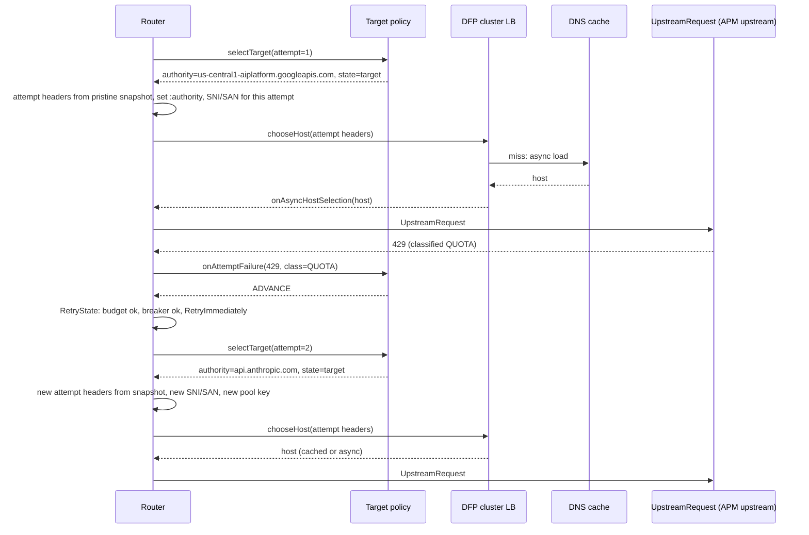
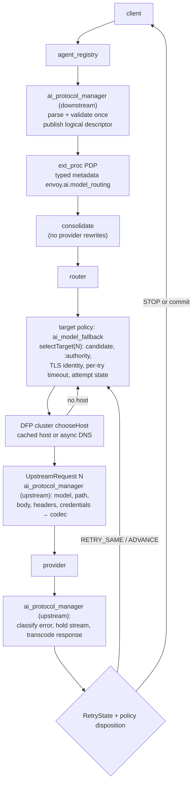

# AI model routing and fallback in Envoy

Status: design proposal. Nothing here is implemented.

All code references are to upstream/main `1dc43a3ace` (2026-09-13).

## Summary

The PDP returns an ordered list of candidates. That list is request-scoped **data**. The router's
existing retry loop should **consume** it. There must be no second retry loop.

Today the router changes only the upstream host between attempts. Everything else stays fixed or
leaks from one attempt into the next:

- the cluster (unless `refresh_cluster_on_retry` is set);
- the TLS identity (SNI and SAN);
- the request headers;
- route-level rewrites.

AI fallback needs a **different request**, derived from the same logical request, sent to a
**different target**. The missing abstraction is an *attempt-scoped upstream target*.

Recommendation:

1. **Generic router changes**, each useful on its own:
   - attempt-scoped request headers;
   - per-attempt transport socket options (SNI and SAN);
   - picking another target within the same attempt when host selection finds no host.
2. **A generic extension point**, `RetryPolicy.upstream_target_policy`. It runs for every attempt:
   - It chooses that attempt's target.
   - When an attempt fails, it classifies the failure as *retry same*, *advance* or *stop*.
     `RetryState` then applies budgets, circuit breakers and backoff as it does today.
   - It generalizes `refresh_cluster_on_retry` and `retry_options_predicates`.
3. **An AI implementation of that point**, `envoy.upstream_target_policies.ai_model_fallback`. It
   holds the model resolver and `ModelRoutingState`.
4. **`ai_protocol_manager` as the per-attempt executor**, running as an upstream filter:
   - It derives each provider request from the immutable logical request plus a per-attempt
     `ResolvedModelTarget`.
   - It classifies provider errors before the router decides whether to retry.
   - It can hold a streaming response for a bounded window.
5. **Dynamic Forward Proxy (DFP)**:
   - Fallback routes do not use the DFP HTTP filter.
   - The DFP cluster resolves each attempt's authority itself (`dfp_cluster_resolves_hosts`, on by
     default).

Not recommended:

- **Priorities or aggregate/composite clusters:** the order is static and cannot follow a
  per-request PDP decision.
- **Internal redirects:** they re-run the whole downstream filter chain.
- **A separate AI router:** it is a parallel routing stack.
- **Prewarming candidates on every request.**

## 1. Routing semantics

### 1.1 Terms

| Term | Meaning | Scope | Owner |
|---|---|---|---|
| Logical model routing | Maps the client's logical request (API dialect, logical model, features) to ordered candidates | Once per request | PDP (ext_proc) |
| Candidate | A complete logical backend: backend (provider endpoint family), provider model id, region or other parameters, wire protocol, credential reference, attempt budget | Request | PDP output, bounded by operator config |
| Upstream target | What Envoy connects to for one attempt: cluster, `:authority`, TLS identity (SNI/SAN), per-try timeout | Attempt | Target policy |
| Endpoint/host routing | Target to host. For DFP, `:authority` becomes a DNS cache entry and a logical host. For EDS, the cluster's host set | Attempt | Cluster load balancer |
| Load balancing | Picking a host within the target's cluster (DFP lookup, EDS LB, override_host), then an address (happy eyeballs) and a connection (pool) | Attempt | LB, connection pool |
| Retry | Another attempt on the **same** candidate and target. A new stream, possibly a new connection or host | Attempt | Router + `RetryState` |
| Model fallback | Advance to candidate N+1 with a different model. The backend may be the same | Attempt | Target policy |
| Provider fallback | Advance to candidate N+1 with a different backend (provider, region or hostname). Target, TLS identity, protocol and credentials may all change | Attempt | Target policy |
| Commit | The first response byte forwarded downstream (`downstream_response_started_`, `source/common/router/router.cc:2072`). No retry or fallback is possible after it | Request | Router |

### 1.2 What changes between attempts

| Dimension | Retry (same candidate) | Model fallback | Region fallback | Provider fallback |
|---|---|---|---|---|
| Candidate index | same | N+1 | N+1 | N+1 |
| Cluster | same | same | same with DFP | may change |
| `:authority`, DFP host, SNI/SAN | same | usually same | changes | changes |
| Host / connection | may change | may change | changes | changes |
| Wire protocol (transcoding) | same | same | same | may change |
| Model id in body or path | same | changes | same | changes |
| Credentials | same | same | same type, maybe another project | changes |
| Backoff before the attempt | yes (jittered, or `Retry-After`) | no | no | no |
| Budget consumed | per-candidate attempts and overall attempts | overall attempts | overall attempts | overall attempts |

### 1.3 Failure dispositions

There are three dispositions:

- **RETRY_SAME:** same candidate, with backoff, while the candidate still has attempts left.
- **ADVANCE:** the next eligible candidate, immediately. A domain-scoped variant also skips the
  remaining candidates in the same failure domain, for example the same region.
- **STOP:** no further attempts. The current response goes downstream, or a local reply if there is
  no response.

In every case the overall attempt budget and the pre-commit deadline still apply. If a candidate
runs out of attempts while its failure is still retriable, the disposition becomes ADVANCE.

| Failure | Envoy signal | Default | Notes |
|---|---|---|---|
| TCP connect failure or connect timeout | reset `RemoteConnectionFailure` / `LocalConnectionFailure` / `ConnectionTimeout`, flag `UF` | RETRY_SAME once, then ADVANCE | No request byte was sent, so it is safe. Happy eyeballs already tried the other addresses in the list |
| TLS handshake or SAN verification failure | same resets; `upstreamTransportFailureReason` (`source/common/router/upstream_request.cc:634`) | ADVANCE | Not transient. Also what a stale SNI looks like (section 4) |
| DNS failure: NXDOMAIN, SERVFAIL, timeout, empty result | DFP load balancer returns no host (`source/extensions/clusters/dynamic_forward_proxy/cluster.cc:476-477`), or the DFP filter sends a 503 | ADVANCE, skipping the domain | A retry to the same name within the request is useless: failures stay cached until the refresh timer. **Today this ends the request** (section 2.4) |
| Reset before any request byte, or REFUSED_STREAM / GOAWAY | `reset-before-request`, `refused-stream` | RETRY_SAME | The provider did not see the request |
| Reset after the request was sent, before response headers | `RemoteReset`, `ConnectionTermination` | RETRY_SAME once, then ADVANCE | Safe to replay (no client-visible side effects), but it may be billed twice. Count it against the candidate budget |
| Local circuit-breaker overflow | reset `Overflow` (never retried today: `source/common/router/retry_state_impl.cc:439-442`) | ADVANCE if the next target is a different host or cluster; otherwise STOP | Retrying the same saturated target makes things worse |
| 429, provider quota or rate limit | status 429; provider error code in the body | ADVANCE | Quotas are per model, region or account, so the next candidate usually has headroom. RETRY_SAME only for a short `Retry-After` below a threshold |
| 429 from Envoy's own rate limiter | `x-envoy-ratelimited` | STOP | Never route around the gateway's own policy |
| 500 | status | RETRY_SAME once, then ADVANCE | |
| 502, 504 from the provider edge | status | RETRY_SAME once, then ADVANCE | A 504 after a long generation should ADVANCE: a same-candidate retry is likely to time out again and costs twice |
| 503, 529, provider overload | status or provider error code (`overloaded_error`, `UNAVAILABLE`) | ADVANCE | Optionally skip the domain |
| Model unavailable | 404 model not found; 400/403 "model not supported or not enabled here" | ADVANCE | Fatal for this candidate and likely persistent. Log it so the PDP can learn |
| Region unavailable | DNS or connect failure to a regional host; regional 503; location errors | ADVANCE, skipping the domain | |
| Per-try timeout before commit | `UpstreamRequestTimeout` via `onPerTryTimeout` (`source/common/router/router.cc:1501-1533`) | ADVANCE | A slow candidate is usually overloaded, and RETRY_SAME doubles latency. Configurable |
| Pre-commit deadline or route timeout exhausted | policy deadline, `response_timeout_` | STOP (504) | |
| Idle timeout or stall after commit | `per_try_idle_timeout`, stream idle timeout | STOP: end the stream | Section 11 |
| Error inside a stream before commit | an upstream filter holds headers and sees an error event | RETRY_SAME or ADVANCE, per the provider's error class | Only possible if nothing has gone downstream (section 11) |
| Error after commit (partial output) | none: the router no longer retries (`source/common/router/router.cc:1637`) | STOP with a protocol-correct terminal error | No transparent fallback |
| 400 invalid request or schema error | status plus body | STOP | Fatal for the request, not the candidate |
| Context length exceeded | provider error code | STOP by default; ADVANCE only if the next candidate declares a larger context | Capability-aware |
| Content policy or safety refusal | provider error code | STOP | Fallback must never route around a safety decision |
| 401/403 on the gateway's own backend credentials | status | ADVANCE, and alert | Fatal for the backend, not the request |
| Client cancel (downstream reset) | stream reset | STOP | |
| The candidate cannot express the request (tools, modality) | transcoder capability check | Skip before the attempt; ADVANCE if only found while transcoding | Needs an attempt-failure API for upstream filters (section 6.4) |

The router itself only sees four things:

- reset reasons;
- response headers;
- timers;
- the result of host selection.

Anything that needs the response **body** (provider error codes, SSE error events) must be
classified by an upstream filter before the headers reach the router. Section 6 describes that.

## 2. Current Envoy architecture

### 2.1 Components on the path

| Component | Runs | What it does, and why it matters for fallback |
|---|---|---|
| HCM route resolution | Once, lazily; again after `clearRouteCache()` | Matches the route and runs the cluster specifier (`RouteEntryImplBase::clusterEntry`) before the filter chain is built. `refreshRouteCluster()` re-runs only the cluster specifier (`source/common/http/conn_manager_impl.cc:2577-2596`) |
| Downstream HTTP filters (`agent_registry`, `ai_protocol_manager`, ext_proc, consolidate, DFP) | **Once per downstream stream.** Retries never re-run them; only `recreateStream` does | Anything they rewrite is fixed for every attempt |
| Route action, cluster specifier | At route resolution; again on `refreshRouteCluster()` if the specifier supports it | Refresh works for weighted_clusters, matcher and dynamic modules. Static `cluster` and `cluster_header` ignore it |
| Router filter | Terminal decoder filter; owns every attempt | Latches the route and cluster (`source/common/router/router.cc:519-588`), computes timeouts, runs `finalizeRequestHeaders` once (664-669), computes SNI/SAN once (672-713), is the `LoadBalancerContext`, and creates one `UpstreamRequest` per attempt |
| `RetryPolicy` / `RetryState` | Created after the first host selection (`source/common/router/router.cc:847-851`), only if `retry_on` is set (`source/common/router/retry_state_impl.cc:39-47`) | Decides on response headers, resets and per-try timeouts. Owns `num_retries`, the retry circuit breaker (`max_retries` defaults to 3, `source/common/upstream/upstream_impl.cc:2304`), backoff and rate-limited backoff |
| Retry plugins | Per attempt | Host predicates and retry priority see hosts or priority load only. Options predicates can only replace socket options (`source/common/router/router.cc:2410-2419`). None gets the failure reason as an argument |
| Load balancer | Per attempt: `chooseHost(this)` (`source/common/router/router.cc:737`, `:2473`) | Sync or async (`HostSelectionResponse`, `envoy/upstream/load_balancer.h:60-73`) |
| DFP HTTP filter | Once, before the router | Resolves `:authority` or the filter-state host through the DNS cache and holds the request until done. Sends a 503 on DNS failure |
| DFP cluster | Per attempt, inside `chooseHost` | Key: filter state `envoy.upstream.dynamic_host`, else `:authority`, else downstream SNI (`source/extensions/clusters/dynamic_forward_proxy/cluster.cc:394-424`). With `dfp_cluster_resolves_hosts` it resolves unknown hosts asynchronously (455-485). It forces `auto_sni` and `auto_san_validation` (606-613, 632-639) |
| DNS cache | Shared, main thread | Key is `host:port`. Deduplicates in-flight lookups, caches failures, evicts after `host_ttl` |
| Upstream HTTP filters | **Per attempt**, created after host selection (`source/common/router/upstream_request.cc:168-188`) | The cluster's chain wins over the router's. They see the router's **shared** request header map and a **fresh copy** of the body |
| `ai_protocol_manager` | Downstream and upstream (`source/extensions/filters/http/ai_protocol_manager/config.cc:36-43`) | Parses, validates and re-serializes the request; extracts token usage from responses. No transcoding yet. Protocols come from `envoy.type.ai.v3.ApiProtocol` |
| ext_proc | Downstream (PDP); can also run upstream | Can write namespaced dynamic metadata, typed or untyped, gated by `metadata_options.receiving_namespaces`. `:authority` mutation is blocked unless `allow_all_routing` |

### 2.2 Where each decision is made today

| Decision | Where | Code | Re-evaluated per attempt? |
|---|---|---|---|
| Route selection | HCM `refreshCachedRoute`, cached | `source/common/http/conn_manager_impl.cc:1661` | No. Only `clearRouteCache` or internal redirect |
| Cluster selection | Cluster specifier at route resolution; router reads `route_entry_->clusterName()` | `source/common/router/router.cc:576-588` | Only with `refresh_cluster_on_retry`, and not with hedging (`:858-860`, `:2436-2460`) |
| Host selection | `cluster->chooseHost(router)` | `source/common/router/router.cc:737`, `:2473` | **Yes** |
| Retry decision | `RetryStateImpl::shouldRetryHeaders` / `shouldRetryReset`, before commit | `source/common/router/router.cc:1969-2012`, `:1632-1687` | Yes, per failure |
| Retry host selection | Same LB; host predicates, priority load and `hostSelectionRetryCount` apply on retries only; override host on the first attempt only | `source/common/router/router.h:438-482` | Yes |
| Request reconstruction | None. The same header map (plus router-set attempt headers) and a new copy of the buffered body | `source/common/router/router.cc:2511-2547`, `source/common/router/upstream_request.cc:487` | Headers carry over; body is copied |
| Upstream filter execution | New chain per `UpstreamRequest`, after host selection, while the pool connects | `source/common/router/upstream_request.cc:168-188`, `:447-487` | Yes, new instances |
| TLS identity (SNI/SAN) | Router `decodeHeaders`, from `:authority` | `source/common/router/router.cc:672-713` | **No** |

### 2.3 Attempt lifecycle today

```mermaid
sequenceDiagram
  participant C as Client
  participant HCM as HCM + downstream filters
  participant R as Router
  participant LB as Cluster LB (DFP)
  participant U as UpstreamRequest + upstream filters
  participant P as Provider
  C->>HCM: request
  HCM->>HCM: route + cluster specifier (once)
  HCM->>HCM: agent_registry, APM parse, ext_proc PDP, consolidate, DFP DNS (once)
  HCM->>R: decodeHeaders
  R->>R: latch route/cluster, timeouts, finalizeRequestHeaders, SNI/SAN (once)
  R->>LB: chooseHost(ctx: shared headers, filter state)
  LB-->>R: host (maybe async)
  R->>U: new UpstreamRequest #1 (filters built), onHostSelected, newStream
  U->>U: upstream filters decode shared headers; body copy
  U->>P: encode when pool ready
  P-->>U: response headers
  U-->>R: onUpstreamHeaders (after upstream encode filters)
  alt retriable and not committed
    R->>R: RetryState: budget, breaker, backoff
    R->>LB: doRetry: [refreshRouteCluster], chooseHost
    R->>U: new UpstreamRequest #N: same header map, new body copy
  else commit
    R-->>C: encodeHeaders (no more retries)
  end
```

### 2.4 Constraints that shape the design

1. **Upstream filters edit one shared header map.**
   - `acceptHeadersFromRouter` passes `*parent_.downstreamHeaders()`, and so does
     `requestHeaders()` (`source/common/router/upstream_request.cc:486-487`, `:835-837`). The router
     writes attempt headers into that same map (`source/common/router/router.cc:2511-2518`).
   - The router already copies headers for shadow requests *because* `acceptHeadersFromRouter`
     changes them (`:883-889`).
   - Consequences: `header_mutation` appends pile up. `credential_injector` with `overwrite: false`
     keeps the **previous provider's** credential. A provider rewrite of `:path` or an auth header
     leaks into the next attempt.
   - Envoy AI Gateway (now Agent Router) snapshots and restores headers in its upstream ext_proc to
     work around this. Issue #12088 (open since 2020) asks for per-attempt request changes.
2. **The body is safe.** Each attempt gets a copy of the router's buffered body
   (`source/common/router/router.cc:1189-1201`, `:2542-2547`). If the body exceeds the buffer limit,
   retries are silently dropped (`retry_or_shadow_abandoned`, `:1145-1155`).
3. **SNI, SAN and the transport socket options are computed once.** They come from `:authority` in
   `decodeHeaders`, are set in filter state only if absent, and are never recomputed on retry
   (`source/common/router/router.cc:672-713`). They are also part of the connection pool key.
4. **Host selection runs before any upstream filter exists** (`source/common/router/upstream_request.cc:447-458`).
   An upstream filter cannot influence the host of its own attempt.
5. **Upstream filters cannot fail just their attempt.**
   - A local reply goes straight downstream (`source/common/router/upstream_request.cc:62-75`).
   - A `LocalReset` resets the downstream stream (`:866-878`).
   - Only non-local reset reasons reach `onUpstreamReset` and the retry path.
6. **No host ends the request.** `createConnPoolOrHandleFailure` sends a 503 and cleans up, with no
   retry, on both the initial and the retry path (`source/common/router/router.cc:1054-1092`,
   `:2447-2453`). For DFP this includes DNS failure.
7. **Cross-cluster retry exists but is partial.**
   - `refresh_cluster_on_retry` (#44719) swaps `cluster_`, so the next attempt uses the new
     cluster's upstream filters.
   - `RetryState`, retry circuit breakers, timeouts, SNI and the cached metadata-match criteria stay
     with the first cluster (`source/common/router/router.cc:2436-2460`; TODO at `:2438-2442`).
   - It is disabled when hedging is on.
8. **Per-attempt state has a home already.** `upstreamStreamInfo()` is per attempt
   (`source/common/router/upstream_request.h:367`). The `streamInfo()` an upstream filter gets is the
   downstream one, shared by all attempts (`source/common/router/upstream_request.cc:56-61`).
   Upstream access logs use the per-attempt StreamInfo (`:270-280`).
9. **Commit is final.** After `downstream_response_started_`, resets and per-try timeouts are not
   retried (`source/common/router/router.cc:1637`; `source/common/router/upstream_request.cc:597-609`).
   A 1xx response also clears retry state (`source/common/router/router.cc:1859-1867`).
10. **The per-try timeout covers the time until response headers reach the router.**
    - It starts when the request is complete and the pool is ready
      (`source/common/router/upstream_request.cc:710-714`).
    - After commit it is ignored.
    - The route timeout runs until the response is complete (`source/common/router/router.cc:1378-1381`),
      so streaming routes normally set it to 0.

## 3. Where the ordered policy should live

### 3.1 Option A: the router owns fallback

- **A1: AI concepts in the router core.** Rejected. The router must stay protocol-agnostic.
- **A2: a generic per-attempt extension point in the retry machinery.** This is the recommended
  form. For **every** attempt, including the first, the router:
  1. calls `policy.selectTarget(attempt)` before `chooseHost`;
  2. applies the returned cluster, `:authority`, TLS identity, per-try timeout and attempt state;
  3. on failure, lets `RetryStateImpl` ask the policy for a disposition, and only then applies the
     budget, circuit breaker and backoff it already applies today.

  There is still one retry loop, one attempt counter and one budget.

A2 requires these router changes:

- attempt-scoped request headers;
- per-attempt transport socket options;
- picking another target within the same attempt when host selection finds no host;
- a disposition hook in `RetryStateImpl`;
- per-attempt filter state and per-try timeout.

It suits DFP. The DFP load balancer already re-reads its key on every attempt and resolves unknown
hosts asynchronously; it only needs the right `:authority` and SNI in front of it.

### 3.2 Option B: the cluster or load balancer owns it

- **B1: priorities in one cluster, or an aggregate cluster, plus `previous_priorities`.** This is
  Envoy AI Gateway's shape: one priority per backend, endpoint metadata names the backend, and an
  upstream ext_proc transforms the request.
  - The order is config, not per request.
  - The router applies a retry priority only on retries (`source/common/router/router.h:449-459`),
    so attempt 1 always follows the static order.
  - It does not work with DFP, because dynamic hosts carry no priorities or metadata.
  - Retry-same versus advance is only `update_frequency`; there is no failure kind.
  - Aggregate clusters run the aggregate's upstream filters and `max_retries`, but the sub-cluster's
    transport socket.
- **B2: composite cluster (#42618).**
  - Attempt *k* goes to `clusters[k-1]`, taking the attempt count from StreamInfo
    (`source/extensions/clusters/composite/cluster.cc:52-54`).
  - Within one attempt it skips a sub-cluster with no host (`:133-141`). It forwards async host
    selection (`source/extensions/clusters/composite/lb_context.h:74-75`), but only a *synchronous*
    empty result is skipped.
  - Every retry advances, so there is no retry-same.
  - One upstream filter chain (the composite's) and one SNI computation apply to every candidate.
  - A per-request order was proposed in #46624, a draft that has gone stale.
- **B3: a request-scoped ordered load balancer (`override_host`).**
  - It takes a list of `IP:port` endpoints inside one cluster. Its cursor lives in filter state and
    advances on every host selection.
  - It cannot name hostnames or other clusters, and cannot change the request.

**Verdict:** the load balancer is the right place to choose an endpoint *within* a candidate:
EDS pools, `override_host` for inference pools, health-based spillover. It is the wrong place for
the candidate order.

### 3.3 Option C: cluster specifier or route mutation

- **C1: `refresh_cluster_on_retry` with a refreshable cluster specifier.** It exists today.
  - Specifiers that support refresh: weighted_clusters, matcher and dynamic modules; `priority_group`
    is proposed in #46640.
  - A dynamic-module specifier can read the attempt count (`upstream.request_attempt_count`,
    `source/extensions/dynamic_modules/abi_context_accessors.cc:502-503`) and dynamic metadata.
  - Only the cluster, priority and (conditionally) metadata-match criteria are re-read per attempt
    (`source/extensions/dynamic_modules/abi/abi.h:15081-15088`).
  - The specifier sees headers read-only and gets no failure context. It runs after the retry
    decision, so it cannot choose between retry and stop.
  - SNI stays stale, and hedging turns it off.
  - With DFP it cannot express fallback within one cluster: the cluster doesn't change and the
    `:authority` can't.
- **C2: internal redirect (`recreateStream`).**
  - It needs an upstream 3xx with `Location`, and the whole request already received.
  - It re-runs the **whole** downstream chain: the PDP again, authz, rate limits.
  - It restarts the route timeout and retry state, drops FilterChain-lifespan filter state, and logs
    the original stream separately.
  - That is re-routing, not fallback.

**Verdict:** C1 is the closest existing hook and the right base to generalize. C2 is not fallback.

### 3.4 Option D: a dedicated `model_resolver`

A resolver is a function. It needs something to call it at the right moments: before host
selection, and when a failure is being classified.

- Implemented as a filter, it runs once, before the router.
- Implemented as a standalone extension category, nothing calls it.

So D is not an alternative architecture. It is the internal logic of A2 (section 7).

### 3.5 Option E: a dedicated AI router filter

- **E1: a terminal AI router that replaces the router.** It would have to re-implement timeouts,
  retries, stats, upstream logs, shadowing, flow control, upstream filters and hedging.
- **E2: a filter in front of the router that drives attempts through `AsyncClient` or
  `recreateStream`.**
  - Retries nest if the route also retries.
  - The body is buffered twice, and streaming has to go through `AsyncClient`.
  - The router's per-attempt logs, spans and stats are lost.
  - The DFP filter does not run on the `AsyncClient` path.

**Verdict:** this is the fastest out-of-tree prototype and the wrong upstream architecture.

### 3.6 Comparison

| | A2 target policy | B1 priorities / aggregate | B2 composite | B3 override_host | C1 refresh + specifier | C2 internal redirect | E AI router |
|---|---|---|---|---|---|---|---|
| Correct per-request order | Good | Poor: static | Poor: static | Partial: endpoints only | Good | Good | Good |
| Retry-same vs advance | Good: disposition | Partial: `update_frequency` | Poor: always advance | Poor: always advance | Poor: no failure context | Poor | Good |
| Implementation complexity | Medium (router + extension) | Low | Low | Low | Low | Low | Very high |
| Uses existing retry machinery | Yes, single loop | Yes | Yes | Yes | Yes | No (new stream) | No (parallel loop) |
| DFP integration | Good: per-attempt authority + async DNS | Poor | Partial: needs one cluster per host | Poor | Poor: same cluster | Partial: re-runs DFP filter | Partial |
| Change hostname between attempts | Good | Only across static endpoints | Only across clusters | Poor | Only across clusters | Good | Good |
| Change provider / transcoding | Good: attempt state for upstream filters | Partial: host metadata | Poor: one filter chain | Poor | Good: per-cluster filters | Good | Good |
| TLS identity per attempt | Good (router change) | Good: per-endpoint cluster | Partial | n/a | Poor: stale SNI | Good | Good |
| Observability | Good: per-attempt logs, spans, policy state | Partial | Partial | Partial | Partial | Poor: split logs | Poor: duplicated |
| Streaming | Standard commit boundary + hold | Standard | Standard | Standard | Standard | Standard | Hard |
| Extensibility beyond AI | Good (generic region/SaaS failover) | Low | Low | Low | Medium | Low | None |

### 3.7 Recommendation

Adopt A2, framed as the generalization of two existing features:

- `refresh_cluster_on_retry` becomes a target policy that refreshes the route cluster.
- `retry_options_predicates` becomes a target policy that returns socket options.

Both keep working unchanged. Internally they share the new per-attempt path.

Existing abstractions cannot model AI model fallback correctly, for four reasons:

1. **Retry assumes the same request; fallback needs a different, derived request.** The router has
   no per-attempt request boundary: all attempts share one header map.
2. **The retry decision is binary.** Fallback needs a *kind* (same, advance or stop), and that kind
   drives both the backoff and the next target.
3. **An AI target is more than a host.** It is a cluster, an `:authority` and a TLS identity. The
   router varies only the host, and optionally the cluster.
4. **The order is per-request data.** Priorities, aggregate and composite clusters hold it as
   configuration.

## 4. Dynamic Forward Proxy

### 4.1 How DFP resolves a host today

A DFP host can be resolved on two paths.

**Filter path** (the DFP HTTP filter, downstream, once per stream):
- The filter resolves `:authority`, or the filter-state host, through the DNS cache and holds the
  request until the lookup is done.
- On DNS failure it sends its own 503 before the router runs.
- The router then finds the host in the DFP cluster's host map.

**Cluster path** (`dfp_cluster_resolves_hosts`, on by default):
- `chooseHost` looks up `normalizeHostForDfp(host, port)` in the host map
  (`source/extensions/clusters/dynamic_forward_proxy/cluster.cc:444-458`).
- If the host is missing, it starts a DNS cache load and returns an async `HostSelectionResponse`
  (`:460-485`).
- The router waits on both the initial and the retry path (`source/common/router/router.cc:758-780`,
  `:2493-2501`).
- The DNS cache inserts the host before it notifies workers, so the callback finds it.

Details that hold on both paths:

- **Lookup key, in order** (`source/extensions/clusters/dynamic_forward_proxy/cluster.cc:394-424`):
  1. filter state `envoy.upstream.dynamic_host`, plus `dynamic_port`;
  2. `downstreamHeaders()->getHostValue()`;
  3. the downstream connection's SNI.

  The key is read on every call, so a retry sees a changed key.
- **DNS failure:** a cached failure comes back as InCache with no address. The load balancer
  returns `{nullptr, details}` (`:476-477`), and the router sends a 503 and ends the request.
- **TLS:** the DFP cluster forces `auto_sni` and `auto_san_validation` (`:606-613`, `:632-639`). The
  router derives SNI and SAN from `:authority` once per request
  (`source/common/router/router.cc:672-713`). The connection pool key includes that SNI and SAN.
- **Unhealthy hosts** are hidden from lookup (`source/extensions/clusters/dynamic_forward_proxy/cluster.cc:509-512`).

### 4.2 Scenario: `us-central1-aiplatform.googleapis.com` → `us-east1-aiplatform.googleapis.com` or `api.anthropic.com`

**Today**, with no changes:

1. **Attempt 1.** A downstream filter (for example consolidate) has set
   `:authority: us-central1-aiplatform.googleapis.com`.
   - DFP resolves it, and the router pins SNI/SAN to it.
   - `chooseHost` returns the us-central1 host.
2. **Attempt 1 fails with a retriable error.**
   - `doRetry` changes nothing that feeds the key, so `chooseHost` returns the **same** host.
   - Region or provider fallback is impossible.
3. **The only workarounds are hacks.**
   - An upstream filter of attempt 1 writes the next `:authority` into the shared header map, or
     overwrites `envoy.upstream.dynamic_host` with the same life span. The DFP load balancer then
     selects (or asynchronously resolves) the new host.
   - **But SNI, SAN and the pool key are still attempt 1's.**
     - `api.anthropic.com` would be offered SNI `us-central1-aiplatform.googleapis.com`, and the
       handshake or SAN validation fails.
     - `us-east1-…` may pass only by accident, because the wildcard certificate also covers the
       stale name.
   - The host is *selectable*, not *connectable*.

**With the proposed design:**



If DNS fails for `api.anthropic.com`:
- The router reports a `NoHost` outcome to the policy **within attempt 2**.
- The policy picks candidate 3 (or stops).
- No retry budget is spent, which matches the composite cluster's in-attempt skip (#46308).

### 4.3 Answers

- **Does the DFP filter need to execute again?**
  - No, and it cannot: downstream filters never re-run on retry; only `recreateStream` re-runs them.
  - With `dfp_cluster_resolves_hosts`, the DFP cluster resolves each attempt's authority
    asynchronously inside `chooseHost`. The DFP HTTP filter is unnecessary on fallback routes.
- **Can an existing DFP cluster select, on retry, a host for a newly rewritten hostname?**
  - Selection works: `chooseHost` runs per attempt and reads the key fresh.
  - Two things are missing:
    1. a supported hook that changes the key between the retry decision and host selection;
    2. per-attempt TLS identity.

    Without both, the new host is selected but the connection uses attempt 1's SNI, SAN and pool.
- **When must `:authority` change?**
  - After the retry decision, before `chooseHost` for that attempt
    (`source/common/router/router.cc:2424-2473`), and before that attempt's transport socket options
    are computed.
  - For attempt 1: after `finalizeRequestHeaders` (`:664-669`), so route host rewrites don't
    overwrite it, and before `chooseHost` (`:737`).
  - A downstream filter can only affect attempt 1. An upstream filter is too late, because the host
    is already chosen (`source/common/router/upstream_request.cc:447-458`).
- **Does DFP host selection happen early enough for a retry to change the host?**
  - Yes. It runs per attempt, before the `UpstreamRequest` and its filters exist, and async
    resolution works on the retry path.
  - What is missing is the hook in front of it, not the timing.
- **Is the router's retry machinery tied to the originally selected DFP host?**
  - Not to the host object, which is re-selected per attempt.
  - It is tied to state computed at attempt 1:
    - transport socket options (SNI, SAN, pool hash);
    - the cached metadata-match criteria (`source/common/router/router.h:377-382`);
    - the route and cluster (unless refreshed);
    - the retry circuit breaker (first cluster);
    - `auto_host_rewrite` writing into the shared headers;
    - `envoy.upstream.dynamic_host` filter state, which beats `:authority` in the DFP load balancer.
- **Must the upstream request be recreated or re-resolved before each fallback attempt?**
  - The router already creates a new `UpstreamRequest` per attempt: a new pool handle and new
    upstream filter instances.
  - What must be *re-derived* per attempt:
    - the target (cluster, authority);
    - the TLS identity;
    - the host (automatic through `chooseHost`);
    - the provider request, which upstream filters build from the immutable logical request.
  - The downstream stream must **not** be recreated.

### 4.4 DFP rules for fallback routes

- **Don't put the DFP HTTP filter on fallback routes.**
  - It resolves the pre-router `:authority`.
  - It sends its own 503 on DNS failure, bypassing fallback.
  - It holds a DNS handle for a host the attempt may not use.
  - Disable it per route, or leave it off those listeners.
- **Don't set `envoy.upstream.dynamic_host`.** It beats `:authority` and pins every attempt. The
  policy should treat its presence as a configuration error.
- **Don't use `sub_clusters_config`.** Only the filter creates sub-clusters; the load-balancer path
  returns no host when one is missing, so a retry can never reach a new authority.
- **Don't combine `auto_host_rewrite` with policy-set authorities.** It rewrites the shared headers
  on every attempt (`source/common/router/upstream_request.cc:740-745`).
- **Keep `auto_sni` and `auto_san_validation`**, and rely on per-attempt transport socket options.
- **Size the DNS cache** for the set of authorities: `max_hosts`,
  `dns_cache_circuit_breaker.max_pending_requests`, `dns_failure_refresh_rate`.
- **Replace the default retry circuit breaker.** The DFP cluster's `max_retries` defaults to 3
  concurrent retries, which would suppress most fallbacks during an incident. Use `retry_budget`.
- **Don't count on connection coalescing across regional hostnames.** `allow_coalesced_connections`
  appears to have no callers in core.

## 5. Host prewarming

### 5.1 What a cold fallback costs

The first use of a new authority, per Envoy instance, within `host_ttl` costs:

- **One asynchronous DNS lookup,** capped by `dns_query_timeout` (5s default), usually milliseconds
  to tens of milliseconds.
- **Adding the host:** an O(hosts) priority-set rebuild plus a cross-thread post.
- **Per worker, a new connection pool:**
  - a TCP and TLS handshake (1 to 3 RTTs, commonly 50–300 ms to a remote provider);
  - HTTP/2 setup;
  - a provider auth token, if it isn't already cached.

DNS is the smallest of these.

### 5.2 DNS cache behavior that matters for warming

- **Keys and dedup:** the key is `host:port`, and concurrent lookups for one key are merged.
- **Defaults:** `max_hosts` 1024, `max_pending_requests` 1024, `host_ttl` 5m, `dns_refresh_rate` 60s,
  `dns_min_refresh_rate` 5s, `dns_query_timeout` 5s.
- **Eviction:** `host_ttl` counts from the last *successful DFP cluster lookup*. Warming a name
  doesn't count as use, so a warmed name that no attempt uses expires `host_ttl` after it was created.
- **Failures are cached:**
  - NXDOMAIN stays "in cache, no address" until `dns_refresh_rate`.
  - Other failures follow `dns_failure_refresh_rate`.
  - Warming during a transient DNS outage makes later real attempts fail fast for that interval.
    With in-attempt reselection that is acceptable.
- **`preresolve_hostnames`** already exists. Its entries count against `max_hosts` and are not exempt
  from eviction.

### 5.3 Warming connections versus warming DNS

- **Pools are per worker × host × (protocol, socket options, transport socket options).** A useful
  warm connection means one handshake per worker per candidate, with the exact SNI and SAN the
  attempt will use.
- **There is no API to preconnect without traffic.**
  - `per_upstream_preconnect_ratio` only acts in a pool that already has streams.
  - Predictive preconnect needs `peekAnotherHost`, and DFP returns null for it.
- **Idle connections close** after `common_http_protocol_options.idle_timeout`, so a warm pool stays
  warm only while it carries traffic.

### 5.4 Memory and cardinality

- **Per authority:** a DNS entry (two timers, an address list), a `LogicalHost`, priority-set
  membership, an alternate-protocols cache entry (at most 1024 per cluster), and pools created on
  demand. No per-host stat series unless `per_endpoint_stats` is on.
- **Unbounded hostnames:** a PDP can emit hostnames without limit, for example per-customer resource
  names. That can exhaust `max_hosts` (no host returned, detail `dns_cache_overflow`) and keep
  rebuilding host sets.
- **Warming K candidates per request:**
  - multiplies DNS queries by K on every cache miss;
  - can trip the DNS cache's pending-request breaker, which then rejects *real* lookups
    (`dns_cache_pending_requests_overflow`, `source/extensions/clusters/dynamic_forward_proxy/cluster.cc:461-466`).

### 5.5 Latency

- **Synchronous warming** adds the slowest of K lookups to every request, including the vast majority
  that never fall back. Not acceptable.
- **Asynchronous warming** adds nothing to attempt 1, but saves at most one DNS lookup on the rare
  fallback. The handshake still happens.
- **On ADVANCE the next attempt starts on the next event-loop iteration,** so its lookup begins right
  after the failure. The only time warming could use is the time attempt N spent in flight.

### 5.6 Recommendation

1. **Do not warm per request.** Never make attempt 1 wait on later candidates.
2. **Preresolve known endpoints.** For a bounded set of operator-known endpoints, list them in
   `dns_cache_config.preresolve_hostnames` and set `host_ttl` above the typical gap between uses
   (for example 1h). This is almost free.
3. **Keep fallback paths warm with real traffic, not synthetic connections.** Have the PDP send a
   small weighted share to secondary candidates. That also continuously tests their credentials,
   quota and transcoding. A cold fallback path is often a broken one.
4. **Build speculative warming only if the data justifies it.**
   - Scope: resolve only candidate N+1 when attempt N starts, only if uncached, only for dynamic-host
     targets, and rate-limited.
   - Measure first: the router already records `envoy.router.host_selection_start_ms` and
     `envoy.router.host_selection_end_ms` (`source/common/router/router.cc:733-735`, `:1058-1059`).
5. **The PDP returns logical targets:** a backend name, a model and parameters, never IP addresses.
   - Envoy owns DNS (TTL, address families, happy eyeballs), the TLS identity and the hostname
     allowlist.
   - The one exception is endpoint picking inside a self-hosted pool (`override_host` or
     ORIGINAL_DST). That picks an endpoint within a candidate, not the candidate.

## 6. Upstream filters and transcoding

### 6.1 Upstream filter lifecycle within an attempt

1. **Host selection.** `chooseHost` runs in the router (`source/common/router/router.cc:737`,
   `:2473`). No upstream filter exists yet.
2. **Pool handle.** A generic connection pool is created for (cluster, host, protocol)
   (`source/common/router/router.cc:1004-1044`).
3. **`UpstreamRequest` constructor** (`source/common/router/upstream_request.cc:99-188`):
   - a per-attempt StreamInfo, with FilterChain-lifespan filter state;
   - a span tagged with the retry count;
   - the upstream host recorded;
   - the filter chain built: the cluster's `http_filters` if set, else the router's
     `upstream_http_filters`, else the codec alone.
4. **`acceptHeadersFromRouter`** (`:412-488`):
   - `onHostSelected` callbacks run, and a filter may reject before connecting;
   - `conn_pool_->newStream`;
   - `decodeHeaders` on the **shared** header map.
5. **Encoding.** The codec filter holds the headers until the pool is ready
   (`source/common/router/upstream_codec_filter.cc:42-61`). `onPoolReady` applies
   `auto_host_rewrite` to the shared headers first (`source/common/router/upstream_request.cc:740-745`).
6. **Body and trailers.** The body is a **copy** of the router's buffered data
   (`source/common/router/router.cc:1189-1193`, `:2542-2547`). Trailers are the shared map.
7. **Response.** It flows codec → upstream filters (encode path) → `UpstreamRequest::decodeHeaders`
   → `Router::onUpstreamHeaders` (`source/common/router/upstream_request.h:281-283`). The retry
   decision sees the headers **after** the upstream filters.
8. **Retry.**
   - The old `UpstreamRequest` is reset and deferred-deleted, and its filters get `onDestroy`.
   - After backoff, `doRetry` repeats steps 1–7 with **new filter instances**, the **same** header
     map and a **new** body copy.

### 6.2 Can an upstream filter transcode differently on each attempt?

**Structurally, yes.** Each attempt gets a new filter chain, created after host selection and fed a
clean copy of the body.

**It is only safe if two conditions hold. Both fail today.**

1. **The filter must know the attempt's target.**
   - Today it can only infer it from `upstreamHost()` or the cluster. For DFP that is just the
     hostname.
   - Per-route config is static.
2. **The filter must never read anything a previous attempt produced.**
   - The shared header map breaks this.
   - So do filter-state keys written on the shared downstream StreamInfo. For example,
     `ai_protocol_manager` writes `envoy.filters.http.ai_protocol_manager.request_json` with
     `LifeSpan::Request` in both placements
     (`source/extensions/filters/http/ai_protocol_manager/filter_manager.cc:82-87`).

**If a retry changes the DFP host or provider, does the upstream `ai_protocol_manager` run again with
the new model or provider?**

- It runs again, as a new instance for the new attempt.
- It does **not** know the new model or provider.
- It sees the previous attempt's header rewrites.
- Today it does no transcoding at all; its docs say schema transcoding is not implemented yet.
- Token usage is published only for 2xx responses, first writer wins, on the downstream StreamInfo
  (`source/extensions/filters/http/ai_protocol_manager/filter.cc:543-607`).

### 6.3 The logical-request invariant

**Invariant:** attempt *N* builds its provider request only from **L** and **T<sub>N</sub>**, and
never from anything an earlier attempt produced.

- **L**, the logical request, has three parts:
  - the body bytes as they reached the router;
  - the request headers as they stood after `finalizeRequestHeaders`;
  - the logical descriptor (source `ApiProtocol`, logical model, `stream`, features), produced once
    by the downstream parse.
- **T<sub>N</sub>** is the `ResolvedModelTarget` for attempt *N*.

| Part | Today | Needed |
|---|---|---|
| Body | Copied per attempt by the router | Nothing, as long as downstream filters stay protocol-neutral |
| Headers | One map shared by all attempts | Attempt-scoped headers in the router (R1, section 8.3) |
| Descriptor | Validated but not published on upstream/main (the `request_info` AI filter is still in review) | An immutable FilterState record from the downstream parse |
| Per-attempt scratch state | Downstream StreamInfo, shared by all attempts | `upstreamStreamInfo().filterState()` |

Rules:

- **No provider-specific rewrites downstream.** The consolidate filter's model rewrite moves into the
  upstream executor.
- **Until R1 lands, upstream filters must fully own their headers.** They set rather than append
  every header they own, and remove headers owned by other backends. Keep this as defense in depth
  after R1 too, especially for credentials.
- **Test:** attempt *N*'s upstream bytes must be identical whether or not attempts 1..N-1 ran.

> **Security:** without header isolation, a fallback can forward provider A's credential to
> provider B. For example, `authorization: Bearer <GCP token>` would reach `api.anthropic.com` if
> the Anthropic path only sets `x-api-key`. Treat R1 as a security fix for every upstream credential
> filter, not only for AI.

### 6.4 Required changes

**Router (generic)**

- **R1: attempt-scoped request headers.**
  - The router snapshots the headers after `finalizeRequestHeaders`, and each `UpstreamRequest` owns
    a copy.
  - These all use the copy: `requestHeaders()`, `acceptHeadersFromRouter`, `auto_host_rewrite`,
    upstream access logs, and the load-balancer context during that attempt's host selection.
  - The downstream headers are left untouched.
  - Enabled when a target policy is configured, or by an explicit opt-in. Cost: one header map copy
    per attempt.
- **R4: attempt state.** Before the attempt's filters are created, the router places the policy's
  objects into that attempt's StreamInfo filter state, and applies the policy's span tags to the
  attempt span. Upstream filters can't tag that span themselves: their `activeSpan()` is the
  downstream span (`source/common/router/upstream_request.cc:862-864`).
- **Later, optional:** an attempt-failure API for upstream filters. A capability mismatch would then
  fail just the attempt instead of sending a downstream local reply. `source/docs/upstream_filters.md`
  already notes that local replies don't retry, and there is a TODO at
  `source/common/router/upstream_request.cc:72`.

**`ai_protocol_manager` in the upstream placement: the per-attempt executor**

- **Target:** read `ResolvedModelTarget` from the attempt's filter state. If it is absent, pass
  through: this is not a fallback route.
- **Request:** build the provider request from L.
  - Same-protocol first: model id, `:path`, provider headers, `content-length`.
  - Cross-protocol later, through `AiRequest::transcode(protocol)` from the sequential-chain design.
- **Header ownership:** overwrite every provider header this backend owns, and remove the credential
  headers of all other backends.
- **Credentials:** the backend names a credential. The material comes from providers configured in
  Envoy: an SDS generic secret, a GCP token source, or an AWS SigV4 signer. The existing filters don't
  fit as they stand:
  - `gcp_authn` is downstream-only.
  - `credential_injector` with `overwrite: false` keeps a stale credential.

  Host the credential providers inside the executor and reuse those filters' libraries.
- **Error classification:** for a non-2xx response, hold the headers, buffer a bounded error body,
  map the provider error to an `AttemptErrorClass`, write it to the attempt's filter state, then
  continue. The router sees the headers only after this.
- **Streaming:** apply the hold window from section 11.
- **Response:** transcode back to the client's protocol when the two protocols differ.
- **Token usage:** publish it only for the committed attempt (a 2xx that got past the hold). For
  failed attempts, write usage to the upstream access log instead.
- **Filter state:** in the upstream placement, write `request_json` to the attempt StreamInfo instead
  of the downstream one.

## 7. Do we need a `model_resolver`?

**As a concept, yes. As a new Envoy-wide extension point, no.** It is the core of the
`ai_model_fallback` target policy.

### 7.1 Where it could live

| Placement | Verdict | Reason |
|---|---|---|
| A new Envoy extension point (`envoy.model_resolvers`) | No | Nothing would invoke it at the right moments. The target policy is that hook, and a second, AI-specific hook would duplicate it |
| Inside an AI routing filter | No | A filter runs once, before the router. It cannot act per attempt |
| Part of `ai_protocol_manager` | No | It runs after host selection, cannot steer retries, and its local replies bypass retries |
| Part of the router | No | The router must stay AI-agnostic |
| Internal class of the `ai_model_fallback` target policy | **Yes** | The router calls it exactly at attempt start and at failure classification |
| Unnecessary | No | Something must turn policy + state + outcome into a target and a disposition |

`ModelResolver` should be a pure, unit-testable class:
`(policy, state, outcome) → {disposition, ResolvedModelTarget}`. The policy wraps it with Envoy
plumbing. Its generic mechanics can move into a shared library later, so a non-AI "ordered targets"
policy can reuse them: the cursor, per-target budgets, the deadline, domain skipping, and applying
the target.

### 7.2 Where the state lives and who reads it

- **The PDP result.**
  - Written by ext_proc as typed dynamic metadata, namespace `envoy.ai.model_routing`, value an `Any`
    of `envoy.data.ai.v3.ModelRoutingPolicy`.
  - Allowed through `metadata_options.receiving_namespaces.typed`.
  - Untyped `Struct` is accepted too; it is converted once.
- **`ModelRoutingState`.**
  - Downstream FilterState key `envoy.ai.model_routing`, `LifeSpan::FilterChain`, so an internal
    redirect starts over.
  - Created by the policy on its first `selectTarget`.
  - Holds a `shared_ptr` to the immutable policy, the cursor, per-candidate attempt counts, the
    deadline start, failed domains, the attempt history and the outcome.
- **The router.** It owns a per-stream `UpstreamTargetPolicy`, created from the effective retry
  policy. It calls `selectTarget` before each attempt's host selection, and again within the attempt
  if no host was found.
- **The retry logic.** `RetryStateImpl` holds a reference to the policy and asks
  `onAttemptFailure()` before `shouldRetry()` applies the budget, circuit breaker and backoff
  (section 10).
- **Upstream filters** read the per-attempt target from the attempt's StreamInfo:

  ```cpp
  callbacks->upstreamCallbacks()->upstreamStreamInfo().filterState()
      ->getDataReadOnly<ResolvedModelTarget>(ResolvedModelTarget::key());
  ```
- **DFP** gets the hostname from the attempt's `:authority`, through
  `LoadBalancerContext::downstreamHeaders()`. During host selection the router points that at the
  attempt headers. DFP never uses `envoy.upstream.dynamic_host` here.
- **Feedback from provider errors.** The upstream executor writes `envoy.ai.attempt_error` to the
  attempt's filter state. The router passes the attempt StreamInfo inside `AttemptOutcome`.
- **Stats**, under `<stat_prefix>.ai_model_fallback.`:
  - counters: `attempt`, `retry_same`, `advance`, `advance_<class>` (fixed set), `domain_skip`,
    `reselect_no_host`, `exhausted`, `deadline_exceeded`, `stopped`, `committed_first_candidate`,
    `committed_after_fallback`;
  - histogram: `candidates_tried`.

  Stat names are never built from PDP strings.
- **Tracing.**
  - Each attempt span gets tags from the router, taken from `UpstreamTarget::span_tags`:
    `ai.candidate.index`, `ai.candidate.label`, `ai.backend`, `ai.model`, `ai.attempt.disposition`.
  - The downstream span gets `ai.fallback.count` and `ai.decision_id`, set by the policy at commit.
- **Access logs.**
  - Per attempt, upstream logs can read `%FILTER_STATE(envoy.ai.model_target:FIELD:model)%` and
    `%FILTER_STATE(envoy.ai.attempt_error:FIELD:class)%`.
  - Per request, downstream logs can read `%FILTER_STATE(envoy.ai.model_routing:FIELD:committed_model)%`
    and `%FILTER_STATE(envoy.ai.model_routing:FIELD:attempts)%`.
  - Existing operators still apply: `%UPSTREAM_REQUEST_ATTEMPT_COUNT%`, `%UPSTREAM_HOSTS_ATTEMPTED%`.

## 8. Target architecture

### 8.1 Request flow

This refines the flow sketched in the question:

- **The resolver is not a stage between the PDP and the router.** It runs inside the router's
  attempt loop, as the target policy.
- **`ai_protocol_manager` appears twice:** a downstream parse (once per request) and an upstream
  executor (once per attempt).
- **The DFP HTTP filter is gone.** The DFP cluster resolves each attempt's authority.
- **There is no separate retry coordinator.** It is the existing `RetryState` plus the policy's
  disposition.
- **Provider errors are classified in the upstream executor,** before the router decides.



### 8.2 Request and attempt sequence

1. **Downstream, once per request.**
   - `agent_registry` runs unchanged.
   - `ai_protocol_manager` parses, validates and re-serializes the request, then publishes the
     logical descriptor.
   - ext_proc receives the descriptor (through `metadata_options.forwarding_namespaces`) and returns a
     `ModelRoutingPolicy`.
   - consolidate keeps only work that is not provider-specific.
2. **Router `decodeHeaders`.**
   - Latch the route and cluster, compute timeouts, run `finalizeRequestHeaders`.
   - Snapshot the pristine headers (R1) and create the target policy instance.
3. **`selectTarget(attempt=1)`.** The policy:
   - builds `ModelRoutingState` from the metadata, the first time only;
   - picks the first eligible candidate;
   - resolves its backend into: `:authority` (template plus allowlist), an optional cluster, the
     protocol, the path, a credential reference, and a per-try timeout (the smaller of the candidate's
     value and the time left before the deadline);
   - returns `ResolvedModelTarget` as attempt state, plus span tags.
4. **The router applies the target.**
   - The attempt headers are a copy of the pristine headers, with the new `:authority` and the
     router's attempt headers.
   - Transport socket options for this attempt: SNI and SAN come from that authority (R2).
   - `chooseHost` goes to the DFP load balancer, which returns a cached host or resolves
     asynchronously.
5. **No host** (DNS failure, overflow). The router calls `selectTarget` again **within the same
   attempt**, passing a `NoHost` outcome. That repeats at most once per candidate; after that the
   router sends a 503 with the last details (R3).
6. **The router always creates `RetryState` when a target policy is configured,** even with an empty
   `retry_on`.
7. **`UpstreamRequest` N.**
   - `ResolvedModelTarget` goes into the attempt's filter state; span tags and per-try timeout are
     applied (R4).
   - The upstream `ai_protocol_manager` builds the provider request from L, then the codec sends it.
8. **Response.**
   - A 2xx non-streaming response continues.
   - A 2xx streaming response is held until the first content event, within the section 11 bounds.
   - A non-2xx response has its error body buffered up to a limit and classified; the result goes into
     `envoy.ai.attempt_error` before the headers continue.
9. **Router `onUpstreamHeaders`, or a reset, per-try timeout or max-stream-duration.**
   - `RetryState` asks the policy for a disposition and maps it (section 10).
   - It then applies the budget, circuit breaker and backoff.
10. **Retry granted.** The upstream request is reset and the retry scheduled: immediately for ADVANCE,
    with backoff for RETRY_SAME. `doRetry` increments the attempt and calls
    `selectTarget(N+1, previous outcome)`, then steps 4–9 repeat.
11. **No retry: commit.**
    - `onAttemptCommitted` finalizes the state, stats and downstream span tags.
    - The upstream `ai_protocol_manager` publishes token usage for this attempt.
    - The (transcoded) response flows downstream.

### 8.3 Components

**Reused unchanged**
- HCM route matching and the route cache.
- `agent_registry`.
- ext_proc, for typed metadata in and out.
- The DNS cache, and the DFP cluster load balancer including its async resolution.
- Connection pools and outlier detection.
- `RetryState` budgets, circuit breakers, backoff and rate-limited backoff.
- Per-attempt upstream access logs and spans, and `%UPSTREAM_HOSTS_ATTEMPTED%`.
- Cluster-level upstream filter chains.
- EDS, `override_host` and aggregate clusters for choosing an endpoint *within* a candidate.

**Small extensions**

| ID | Where | Change |
|---|---|---|
| R1 | Router | Attempt-scoped request headers (section 6.4) |
| R2 | Router | Per-attempt transport socket options: re-derive auto SNI/SAN from the attempt's `:authority` and cluster instead of latching them at `decodeHeaders` |
| R3 | Router | When host selection finds no host and a target policy is present, pick another target within the same attempt instead of sending a 503 |
| R4 | Router | Per-attempt filter state, span tags and per-try timeout. Create `RetryState` whenever a policy is present. Reject hedging combined with a target policy |
| R5 | `RetryStateImpl` | Map the policy's disposition before `shouldRetry()` |
| R6 | Router | Reuse the `refresh_cluster_on_retry` swap path when the policy picks a different cluster |
| — | `ai_protocol_manager` | The upstream executor (section 6.4); cross-protocol transcoding later |
| — | ext_proc | Nothing required. Forwarding the logical descriptor is optional |

**New**
- A generic extension point:
  - interface `envoy/router/upstream_target_policy.h`;
  - API field `RetryPolicy.upstream_target_policy`;
  - extension category `envoy.upstream_target_policies`.
- An AI implementation, `envoy.upstream_target_policies.ai_model_fallback`: `ModelResolver`,
  `ModelRoutingState`, `ResolvedModelTarget`, and the backend registry.
- Data protos: `envoy.data.ai.v3.ModelRoutingPolicy` (the PDP contract) and
  `envoy.data.ai.v3.ModelAttempt` (the log and trace record).

### 8.4 Why the policy belongs on `RetryPolicy`

- **Attempts are already retry-policy concepts.** `per_try_timeout` applies "including the initial
  attempt".
- **It sits next to the features it generalizes:** `refresh_cluster_on_retry` and
  `retry_options_predicates`.
- **It can be set wherever a retry policy can:** virtual host, route or cluster.

Caveat: a cluster-level `retry_policy` replaces the route's (`source/common/router/router.cc:2670-2678`).
Config validation should warn when a route sets a target policy and its cluster also sets a retry
policy.

The alternative, `RouteAction.upstream_target_policy`, is left as an open question for API review.

## 9. Data structures

### 9.1 PDP contract: `api/envoy/data/ai/v3/model_routing.proto`

The PDP returns logical targets: a backend name, a model and parameters. It never returns hostnames
it invented, IP addresses or secrets.

```proto
syntax = "proto3";

package envoy.data.ai.v3;

import "google/protobuf/duration.proto";
import "google/protobuf/wrappers.proto";

import "validate/validate.proto";

// Ordered model routing decision for one request. Envoy treats the list as exhaustive: it never
// adds or reorders candidates.
message ModelRoutingPolicy {
  // Candidates in preference order.
  repeated ModelCandidate candidates = 1 [(validate.rules).repeated = {min_items: 1 max_items: 16}];

  // Upper bound on upstream attempts across all candidates, including the first. Clamped by the
  // route retry policy.
  google.protobuf.UInt32Value max_attempts = 2;

  // Budget from the start of the first attempt until the response is committed downstream.
  google.protobuf.Duration commit_deadline = 3;

  // Opaque decision identifier, copied to logs and traces.
  string decision_id = 4 [(validate.rules).string = {max_len: 128}];
}

message ModelCandidate {
  // Name of a backend in the target policy configuration.
  string backend = 1 [(validate.rules).string = {min_len: 1}];

  // Provider model identifier sent on the wire.
  string model = 2 [(validate.rules).string = {min_len: 1 max_len: 256}];

  // Values for the backend templates, e.g. region or project. Keys and values are checked against
  // the backend's declared parameters.
  map<string, string> parameters = 3;

  // Attempts on this candidate before advancing. Defaults to the backend value.
  google.protobuf.UInt32Value max_attempts = 4;

  // Per-attempt budget until response commit. Defaults to the backend value.
  google.protobuf.Duration per_try_timeout = 5;

  // Low-cardinality label for stats, logs and traces, e.g. "primary".
  string label = 6 [(validate.rules).string = {max_len: 32}];
}

// One upstream attempt, as exposed to access logs and traces.
message ModelAttempt {
  uint32 attempt = 1;
  uint32 candidate_index = 2;
  string label = 3;
  string backend = 4;
  string model = 5;
  string authority = 6;
  string error_class = 7;
  string disposition = 8;
}
```

### 9.2 Policy configuration: `api/envoy/extensions/upstream_target_policies/ai_model_fallback/v3/ai_model_fallback.proto`

```proto
// [#extension: envoy.upstream_target_policies.ai_model_fallback]
message AiModelFallback {
  enum MissingPolicyAction {
    // Local reply 503.
    REJECT = 0;
    // Use the route cluster and request unchanged.
    PASS_THROUGH = 1;
  }

  // Where the per-request ModelRoutingPolicy is read from.
  oneof policy_source {
    option (validate.required) = true;

    // Dynamic metadata namespace holding a typed ModelRoutingPolicy (or an equivalent Struct).
    string metadata_namespace = 1;

    // Filter state key holding a ModelRoutingPolicy object.
    string filter_state_key = 2;
  }

  // Backends that candidates may name.
  map<string, Backend> backends = 3 [(validate.rules).map = {min_pairs: 1}];

  // Used when the request policy sets no max_attempts.
  google.protobuf.UInt32Value max_attempts = 4;

  // Used when the request policy sets no commit_deadline.
  google.protobuf.Duration commit_deadline = 5;

  // Failure classification evaluated before the built-in table. Inputs: response status, error class
  // written by an upstream filter, reset reason, timeout kind. Action: Disposition.
  xds.type.matcher.v3.Matcher classifier = 6;

  MissingPolicyAction missing_policy_action = 7;
}

message Backend {
  // Wire protocol spoken by the backend.
  type.ai.v3.ApiProtocol api_protocol = 1 [(validate.rules).enum = {defined_only: true not_in: 0}];

  oneof target {
    option (validate.required) = true;

    // Through the route's dynamic forward proxy cluster.
    DynamicHost dynamic_host = 2;

    // Through a named cluster, e.g. an EDS inference pool.
    string cluster = 3 [(validate.rules).string = {min_len: 1}];
  }

  // e.g. "/v1/projects/{project}/locations/{region}/publishers/google/models/{model}:{method}".
  // {model} and {method} are filled by the upstream executor.
  string path_template = 4;

  // Credential source name, resolved by the upstream executor.
  string credential = 5;

  // Parameters a candidate may set, with value constraints.
  map<string, type.matcher.v3.StringMatcher> parameters = 6;

  google.protobuf.UInt32Value max_attempts = 7;

  google.protobuf.Duration per_try_timeout = 8;

  // Candidates rendering the same domain are skipped together after a domain-scoped failure,
  // e.g. "vertex/{region}".
  string failure_domain_template = 9;
}

message DynamicHost {
  // e.g. "{region}-aiplatform.googleapis.com".
  string authority_template = 1 [(validate.rules).string = {min_len: 1}];

  // The rendered authority must match, which blocks parameter injection.
  type.matcher.v3.StringMatcher allowed_authority = 2 [(validate.rules).message = {required: true}];
}

enum Disposition {
  RETRY_SAME = 0;
  ADVANCE = 1;
  ADVANCE_SKIP_DOMAIN = 2;
  STOP = 3;
}
```

### 9.3 Core interface: `envoy/router/upstream_target_policy.h`

```cpp
namespace Envoy {
namespace Router {

// Result of an attempt that did not produce a committed response.
struct AttemptOutcome {
  enum class Kind { ResponseHeaders, Reset, PerTryTimeout, PerTryIdleTimeout, MaxStreamDuration, NoHost };

  Kind kind;
  uint32_t attempt; // 1-based.
  OptRef<const Http::ResponseHeaderMap> response_headers;
  std::optional<Http::StreamResetReason> reset_reason;
  // Transport failure reason, or host selection details for NoHost.
  absl::string_view details;
  Upstream::HostDescriptionConstSharedPtr host; // Null for NoHost.
  bool upstream_request_started;
  // Per-attempt StreamInfo: attempt state set by the policy and annotations from upstream filters.
  // Null for NoHost.
  const StreamInfo::StreamInfo* attempt_stream_info;
};

enum class AttemptDisposition {
  // Keep the retry policy's own verdict (retry_on, retriable_status_codes, ...).
  UseRetryPolicy,
  // Retry the same target with backoff.
  RetrySameTarget,
  // Retry immediately on another target, even if retry_on would not retry.
  AdvanceTarget,
  // Do not retry. The response (or a local reply) goes downstream.
  Stop,
};

struct AttemptContext {
  uint32_t attempt;         // 1-based.
  uint32_t selection_round; // 0, or >0 after NoHost within the same attempt.
  const Http::RequestHeaderMap& pristine_request_headers;
  StreamInfo::StreamInfo& stream_info; // Downstream.
  const AttemptOutcome* previous_outcome; // Null on the first selection of attempt 1.
};

struct UpstreamTarget {
  // Empty keeps the route cluster.
  std::string cluster_name;
  // Empty keeps the request :authority. Also the source of auto SNI and SAN for this attempt.
  std::string authority;
  // Zero keeps the retry policy per_try_timeout.
  std::chrono::milliseconds per_try_timeout{0};
  // Placed in the attempt StreamInfo filter state before upstream filters are created.
  std::vector<std::pair<std::string, StreamInfo::FilterState::ObjectSharedPtr>> attempt_state;
  std::vector<std::pair<std::string, std::string>> span_tags;
};

class UpstreamTargetPolicy {
public:
  virtual ~UpstreamTargetPolicy() = default;

  // Called before host selection for every attempt, and again within the attempt after NoHost.
  // An error status stops the request with a local reply.
  virtual absl::StatusOr<UpstreamTarget> selectTarget(const AttemptContext& context) PURE;

  // Called for every failed attempt before RetryState applies budgets, breakers and backoff.
  virtual AttemptDisposition onAttemptFailure(const AttemptOutcome& outcome,
                                              RetryState::RetryDecision retry_policy_decision) PURE;

  // Called once when an attempt's response starts flowing downstream.
  virtual void onAttemptCommitted(uint32_t attempt, const StreamInfo::StreamInfo& attempt_stream_info) PURE;
};

using UpstreamTargetPolicyPtr = std::unique_ptr<UpstreamTargetPolicy>;

class UpstreamTargetPolicyFactory : public Config::TypedFactory {
public:
  // Called at config load; the returned callback creates one policy per stream.
  virtual std::function<UpstreamTargetPolicyPtr()>
  createPolicyFactory(const Protobuf::Message& config,
                      Server::Configuration::ServerFactoryContext& context) PURE;

  std::string category() const override { return "envoy.upstream_target_policies"; }
};

} // namespace Router
} // namespace Envoy
```

`RetryPolicy` gains `upstreamTargetPolicyFactory()`. Existing behavior becomes a special case: a
built-in policy that calls `refreshRouteCluster()` and returns the new cluster name expresses
`refresh_cluster_on_retry` exactly.

### 9.4 AI types

```cpp
// Attempt filter state: envoy.ai.model_target. Immutable once created.
class ResolvedModelTarget : public StreamInfo::FilterState::Object {
public:
  uint32_t candidate_index;
  uint32_t candidate_attempt; // 1-based attempt number on this candidate.
  std::string label;
  const Backend* backend; // Owned by the policy config.
  std::string model;
  envoy::type::ai::v3::ApiProtocol api_protocol;
  std::string authority;
  std::string path; // Rendered, except {method}.
  std::string credential;
  std::string failure_domain;

  ProtobufTypes::MessagePtr serializeAsProto() const override; // ModelAttempt.
  bool hasFieldSupport() const override { return true; }
  FieldType getField(absl::string_view field) const override;
};

// Downstream filter state: envoy.ai.model_routing. Mutated only on the worker that owns the stream.
class ModelRoutingState : public StreamInfo::FilterState::Object {
public:
  enum class Outcome { InProgress, Committed, Exhausted, Stopped, DeadlineExceeded };

  std::shared_ptr<const envoy::data::ai::v3::ModelRoutingPolicy> policy;
  uint32_t cursor{0};
  absl::InlinedVector<uint8_t, 4> attempts_per_candidate;
  uint32_t total_attempts{0};
  MonotonicTime first_attempt_start;
  std::optional<AttemptDisposition> pending; // Set on failure, applied by the next selectTarget.
  absl::flat_hash_set<std::string> failed_domains;
  absl::InlinedVector<envoy::data::ai::v3::ModelAttempt, 4> history;
  Outcome outcome{Outcome::InProgress};
  std::optional<uint32_t> committed_candidate;
};

// Attempt filter state: envoy.ai.attempt_error. Written by the upstream executor.
class AttemptErrorClassification : public StreamInfo::FilterState::Object {
public:
  enum class Class {
    Transient, RateLimited, QuotaExhausted, Overloaded, ModelUnavailable, RegionUnavailable,
    AuthFailed, InvalidRequest, ContextLengthExceeded, ContentFiltered, Unsupported,
  };
  Class error_class;
  std::optional<std::chrono::milliseconds> retry_after;
  std::string provider_code; // e.g. "overloaded_error", "RESOURCE_EXHAUSTED".
};

// Pure resolution logic, unit-testable without Envoy plumbing.
class ModelResolver {
public:
  struct Selection {
    std::optional<ResolvedModelTarget> target; // Empty means stop.
    ModelRoutingState::Outcome stop_reason;
  };

  Selection select(ModelRoutingState& state, MonotonicTime now) const;
  AttemptDisposition classify(ModelRoutingState& state, const AttemptOutcome& outcome,
                              const AttemptErrorClassification* provider_error,
                              RetryState::RetryDecision retry_policy_decision, MonotonicTime now) const;
};
```

### 9.5 Where data is written and read

| Data | Written by | Stored as | Read by |
|---|---|---|---|
| Logical descriptor | `ai_protocol_manager`, downstream | The `RequestInfo` record under `envoy.ai.request_info` (typed; in review), immutable | PDP (forwarded), policy (capability checks), upstream executor |
| `ModelRoutingPolicy` | ext_proc PDP | Typed dynamic metadata `envoy.ai.model_routing` | Policy, once per request |
| `ModelRoutingState` | Policy | Downstream filter state `envoy.ai.model_routing` | Policy, downstream access logs, tracing |
| `ResolvedModelTarget` | Policy, installed by the router | Attempt filter state `envoy.ai.model_target` | Upstream executor, upstream access logs |
| `AttemptErrorClassification` | Upstream executor | Attempt filter state `envoy.ai.attempt_error` | Policy (through `AttemptOutcome`), upstream access logs |
| Token usage | Upstream executor, committed attempt only | Typed dynamic metadata `envoy.ai.token_usage` | Access logs |

### 9.6 Example configuration

```yaml
http_filters:
- name: envoy.filters.http.ai_protocol_manager       # Downstream: parse and validate once.
  typed_config:
    "@type": type.googleapis.com/envoy.extensions.filters.http.ai_protocol_manager.v3.AiProtocolManager
    request_handling: {}
- name: envoy.filters.http.ext_proc                  # PDP.
  typed_config:
    "@type": type.googleapis.com/envoy.extensions.filters.http.ext_proc.v3.ExternalProcessor
    grpc_service: {envoy_grpc: {cluster_name: pdp}}
    processing_mode: {request_header_mode: SEND, response_header_mode: SKIP}
    metadata_options:
      forwarding_namespaces: {typed: [envoy.ai.request_info]}
      receiving_namespaces: {typed: [envoy.ai.model_routing]}
- name: envoy.filters.http.router
  typed_config:
    "@type": type.googleapis.com/envoy.extensions.filters.http.router.v3.Router
    start_child_span: true
    upstream_http_filters:
    - name: envoy.filters.http.ai_protocol_manager   # Upstream: per-attempt executor.
      typed_config: {...}
    - name: envoy.filters.http.upstream_codec
      typed_config:
        "@type": type.googleapis.com/envoy.extensions.filters.http.upstream_codec.v3.UpstreamCodec

route:
  cluster: ai_dfp
  timeout: 0s                                        # Streaming: bound by commit deadline and idle timeouts.
  retry_policy:
    retry_on: reset-before-request,refused-stream,connect-failure
    num_retries: 5
    per_try_timeout: 10s
    per_try_idle_timeout: 30s
    retry_back_off: {base_interval: 0.1s, max_interval: 1s}
    upstream_target_policy:
      name: envoy.upstream_target_policies.ai_model_fallback
      typed_config:
        "@type": type.googleapis.com/envoy.extensions.upstream_target_policies.ai_model_fallback.v3.AiModelFallback
        metadata_namespace: envoy.ai.model_routing
        max_attempts: 4
        commit_deadline: 8s
        backends:
          vertex:
            api_protocol: GEMINI_GENERATE_CONTENT
            dynamic_host:
              authority_template: "{region}-aiplatform.googleapis.com"
              allowed_authority: {safe_regex: {regex: "^[a-z0-9-]+-aiplatform\\.googleapis\\.com$"}}
            path_template: "/v1/projects/{project}/locations/{region}/publishers/google/models/{model}:{method}"
            credential: gcp_default
            max_attempts: 2
            failure_domain_template: "vertex/{region}"
          anthropic:
            api_protocol: ANTHROPIC_MESSAGES
            dynamic_host:
              authority_template: "api.anthropic.com"
              allowed_authority: {exact: "api.anthropic.com"}
            path_template: "/v1/messages"
            credential: anthropic_key
            max_attempts: 1

clusters:
- name: ai_dfp
  lb_policy: CLUSTER_PROVIDED
  cluster_type:
    name: envoy.clusters.dynamic_forward_proxy
    typed_config:
      "@type": type.googleapis.com/envoy.extensions.clusters.dynamic_forward_proxy.v3.ClusterConfig
      dns_cache_config:
        name: ai
        host_ttl: 3600s
        preresolve_hostnames:
        - {address: us-central1-aiplatform.googleapis.com, port_value: 443}
        - {address: api.anthropic.com, port_value: 443}
  circuit_breakers:
    thresholds:
    - retry_budget: {budget_percent: {value: 25}, min_retry_concurrency: 16}
  transport_socket: {...}                            # TLS; auto_sni and auto_san_validation stay on.
```

Example PDP result (JSON form of the typed metadata):

```json
{
  "candidates": [
    {"backend": "vertex", "model": "gemini-2.5-pro", "label": "primary",
     "parameters": {"region": "us-central1", "project": "p1"}},
    {"backend": "vertex", "model": "gemini-2.5-pro", "label": "region",
     "parameters": {"region": "us-east1", "project": "p1"}},
    {"backend": "anthropic", "model": "claude-sonnet", "label": "provider"}
  ],
  "max_attempts": 4,
  "commit_deadline": "8s",
  "decision_id": "d-7f3a"
}
```

## 10. Retry and fallback algorithm

### 10.1 One loop, and one owner for each concern

| Concern | Owner | Mechanism |
|---|---|---|
| Starting attempts | Router | `doRetry` / `continueDoRetry` (unchanged) |
| Overall attempt budget | `RetryState` | `retries_remaining_` (`num_retries` or `x-envoy-max-retries`). The policy's `max_attempts` can only tighten it, by returning Stop |
| Retry concurrency | Cluster circuit breaker | `resourceManager().retries()` or `retry_budget` |
| Backoff | `RetryState` | Exponential or rate-limited for RETRY_SAME; ADVANCE maps to `RetryImmediately` |
| Candidate cursor and per-candidate budget | Policy | `ModelRoutingState` |
| Commit deadline | Policy | Returns Stop once exceeded, and caps each attempt's per-try timeout to the time left |
| Whole-response time | Route timeout | Existing (0 for streaming routes) |
| Request replay | Router | Pristine headers plus a body copy |
| Provider request | Upstream executor | Built per attempt from L and T<sub>N</sub> |

Invariants:

- **Only the router starts upstream requests.** The policy and the filters never send one: no
  `AsyncClient`, no `recreateStream`.
- **Every attempt, including an ADVANCE, goes through `RetryStateImpl::shouldRetry()`.** So
  `num_retries`, the circuit breaker, the `upstream.use_retry` runtime key and the retry stats all
  apply to fallbacks.
- **The policy spends no budget of its own.** It only answers "what kind of failure" and "where
  next".
- **Picking another target after "no host" happens within one attempt** and spends no retry budget.
  It is bounded by the number of candidates.

### 10.2 Router

```text
decodeHeaders(headers):
  ... existing: route, cluster, timeouts, finalizeRequestHeaders(headers)
  if target_policy_factory:
    policy = target_policy_factory()                      # one per stream
    pristine = copy(headers)                              # R1
    reject hedging for this route                         # like refresh_cluster_on_retry
  attempt = 1
  startAttempt(previous = none)

startAttempt(previous):
  for round in 0..:
    if policy:
      target = policy.selectTarget({attempt, round, pristine, stream_info, previous})
      if !target.ok(): sendLocalReply(503, details); return
      if target.cluster_name and target.cluster_name != cluster_.name:
        swapCluster(target.cluster_name)                  # the refresh_cluster_on_retry path
      attempt_headers = copy(pristine)
      if target.authority: attempt_headers.setHost(target.authority)
    else:
      attempt_headers = headers                           # today's behavior
    setRouterAttemptHeaders(attempt_headers)              # x-envoy-attempt-count, timeout headers
    tso = transportSocketOptions(attempt_headers, cluster_)   # R2: SNI/SAN from this authority
    host = cluster.chooseHost(context(attempt_headers, tso))  # sync or async; async re-enters below
    if host == null and policy and round < candidate_count:
      previous = Outcome{NoHost, details}                 # R3: same attempt, no budget spent
      continue
    if host == null: sendNoHealthyUpstreamResponse(); return
    break
  upstream = UpstreamRequest(pool(host), attempt_headers,
                             per_try_timeout = target.per_try_timeout or policy default,
                             attempt_state = target.attempt_state,
                             span_tags = target.span_tags) # R4
  upstream.acceptHeadersFromRouter(); replay copy(buffered_body); replay trailers

onAttemptFailed(upstream, outcome):   # response headers, reset, per-try timeout, max stream duration
  if downstream_response_started: return false            # commit is final
  status = retry_state.shouldRetry(outcome, callback = { attempt++; startAttempt(outcome) })
  if status != Yes: existing stats, flags, cleanup; forward the response or send a local reply

onCommit(upstream):
  if policy: policy.onAttemptCommitted(attempt, upstream.streamInfo())
```

### 10.3 `RetryStateImpl`

```text
shouldRetry(outcome, callback):
  decision = existing rule for outcome.kind   # wouldRetryFromHeaders / wouldRetryFromReset / timeout rules
  if policy and retriable_request_headers_match:
    switch policy.onAttemptFailure(outcome, decision):
      UseRetryPolicy:  keep decision
      RetrySameTarget: decision = (decision == NoRetry) ? RetryWithBackoff : decision
      AdvanceTarget:   decision = RetryImmediately; drop any rate-limited backoff; disable early data
      Stop:            decision = NoRetry
  if decision == RetryWithBackoff and reset headers match: rate-limited backoff    # existing
  return shouldRetry(decision, callback)   # existing: retries_remaining_, breaker, runtime, timer
```

A `Retry-After` from provider A never delays the attempt to provider B, because ADVANCE is
immediate. When `retriable_request_headers` don't match, `retry_on_` is already cleared, and the
policy cannot force a retry either.

### 10.4 `ai_model_fallback` policy

```text
selectTarget(ctx):
  st = state()                        # built from metadata on the first call, then validated
  if st == none: return missing_policy_action
  now = monotonicTime()
  if ctx.attempt == 1 and ctx.round == 0: st.first_attempt_start = now
  if ctx.round > 0:                   # no host within this attempt
    record(st, NoHost); st.failed_domains.add(domain(st.cursor))
    st.cursor = nextEligible(st, st.cursor)
  else if st.pending == AdvanceTarget:
    st.cursor = nextEligible(st, st.cursor)
  st.pending = none
  if st.cursor == END: st.outcome = Exhausted; return error("no eligible candidate")
  remaining = deadline(st) - (now - st.first_attempt_start)
  if remaining <= 0: st.outcome = DeadlineExceeded; return error("commit deadline")
  c = candidate(st.cursor); b = backend(c)
  authority = render(b.dynamic_host.authority_template, c.parameters)   # must match allowed_authority
  st.attempts_per_candidate[st.cursor]++; st.total_attempts++
  return UpstreamTarget{
    cluster_name: b.cluster,
    authority: authority,
    per_try_timeout: min(c.per_try_timeout or b.per_try_timeout, remaining),
    attempt_state: {envoy.ai.model_target: ResolvedModelTarget(st.cursor, c, b, authority)},
    span_tags: {ai.candidate.index, ai.candidate.label, ai.backend, ai.model}}

onAttemptFailure(outcome, retry_policy_decision):
  st = state(); i = st.cursor
  cls = classify(outcome, attemptError(outcome.attempt_stream_info))  # classifier, then built-in table
  record(st, outcome, cls)
  if cls.disposition == STOP: st.outcome = Stopped; return Stop
  if st.total_attempts >= max_attempts(st): st.outcome = Exhausted; return Stop
  if elapsed(st) >= deadline(st): st.outcome = DeadlineExceeded; return Stop
  if cls.disposition == RETRY_SAME and st.attempts_per_candidate[i] < budget(i):
    return RetrySameTarget
  if cls.disposition == ADVANCE_SKIP_DOMAIN: st.failed_domains.add(domain(i))
  if nextEligible(st, i) == END: st.outcome = Exhausted; return Stop   # forward the real error
  st.pending = AdvanceTarget
  return AdvanceTarget

nextEligible(st, i):
  for j in i+1 .. candidate_count-1:
    if domain(j) in st.failed_domains: continue
    if !capable(j, logical_descriptor): continue          # optional capability check
    return j
  return END

onAttemptCommitted(attempt, info):
  st.outcome = Committed; st.committed_candidate = st.cursor; stats; downstream span tags
```

When the last candidate fails, Stop sends that attempt's actual provider error downstream,
translated to the client's protocol. The client does not get a synthetic 503.

### 10.5 Budget walkthrough

Candidate budgets are 2, 2 and 1. The overall limit is 4 attempts within 8 s. Configure this as the
policy's `max_attempts: 4` and `commit_deadline: 8s`, with route `num_retries` of at least 3.

**A: a fallback succeeds**

| t | Attempt | Candidate (try) | Target | Result | Class | Disposition |
|---|---|---|---|---|---|---|
| 0.0 s | 1 | c1 vertex/us-central1 (1 of 2) | `us-central1-aiplatform.googleapis.com` | 503 | Transient | RETRY_SAME, backoff about 100 ms |
| 0.6 s | 2 | c1 (2 of 2) | same | 429 `RESOURCE_EXHAUSTED` | QuotaExhausted | ADVANCE, immediate |
| 0.9 s | 3 | c2 vertex/us-east1 (1 of 2) | `us-east1-aiplatform.googleapis.com` | DNS miss, async resolve, connect, 200 SSE | — | commit |

**B: candidates run out**

| t | Attempt | Candidate (try) | Result | Class | Disposition |
|---|---|---|---|---|---|
| 0.0 s | 1 | c1 (1 of 2) | connect failure | Transient | RETRY_SAME |
| 0.3 s | 2 | c1 (2 of 2) | per-try timeout (3 s) | Timeout | ADVANCE (c1's budget is used up) |
| 3.3 s | 3 | c2 (1 of 2) | no host (NXDOMAIN is cached) | HostUnavailable | Pick another target within attempt 3, skipping the domain |
| 3.3 s | 3 | c3 anthropic (1 of 1) | 529 `overloaded_error` | Overloaded | Stop: nothing left to try; the 529 goes downstream |

**C: the deadline binds.** Attempt 3 starts at 7.2 s, so its per-try timeout is capped at 0.8 s. If
it expires, the policy returns Stop and the client gets a 504.

### 10.6 How this interacts with existing retry configuration

- **`retry_on`** still decides whenever the policy returns `UseRetryPolicy`, for example for an
  unknown class. Keep `reset-before-request,refused-stream,connect-failure` as generic defaults.
- **`num_retries` / `x-envoy-max-retries`** remain an upper bound. Config validation should warn if
  `num_retries + 1` is less than the policy's `max_attempts`.
- **`rate_limited_retry_back_off`** affects RETRY_SAME only.
- **`retry_host_predicate` and `host_selection_retry_max_attempts`** still apply within a target. The
  DFP load balancer ignores them.
- **Hedging** is rejected for routes with a target policy, as `refresh_cluster_on_retry` does today.
- **`x-envoy-attempt-count`** counts every attempt, across candidates.
- **`retry_or_shadow_abandoned`** (body over the buffer limit) turns fallback off for that request.
  Alert on it, and set `request_body_buffer_limit` above the largest expected prompt.

## 11. Streaming

### 11.1 The commit boundary

**Commit** is the moment the router forwards response headers downstream
(`downstream_response_started_`, `source/common/router/router.cc:2072`), or forwards a 1xx
(`:1859-1867`).

After commit:

- **Resets are not retried** (`source/common/router/router.cc:1637`).
- **The per-try timeout is ignored** (`source/common/router/upstream_request.cc:597-609`).
- **Retry state is destroyed** (`source/common/router/router.cc:2039-2041`).
- **Fallback is impossible:** the client already has a status line and maybe tokens.

Before commit, the router only reacts to three things: response headers, resets and timers. The
upstream executor decides *when* response headers reach the router, so it decides where the boundary
falls.

### 11.2 Where the boundary can sit

| Boundary | Supported | How | Cost |
|---|---|---|---|
| Before provider response headers | Yes, today | Router retry on reset, connect failure, per-try timeout or error headers | None |
| After provider headers, before any byte goes downstream | Yes, as an opt-in hold in the upstream executor | Hold 2xx `text/event-stream` headers until the first content event or an error, within bounds | Response headers reach the client at the first content event (about time-to-first-token); bounded memory |
| After the first token goes downstream | No transparent fallback | End the stream with a protocol-correct error | n/a |

### 11.3 The hold window

Scope: 2xx streaming responses on fallback routes, i.e. when a `ResolvedModelTarget` is present.

**Mechanism**
1. Hold the response headers (`StopIteration` in `encodeHeaders`) and buffer events.
2. Wait for the first **content-bearing** event:
   - OpenAI chat: a `choices[].delta` with content or tool calls;
   - Anthropic: `content_block_start` or `content_block_delta` (`message_start` and `ping` are not
     content);
   - Gemini: the first `candidates[].content.parts`.

   Metadata-only events stay held.
3. Then one of three things happens:
   - **A content event arrives:** release the held headers and bytes. The router commits.
   - **An error or overload event arrives before any content:**
     - classify it and write `envoy.ai.attempt_error`;
     - rewrite the held status to the matching error status (429, 503 or 529);
     - replace the body with the normalized error and end the stream.

     The router then sees error headers and applies the disposition.
   - **A bound is exceeded** (`max_hold_duration` or `max_hold_bytes`): release everything. The
     router commits, and no fallback is possible from here.

**Timers during a hold**
- The per-try timeout keeps running, because the router has not seen headers yet. During a hold,
  `per_try_timeout` effectively becomes a time-to-first-content budget.
- `per_try_idle_timeout` resets only when bytes reach the router
  (`source/common/router/upstream_request.cc:301`, `:352`). Keep `max_hold_duration` below it.

**Other cases**
- **Non-streaming 2xx:** the executor already buffers the body for cross-protocol transcoding. With
  hold enabled, it also classifies body-level errors (for example a 200 carrying error JSON) before
  releasing.
- **Token usage:** published only after a 2xx is released, i.e. for the committed attempt.
- **`Expect: 100-continue`:** keep `proxy_100_continue` off on these listeners. A proxied 1xx commits
  the response and turns retries off.

### 11.4 After commit

- **Envoy does not fall back.**
- **On a provider error or reset mid-stream,** the executor ends the stream with the client
  protocol's terminal error:
  - OpenAI: an `error` object in the final data event;
  - Anthropic: an `event: error`;
  - Gemini: an error chunk.

  If the upstream reset the stream, the router resets downstream, as it does today.
- **Record the failure:** the state outcome becomes `FailedAfterCommit`, and the
  `failed_after_commit` stat is incremented.
- **Continuation is out of scope.** Sending the partial output to another model as a prefill (as
  LiteLLM does) changes the response semantics and depends on the model accepting prefill. It
  belongs in the application.

### 11.5 Recommendation

- **Boundary 1:** supported.
- **Boundary 2:** supported as an opt-in. Suggested default: hold until the first content event, at
  most 64 KiB, and for less than `per_try_idle_timeout`.
- **Boundary 3:** not supported.

## 12. Final recommendation

### 12.1 Recommended architecture

**Attempt-scoped upstream targets.** The router keeps its single retry loop and consults a generic
`UpstreamTargetPolicy` at two points: before each attempt's host selection, and on each failure.

- `ai_model_fallback` implements that policy for ordered model candidates.
- `ai_protocol_manager`, running upstream, executes each attempt from the immutable logical request.
- The DFP cluster resolves each attempt's authority.

### 12.2 Why

- **It reuses the one place that already runs per attempt with full context:** the router plus
  `RetryState`.
  - No nested loops, no second routing stack.
  - Budgets, circuit breakers, timeouts, stats, upstream logs and spans keep working as they do today.
- **It continues what upstream has already started:** `refresh_cluster_on_retry` (#44719), weighted
  cluster refresh (#44823), the composite cluster (#42618), dynamic-module cluster specifiers (#46925).
- **It fixes generic defects that fallback exposes** instead of working around them in every filter:
  - shared headers, which can leak credentials;
  - SNI that goes stale on a new host;
  - "no host" ending the request.
- **AI semantics stay in AI extensions.** The core gains only generic concepts: target, attempt,
  disposition.

### 12.3 Components to reuse

- HCM routing and the route cache.
- `agent_registry`.
- ext_proc, with typed metadata.
- The DNS cache and the DFP cluster load balancer, including async resolution.
- Connection pools and outlier detection.
- `RetryState`: budgets, breakers, backoff.
- Upstream access logs and per-attempt spans.
- `%UPSTREAM_REQUEST_ATTEMPT_COUNT%` and `%UPSTREAM_HOSTS_ATTEMPTED%`.
- Cluster-level upstream filter chains.
- EDS, `override_host` and aggregate clusters, for endpoints *within* a candidate.

### 12.4 Components to extend

- **Router:**
  - R1: attempt-scoped headers;
  - R2: per-attempt transport socket options;
  - R3: in-attempt target reselection when no host is found;
  - R4: per-attempt filter state, span tags and per-try timeout;
  - R6: reuse the cluster-swap path for policy-chosen clusters.
- **`RetryStateImpl`** (R5): map the policy's disposition before applying the budget.
- **`ai_protocol_manager`, upstream placement:** the per-attempt executor (section 6.4), then
  cross-protocol transcoding.
- **DFP:** configuration rules only (section 4.4). No code change is needed in the main path.

### 12.5 New components

- **Generic extension point:** `envoy/router/upstream_target_policy.h`,
  `RetryPolicy.upstream_target_policy`, category `envoy.upstream_target_policies`.
- **AI policy:** `envoy.upstream_target_policies.ai_model_fallback`, containing `ModelResolver`,
  `ModelRoutingState`, `ResolvedModelTarget` and the backend registry.
- **Data protos:** `envoy.data.ai.v3.ModelRoutingPolicy` (the PDP contract) and
  `envoy.data.ai.v3.ModelAttempt`.

**No** new `model_resolver` extension category, and **no** separate AI router.

### 12.6 Request and attempt sequence (full detail in section 8.2)

1. **Downstream, once per request:** `agent_registry` → `ai_protocol_manager` parses and publishes
   the logical descriptor → the PDP returns `ModelRoutingPolicy` → consolidate does
   non-provider work.
2. **The router** snapshots the pristine headers and creates the policy.
3. **`selectTarget(N)`** returns the candidate's authority, cluster, per-try timeout, attempt state
   and span tags. The router builds the attempt headers and SNI/SAN, then calls `chooseHost`, which
   uses a cached host or resolves DNS asynchronously. If no host is found, the router reselects
   within the same attempt.
4. **`UpstreamRequest` N** installs the target in attempt state. The executor builds the provider
   request; the codec sends it.
5. **The executor handles the response:**
   - classifies errors;
   - holds a streaming response until the first content event;
   - transcodes the response.
6. **The router asks `RetryState` for a decision,** which includes the policy's disposition:
   - RETRY_SAME (with backoff) or ADVANCE (immediate): back to step 3 with N+1;
   - STOP: forward the response;
   - commit: the policy records the commit; token usage is published.

### 12.7 DFP implications

- **Each attempt uses its own `:authority`.** The DFP cluster load balancer re-reads the key on every
  attempt and resolves unknown hosts asynchronously. The DFP HTTP filter never needs to run again,
  and should not be on fallback routes.
- **Per-attempt SNI and SAN are mandatory.** Without them, a new hostname is selectable but not
  connectable.
- **DNS failure becomes "no host".** The router reselects within the attempt, so a request never
  ends early because one candidate failed DNS.
- **Don't use** `envoy.upstream.dynamic_host`, `sub_clusters_config`, or `auto_host_rewrite` with
  policy authorities.
- **Replace the DFP cluster's default retry breaker** (3 concurrent) with `retry_budget`.

### 12.8 Upstream `ai_protocol_manager` implications

- **A new executor instance per attempt, created after host selection.** It builds the provider
  request only from the logical request and `ResolvedModelTarget`.
- **Header ownership:**
  - With R1, every attempt starts from pristine headers.
  - Before R1, the executor must overwrite every header it owns and remove every other backend's
    credential headers.
- **Classify before the router decides.** Hold non-2xx responses briefly to write
  `envoy.ai.attempt_error`. For streams, use the bounded hold window.
- **Publish token usage only for the committed attempt.** Keep per-attempt scratch state in the
  attempt's StreamInfo, not the downstream one.
- **Cross-protocol transcoding** (OpenAI ↔ Anthropic ↔ Gemini) builds on `AiRequest::transcode` and
  comes after same-protocol fallback.

### 12.9 Host prewarming

- **No per-request warming,** synchronous or asynchronous, in the first releases.
- **Use static `preresolve_hostnames` and a long `host_ttl`** for bounded provider endpoints.
- **Keep secondary paths warm with a small share of real traffic,** chosen by the PDP.
- **The PDP returns logical targets, never IP addresses.**
- **Reconsider speculative DNS for candidate N+1 only if measurements justify it.** The router
  already records `envoy.router.host_selection_start_ms` and `envoy.router.host_selection_end_ms`.

### 12.10 Retry versus fallback

| | Retry (RETRY_SAME) | Fallback (ADVANCE) |
|---|---|---|
| Triggered by | Transient failure classes while the candidate still has attempts left | Candidate-fatal classes, a used-up candidate budget, no host |
| Target | Same candidate, same authority | Next eligible candidate, optionally skipping a failure domain |
| Request | Same provider request, rebuilt from L | Rebuilt from L for the new target |
| Backoff | Yes (exponential, or `Retry-After` within bounds) | No |
| Budgets consumed | Candidate, overall, breaker | Overall, breaker |
| Stops at | Overall budget, commit deadline, a STOP class, commit | The same, or when no eligible candidate remains |
| Allowed after commit | No | No |

### 12.11 Major risks and corner cases

1. **Credentials leaking across providers.**
   - Cause: shared headers.
   - Mitigation: R1, and the executor removes other backends' credential headers.
2. **Fallback silently disabled under load.**
   - Cause: the DFP cluster's `max_retries` breaker defaults to 3.
   - Mitigation: `retry_budget`; alert on `upstream_rq_retry_overflow`.
3. **Large prompts silently lose retries.**
   - Cause: the body exceeds the buffer limit (`retry_or_shadow_abandoned`).
   - Mitigation: size `request_body_buffer_limit`; alert on the stat.
4. **Memory.**
   - Cause: the body is held by the router's buffer, the executor's buffer and the transcoded output.
   - Mitigation: bound it with per-route limits and overload-manager accounting.
5. **DFP misconfiguration pins or ends attempts.**
   - `envoy.upstream.dynamic_host` pins every attempt to one host.
   - The DFP HTTP filter sends its own 503.
   - Sub-clusters cannot be reached on retry.
   - Mitigation: config validation in the policy.
6. **The route's target policy is silently ignored.**
   - Cause: a cluster-level `retry_policy` replaces the route's.
   - Mitigation: a validation warning.
7. **Double billing.**
   - Cause: resets or timeouts after the request was sent may already be billed.
   - Mitigation: prefer ADVANCE for failures after send, and keep candidate budgets small.
8. **Retry storms during a provider incident.**
   - Mitigation: retry budgets, immediate ADVANCE, and PDP-side demotion of failing candidates based
     on logs and metrics.
9. **Outlier detection on shared DFP hosts.**
   - Cause: one host serves many models, so a model-specific 429 or 404 counted as a host failure
     ejects the host for every model.
   - Mitigation: keep AI error classes out of outlier detection.
10. **Cached DNS failures.**
    - Cause: NXDOMAIN stays cached until the refresh timer.
    - Mitigation: in-attempt reselection; tune `dns_failure_refresh_rate`.
11. **Exhausting `max_hosts`.**
    - Cause: unbounded PDP-supplied hostnames.
    - Mitigation: authority templates plus an allowlist.
12. **The streaming hold delays response headers.**
    - Mitigation: keep it bounded and below `per_try_idle_timeout`; opt-in.
13. **Hedging.**
    - Not supported together with a target policy.
    - Hedged fallback, racing candidate N+1 after a per-try timeout, is future work.
14. **Safety and compliance.**
    - Never ADVANCE on content-policy refusals.
    - Use only the candidates the PDP listed, so data-residency rules are enforced by the PDP's list.
    - Allowlist authorities.
15. **Transcoding fidelity** (tools, JSON mode, stop sequences, token limits).
    - Mitigation: capability checks before an attempt; STOP rather than degrade silently.
16. **Provider-side caching lost.** Prompt caching and sticky context don't survive a provider
    change, which costs money and latency. This is a PDP concern.
17. **Logs attribute only the last attempt.**
    - Cause: `%UPSTREAM_HOST%` and `%UPSTREAM_CLUSTER%` show the final attempt.
    - Mitigation: use per-attempt upstream logs and the state fields.
18. **R1 changes existing logs.** Downstream access logs that read headers mutated by upstream filters
    would see different values. Mitigation: make R1 opt-in.
19. **Internal redirects reset fallback state** (FilterChain life span). This is intended; document
    it.
20. **Rewriting Host between the DFP filter and the router.** It has caused a lifetime bug before
    (reported as
    [GHSA-g9vw-6pvx-7gmw](https://github.com/envoyproxy/envoy/security/advisories/GHSA-g9vw-6pvx-7gmw)).
    This design keeps the DFP filter off fallback routes.

### 12.12 Phased implementation plan

**Phase 0: prototype on upstream/main as it is (no core changes)**
- Model each provider endpoint as a cluster (LOGICAL_DNS or STRICT_DNS) with a static `sni` and
  `auto_sni` off.
- Choose the cluster per attempt:
  - with `refresh_cluster_on_retry` plus a dynamic-module cluster specifier that reads
    `envoy.ai.model_routing` and `upstream.request_attempt_count`; or
  - with a composite cluster, for a static order.
- Put a per-cluster upstream executor on each backend that snapshots and restores headers (the Agent
  Router pattern).
- Known limits:
  - no fallback across hostnames within one DFP cluster;
  - every retry advances;
  - "no host" ends the request (except the composite cluster's synchronous skip).
- Exit criteria: the measured failure mix and the latency cost of fallback, and a validated executor
  contract.

**Phase 1: generic router fixes** (small PRs, each with a runtime guard)
- **1a.** Per-attempt transport socket options: auto SNI and SAN from the attempt's authority and
  cluster. This also fixes `refresh_cluster_on_retry` across clusters with different protocol
  options.
- **1b.** Attempt-scoped request headers for upstream filters, opt-in. Tests:
  - an upstream `header_mutation` append does not accumulate across retries;
  - a credential does not leak.

**Phase 2: the extension point**
- `RetryPolicy.upstream_target_policy` and `UpstreamTargetPolicy`.
- Router integration: `selectTarget` on every attempt; in-attempt reselection on no host; disposition
  mapping; attempt state; per-try timeout; span tags; hedging rejected; `RetryState` always created
  when a policy is present.
- A test-only policy.
- An integration test: a DFP retry to a second authority with the correct SNI, against fake upstreams
  with distinct certificates.
- Architecture docs.

**Phase 3: the AI policy** (`work_in_progress`)
- `ModelRoutingPolicy` and `ModelAttempt` protos.
- `ai_model_fallback`:
  - backends, with authority templates and an allowlist;
  - candidate and overall budgets, and the commit deadline;
  - the built-in classification table plus the matcher override;
  - domain skipping;
  - stats, and filter-state objects with field support.

**Phase 4: the executor in `ai_protocol_manager`**
- **4a. Same protocol:**
  - read the target;
  - set the model, path and provider headers;
  - add credential providers;
  - write error classification;
  - publish usage only for the committed attempt;
  - move `request_json` into the attempt StreamInfo.

  This delivers region and model fallback within one protocol family.
- **4b. Cross-protocol:** transcoding between OpenAI chat, Anthropic messages and Gemini, for both
  requests and SSE responses, on top of `AiRequest::transcode`.

**Phase 5: streaming and hardening**
- The hold window, terminal errors after commit, and `FailedAfterCommit`.
- Awareness of candidate health: skip ejected or unhealthy hosts.
- Optional, only if the data supports it:
  - an attempt-failure API for upstream filters;
  - speculative DNS for the next candidate;
  - hedged fallback;
  - moving the retry breaker and retry policy to the new cluster on cross-cluster retries (the TODO
    at `source/common/router/router.cc:2438-2442`).

## Appendix A: Open questions for API review

1. **Where the policy lives:** `RetryPolicy.upstream_target_policy` or
   `RouteAction.upstream_target_policy`? And what should the extension category be called?
2. **R1 default:** should attempt-scoped headers become the default for every route that has retries
   and upstream filters, given that it changes what downstream access logs see?
3. **No-host reselection:** should it also apply to `refresh_cluster_on_retry` without a policy? The
   composite cluster review preferred handling inside the extension over a new `retry_on` condition.
4. **Classification matcher:** should it use the unified matcher with new attempt inputs (status,
   error class, reset reason, timeout kind)?
5. **Generic first?** Should a generic `ordered_targets` policy (candidate targets without AI
   vocabulary) land before `ai_model_fallback`, so region failover for any SaaS API gets the same
   mechanics?
6. **Credentials:** providers hosted inside the executor, or target-aware upstream credential filters
   (`gcp_authn` upstream support, `credential_injector` with a per-target source)?

## Appendix B: Prior art

**Envoy AI Gateway (now Agent Router)**
- One priority per backend, retries through `previous_priorities`, an upstream ext_proc that re-reads
  the selected endpoint's metadata, and header snapshot/restore on retry.
- Docs: [provider fallback](https://theagentrouter.ai/docs/capabilities/traffic/provider-fallback).

**Envoy**

| Kind | Item | What it is | Status |
|---|---|---|---|
| Cross-cluster retry | [#44719](https://github.com/envoyproxy/envoy/pull/44719) | `refresh_cluster_on_retry` | merged |
| Cross-cluster retry | [#44823](https://github.com/envoyproxy/envoy/pull/44823) | Weighted clusters re-pick on refresh | merged |
| Cross-cluster retry | [#42618](https://github.com/envoyproxy/envoy/pull/42618) | Composite cluster | merged |
| Cross-cluster retry | [#46308](https://github.com/envoyproxy/envoy/pull/46308) | Composite skips empty sub-clusters within an attempt | merged |
| Cross-cluster retry | [#46925](https://github.com/envoyproxy/envoy/pull/46925) | Dynamic-module cluster specifier | merged |
| Cross-cluster retry | [#46640](https://github.com/envoyproxy/envoy/pull/46640) | `priority_group` specifier | open |
| Cross-cluster retry | [#46624](https://github.com/envoyproxy/envoy/pull/46624) | Per-request composite order | stale draft |
| Cross-cluster retry | [#46559](https://github.com/envoyproxy/envoy/pull/46559) | `header_order` LB | stale draft |
| Cross-cluster retry | [#38841](https://github.com/envoyproxy/envoy/issues/38841) | Cluster fallback on status code | open issue |
| Per-attempt request changes | [#12088](https://github.com/envoyproxy/envoy/issues/12088) | Changing the request between retry attempts | open since 2020 |
| Host selection and TLS | [#38007](https://github.com/envoyproxy/envoy/pull/38007) | Async `chooseHost` | merged |
| Host selection and TLS | [#38237](https://github.com/envoyproxy/envoy/pull/38237) | The DFP cluster resolves hosts itself | merged |
| Host selection and TLS | [#36903](https://github.com/envoyproxy/envoy/pull/36903) | `auto_host_sni`, `auto_sni_san_validation` | merged |
| Endpoint lists | [#38757](https://github.com/envoyproxy/envoy/pull/38757) | `override_host` LB | merged |
| Endpoint lists | [#39536](https://github.com/envoyproxy/envoy/pull/39536) | `override_host` comma-list cursor | merged |

**Gateway API Inference Extension**
- The endpoint picker returns primary and fallback endpoints through `x-gateway-destination-endpoint`
  (as a header and as `envoy.lb` metadata).
- Proposal: [004 endpoint picker protocol](https://github.com/kubernetes-sigs/gateway-api-inference-extension/blob/main/docs/proposals/004-endpoint-picker-protocol/README.md).

**Other gateways: what triggers fallback, and what happens to streams**

| Gateway | Fallback triggers | Streaming |
|---|---|---|
| [LiteLLM](https://docs.litellm.ai/docs/proxy/reliability) | Retries within a model group, then fallbacks, with separate context-window and content-policy fallbacks | Continues the partial output on the next model via prefill |
| [Portkey](https://portkey.ai/docs/product/ai-gateway/fallbacks) | Any non-2xx by default, or configured status codes | Not documented |
| [Kong AI Proxy Advanced](https://developer.konghq.com/plugins/ai-proxy-advanced/reference/) | Connection errors and timeouts by default; 429 is opt-in; client errors never | Not documented |
| [OpenRouter](https://openrouter.ai/docs/guides/routing/model-fallbacks) | Any error, including context length and moderation | Errors after a 200 arrive as an SSE event, with no mid-stream fallback |

This design deliberately differs from several of them: it STOPs on content-policy refusals,
advances on context length only when capability-aware, and never falls back after commit.
